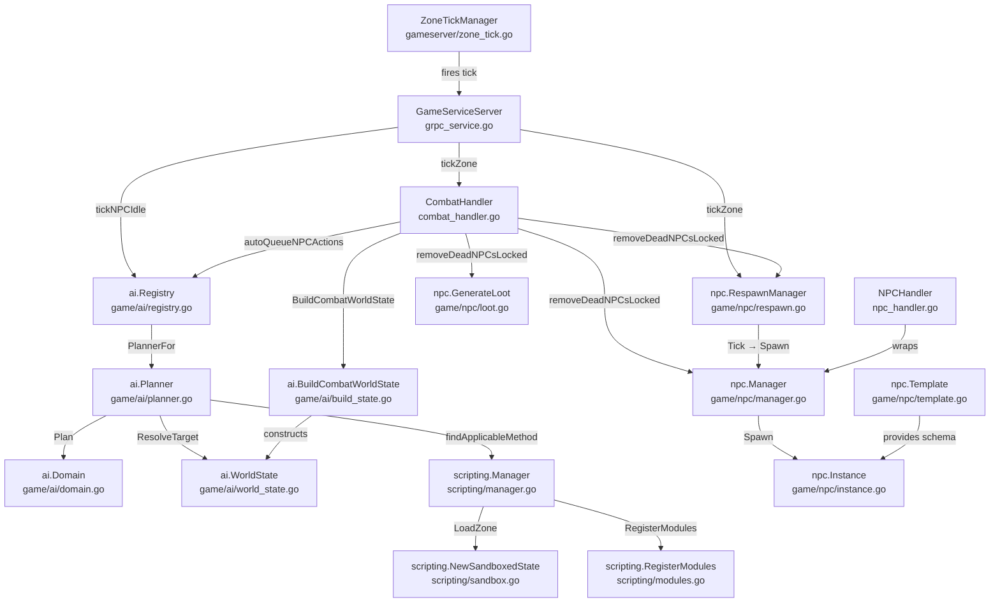
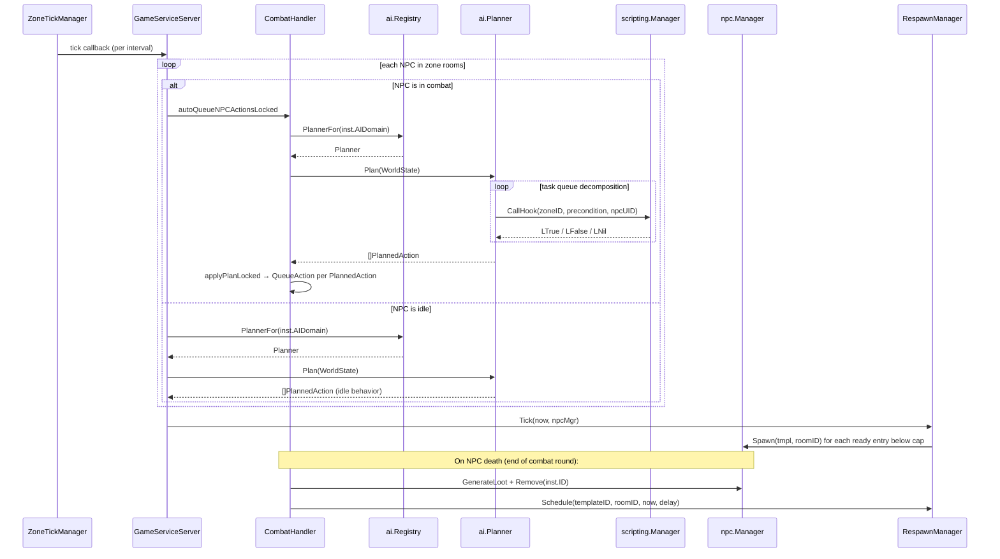

**As of:** 2026-03-18 (commit: 44636bd)

# AI, Scripting, and NPC Lifecycle Architecture

## Overview

NPC intelligence in this MUD is composed of three cooperating subsystems with distinct ownership boundaries: a Hierarchical Task Network (HTN) planner that decomposes abstract goals into concrete actions, a Lua scripting sandbox that evaluates dynamic preconditions and event hooks, and an NPC lifecycle layer that manages instance creation, loot generation, and respawn scheduling. These three subsystems are deliberately decoupled — the HTN planner knows nothing about Lua internals, the Lua sandbox knows nothing about game domain types, and the NPC lifecycle layer does not embed any AI logic.

---

## Package Responsibilities

### HTN Planner (`internal/game/ai/`)

The planner package implements Hierarchical Task Network planning for NPC combat and idle behavior. A Domain is loaded from a YAML file and contains three collections: Tasks (abstract goals), Methods (decomposition rules that map a task to an ordered list of subtasks or operators), and Operators (primitive actions such as `attack`, `strike`, `pass`, or `apply_mental_state`).

At planning time, a `Planner` is given a `WorldState` snapshot and begins with a task queue containing the single root task `"behave"`. Each iteration dequeues a task: if it is an Operator ID, a `PlannedAction` is emitted directly; if it is an abstract task, the planner calls `findApplicableMethod`, which iterates Methods in declaration order and calls the associated Lua precondition hook via the `ScriptCaller` interface. The first Method whose precondition returns `true` has its subtasks prepended to the queue. This preserves ordered decomposition and guarantees at-most-32-step depth to prevent infinite loops.

The `WorldState` type provides helpers for target resolution (`nearest_enemy`, `weakest_enemy`, `self`) and enemy/ally enumeration. The `build_state.go` file contains `BuildCombatWorldState`, which constructs a WorldState snapshot from a live `combat.Combat` at tick time. The `Registry` type indexes Planners by domain ID and prevents duplicate registration.

Relevant requirements: `docs/requirements/AI.md` (AI-1 through AI-5, AI-11, AI-12).

### Lua Scripting (`internal/scripting/`)

The scripting package provides a per-zone GopherLua sandbox with no dependency on game domain packages. `NewSandboxedState` creates an LState with only the safe standard libraries loaded (`base`, `table`, `string`, `math`) and strips all dangerous globals (`dofile`, `loadfile`, `load`, `loadstring`, `collectgarbage`, `require`, `module`, `newproxy`, `setfenv`, `getfenv`). Execution is bounded by a `countingContext` that cancels the Lua VM's context after a configurable number of opcodes (default: 100,000), making the instruction limit exact and deterministic.

The `Manager` type maintains a `map[string]*zoneState` where each entry holds a dedicated LState and a per-zone mutex. `LoadZone` creates a sandboxed VM, registers all `engine.*` modules, then executes every `*.lua` file in the script directory in lexicographic order. `LoadGlobal` populates a reserved `"__global__"` VM used as a fallback when no zone-specific VM is registered for a hook call.

`CallHook(zoneID, hook, args...)` acquires the per-zone mutex, looks up the named Lua global function, and calls it. Lua runtime errors are logged at Warn level and never propagated; the function returns `(LNil, nil)` in all failure paths, making it safe to call from the planner's precondition evaluation path.

`RegisterModules` wires seven engine modules into the Lua global `engine` table: `log`, `dice`, `entity`, `combat`, `world`, `event`, and `map`. All game-side callbacks (GetCombatant, ApplyCondition, ApplyDamage, Broadcast, QueryRoom, GetCombatantsInRoom, GetEntityRoom, RevealZoneMap) are injected into `Manager` as function fields after construction by the gameserver wiring layer. Every module function guards against nil callbacks.

Relevant requirements: `docs/requirements/SCRIPTING.md` (SCRIPT-1 through SCRIPT-13, SCRIPT-19 through SCRIPT-21).

### NPC Lifecycle (`internal/game/npc/` + `internal/gameserver/npc_handler.go`)

The `npc` package owns template loading, instance creation, the live instance registry, loot generation, and respawn scheduling. A `Template` is a YAML-defined archetype specifying stat block, equipment tables (weighted random), AI domain reference, loot table, taunt configuration, ability scores, skill ranks, and respawn delay. `Template.Validate()` enforces invariants (non-empty ID/name, Level >= 1, MaxHP >= 1, AC >= 10, valid durations) before any template is used.

`NewInstanceWithResolver` creates a live `Instance` from a Template, rolling weighted equipment at spawn time. The `Manager` maintains two concurrent-safe indexes: `instances map[string]*Instance` and `roomSets map[string]map[string]bool`. When multiple instances of the same template share a room, `Spawn` assigns alphabetic letter suffixes (A, B, C…), reverting to an unsuffixed name when population drops to one.

`GenerateLoot(lt LootTable) LootResult` is a pure function that rolls currency within its configured range and independently rolls each item entry against its drop chance. The result carries currency (int) and item instances with generated UUIDs.

`RespawnManager` holds a list of pending `respawnEntry` values (templateID, roomID, readyAt). `Schedule` appends an entry only when delay > 0. `Tick(now, mgr)` drains all entries with `readyAt <= now`, checks the population cap, and calls `mgr.Spawn` for each template/room pair still below cap. `PopulateRoom` is the startup-time equivalent: it enforces population caps immediately and fills any deficit.

`NPCHandler` in `internal/gameserver/npc_handler.go` provides thin command-surface wrappers over `npc.Manager` (`InstancesInRoom`, `MoveNPC`, `Examine`) for use by the gRPC service layer.

Relevant requirements: `docs/requirements/AI.md` (AI-6 through AI-10, AI-16, AI-17).

---

## Component Diagram

---

## HTN Tick Cycle — Sequence Diagram

---

## NPC Death → Loot → Respawn Flow

When a combat round ends, `CombatHandler.removeDeadNPCsLocked` is called with the lock held. For each dead NPC combatant:

1. `npc.GenerateLoot(*inst.Loot)` produces a `LootResult` with rolled currency and item drops.
2. Currency (loot + any robbed wallet) is distributed equally among living player participants via the XP/economy service.
3. Item instances are placed on the room floor via `floorMgr.Drop`.
4. Kill XP is awarded and split among participants.
5. `npcMgr.Remove(inst.ID)` removes the Instance from both indexes atomically.
6. `respawnMgr.Schedule(templateID, roomID, time.Now(), delay)` enqueues a future respawn entry. If delay is zero (no respawn configured), this is a no-op.

On the next zone tick after the respawn timer expires, `RespawnManager.Tick` drains the entry, checks that the room population is below the configured cap, and calls `npcMgr.Spawn` to re-insert the NPC. The new Instance is registered in the room index immediately and becomes visible to players and the planner on the following tick.

---

## Key Invariants

- **HTN decomposition depth** is capped at 32 steps to prevent infinite loops in misconfigured domains.
- **Lua errors never propagate** from `CallHook`; they are logged at Warn level and treated as precondition-false, ensuring the planner always produces a result.
- **Per-zone LState serialization**: each zone VM has its own `sync.Mutex`; no two goroutines ever call into the same LState concurrently.
- **Sandbox safety**: dangerous globals are nil'd in the LState before any user script loads. Instruction count is enforced by a counting context, not a goroutine timeout.
- **NPC removal is atomic with respect to the room index**: `Manager.Remove` deletes from both `instances` and `roomSets` under the write lock. Respawn is scheduled only after removal completes.
- **Population cap is checked before every respawn spawn**: `RespawnManager.Tick` and `PopulateRoom` both call `countInRoom` before calling `Spawn`.

---

## Cross-References

- `docs/requirements/AI.md` — NPC AI requirements (AI-1 through AI-18)
- `docs/requirements/SCRIPTING.md` — Lua scripting requirements (SCRIPT-1 through SCRIPT-21)
- `docs/requirements/COMBAT.md` — Combat round mechanics that the HTN planner produces actions for
- `docs/requirements/WORLD.md` — Zone and room data model used by ZoneTickManager
