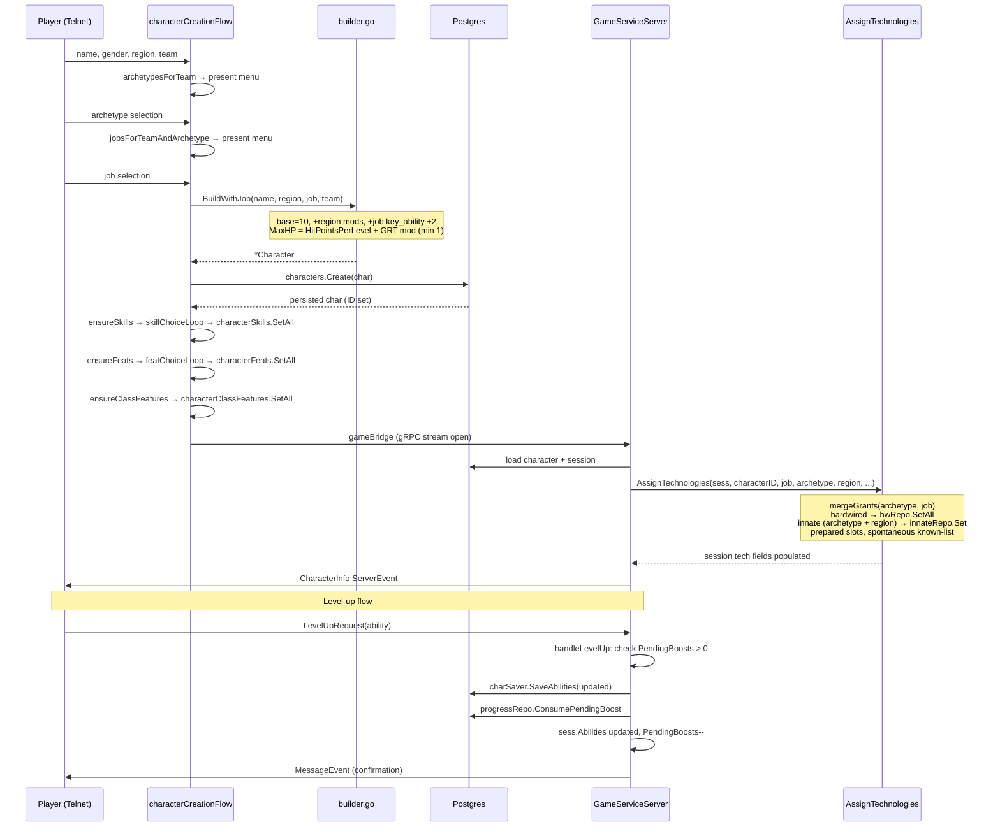
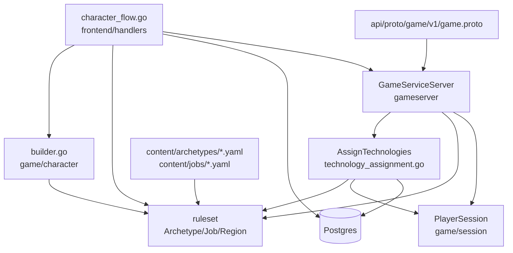

# Character Architecture

**As of:** 2026-03-18 (commit: a70c3c1)
**Skill:** `.claude/skills/mud-character.md`
**Requirements:** `docs/requirements/CHARACTERS.md`, `docs/requirements/SETTING.md`

## Overview

The character system spans three layers: a pure domain model (`internal/game/character/`), an interactive telnet creation UI (`internal/frontend/handlers/character_flow.go`), and gRPC orchestration (`internal/gameserver/grpc_service.go`). Content (archetypes, jobs) is defined entirely in YAML under `content/` and loaded at startup with no code registration required. Technology grants (hardwired, prepared, spontaneous, innate) are assigned from merged archetype + job YAML at session join via `AssignTechnologies`.

## Package Structure

```
internal/game/character/
    model.go            – Character struct, AbilityScores, Modifier()
    builder.go          – BuildWithJob, ApplyAbilityBoosts, BuildSkillsFromJob,
                          BuildFeatsFromJob, BuildClassFeaturesFromJob, AbilityBoostPool
    gender.go           – StandardGenders, RandomStandardGender

internal/game/ruleset/
    archetype.go        – Archetype struct, InnateGrant, TechnologyGrants
    job.go              – Job struct, SkillGrants, FeatGrants

internal/frontend/handlers/
    character_flow.go   – characterFlow, characterCreationFlow, buildAndConfirm,
                          ensureGender, ensureSkills, ensureFeats, ensureClassFeatures

internal/gameserver/
    grpc_service.go     – handleChar, handleArchetypeSelection, handleLevelUp
    technology_assignment.go – AssignTechnologies, repo interfaces

content/archetypes/     – *.yaml archetype definitions (auto-loaded)
content/jobs/           – *.yaml job definitions (auto-loaded)

api/proto/game/v1/game.proto – CharacterInfo, CharacterSheetView messages
```

## Core Data Structures

### character.Character

Key fields: `ID`, `AccountID` (int64, zero until persisted), `Name` (2–32 chars), `Region` (region ID), `Class` (job ID), `Team`, `Level`, `Abilities` (AbilityScores), `MaxHP`/`CurrentHP`, `Skills` (map[string]string), `Feats` ([]string), `ClassFeatures` ([]string), `Gender`.

### CharacterInfo proto

Fields sent at session join: `character_id`, `name`, `region`, `class`, `level`, `experience`, `max_hp`, `current_hp`, plus all six ability scores as `int32`.

### Archetype YAML (content/archetypes/*.yaml)

Required: `id`, `name`, `description`, `key_ability`, `hit_points_per_level`, `ability_boosts.fixed`, `ability_boosts.free`. Optional: `technology_grants`, `innate_technologies` ([]{id, uses_per_day}), `level_up_grants` (map[level → TechnologyGrants]).

### Job YAML (content/jobs/*.yaml)

Required: `id`, `name`, `archetype`, `description`, `key_ability`, `hit_points_per_level`. Optional: `team`, `proficiencies`, `skills` (fixed + choices), `feats` (fixed + choices + general_count), `class_features`, `technology_grants`, `level_up_grants`.

## Primary Data Flow



## Component Dependencies



## Extension Points

### Adding a new archetype

1. Create `content/archetypes/<id>.yaml` with required fields (`id`, `name`, `description`, `key_ability`, `hit_points_per_level`, `ability_boosts`).
2. Add optional `technology_grants`, `innate_technologies`, and `level_up_grants` as needed.
3. The ruleset loader reads all YAML in `content/archetypes/` at startup — no code changes required.
4. Jobs reference the archetype by `id` in their `archetype:` field.
5. Run the full test suite to confirm parsing and property-based tests pass.

### Adding a new job

1. Create `content/jobs/<id>.yaml` with required fields (`id`, `name`, `archetype`, `description`, `key_ability`, `hit_points_per_level`).
2. Set `team:` for team-exclusive jobs; omit for cross-team.
3. Add `skills`, `feats`, `class_features`, `technology_grants`, and `level_up_grants` as needed.
4. The job loader reads all YAML in `content/jobs/` at startup — no code changes required.
5. The new job will appear automatically in `JobsForTeamAndArchetype` lookups and the creation flow.

## Known Constraints & Pitfalls

- `Character.Class` stores the **job ID** — not the archetype ID. Archetype is resolved on the fly via `jobRegistry.Job(class).Archetype`.
- `handleArchetypeSelection` in grpc_service.go is a stub. All real creation state is managed in the frontend `characterCreationFlow`.
- HP uses the **job** `HitPointsPerLevel` even though the archetype YAML also carries that field. The archetype value is display-only in `RenderArchetypeMenu`.
- Ability boost order in `ApplyAbilityBoosts` is fixed: archetype fixed → archetype free → region fixed → region free. Changing order alters final scores.
- `handleLevelUp` logs warnings on `SaveAbilities` and `ConsumePendingBoost` failures but does not roll back session state — failure is logged and execution continues. Full atomicity is not currently enforced.
- `AssignTechnologies` short-circuits entirely when `job == nil && region == nil && len(archetype.InnateTechnologies) == 0`; passing a nil archetype for a character with innate grants will silently skip them.
- `ensureSkills`, `ensureFeats`, `ensureClassFeatures` are idempotent and called for both new and existing characters — they check for existing DB rows before prompting.

## Cross-References

- Technology grant types (hardwired/prepared/spontaneous/innate): `.claude/skills/mud-technology.md`
- Session state loaded at join: `internal/game/session/player_session.go`
- Combat ability modifiers: `.claude/skills/mud-combat.md`
- Persistence repos (characters, skills, feats): `.claude/skills/mud-persistence.md`
- Content pipeline (YAML loaders): `.claude/skills/mud-content-pipeline.md`
