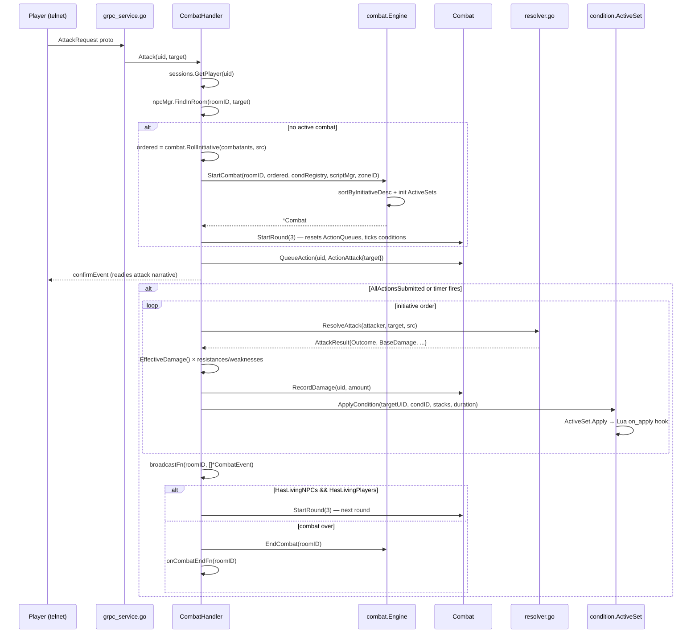
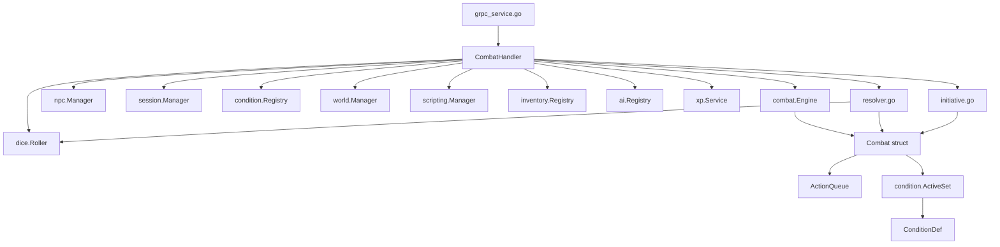

# Combat Architecture

**As of:** 2026-03-18 (commit: ff59c22a6ac2c4f63f8dc1aed3230f3b7b0f66c1)
**Skill:** `.claude/skills/mud-combat.md`
**Requirements:** `docs/requirements/COMBAT.md`

## Overview

The combat system implements PF2E 4-tier outcome mechanics (critical success, success, failure, critical failure) for a turn-based, action-point-economy combat model. Each combatant receives 3 AP per round; conditions may reduce this. The pure engine lives in `internal/game/combat/`; the gRPC shell that drives it is `internal/gameserver/combat_handler.go`. Conditions are defined as YAML files and managed through `internal/game/condition/`.

## Package Structure

```
internal/game/combat/
  combat.go        — Combatant, Outcome, OutcomeFor, proficiency/ability helpers
  engine.go        — Combat struct, Engine (room-keyed), StartCombat/EndCombat/StartRound
  action.go        — ActionType, QueuedAction, ActionQueue, AP tracking
  resolver.go      — ResolveAttack, ResolveFirearmAttack, ResolveSave, ResolveExplosive
  initiative.go    — RollInitiative, InitiativeBonusForMargin

internal/gameserver/
  combat_handler.go — CombatHandler imperative shell; Attack/Strike/Pass/Flee methods;
                      round timer; event broadcast

internal/game/condition/
  definition.go    — ConditionDef (YAML schema), Registry, LoadDirectory
  active.go        — ActiveCondition, ActiveSet, Apply/Remove/Tick, Lua hooks
  modifiers.go     — AttackBonus, ACBonus, APReduction, StunnedAPReduction, DamageBonus, etc.
```

## Core Data Structures

### Combat
| Field | Type | Description |
|-------|------|-------------|
| `RoomID` | `string` | Room where this encounter takes place |
| `Combatants` | `[]*Combatant` | Initiative-ordered (highest first) |
| `Round` | `int` | Current round number; 0 before first StartRound |
| `ActionQueues` | `map[string]*ActionQueue` | UID → current-round AP queue |
| `Conditions` | `map[string]*condition.ActiveSet` | UID → active condition set |
| `DamageDealt` | `map[string]int` | UID → cumulative damage dealt |
| `Participants` | `[]string` | Player UIDs ever active (for XP/loot) |
| `Over` | `bool` | True when combat is resolved |

### Combatant
Key fields: `ID`, `Kind` (KindPlayer/KindNPC), `Name`, `MaxHP`, `CurrentHP`, `AC`, `Level`, `StrMod`, `DexMod`, `Initiative`, `InitiativeBonus`, `Dead`, `Loadout`, `WeaponProficiencyRank`, `WeaponDamageType`, `Resistances`, `Weaknesses`, `GritMod`, `QuicknessMod`, `SavvyMod`, `ToughnessRank`, `HustleRank`, `CoolRank`, `ACMod`, `AttackMod`, `Hidden`, `Position`, `CoverTier`.

### ActionQueue
| Field | Description |
|-------|-------------|
| `MaxPoints` | AP available at round start (usually 3) |
| `remaining` | Unexpended AP; never negative |
| `actions` | Slice of QueuedAction for this round |

`IsSubmitted()` = true when `remaining == 0` or an `ActionPass` is queued.

### AttackResult
| Field | Description |
|-------|-------------|
| `AttackRoll` | Raw d20 value |
| `AttackTotal` | d20 + modifiers |
| `Outcome` | 4-tier: CritSuccess/Success/Failure/CritFailure |
| `BaseDamage` | Damage roll + ability modifier |
| `DamageType` | e.g. "fire", "piercing"; empty = untyped |

`EffectiveDamage()`: ×2 on CritSuccess, ×1 on Success, 0 on Failure/CritFailure.

### ConditionDef
YAML fields: `id`, `name`, `duration_type` ("rounds"|"until_save"|"permanent"), `max_stacks`, `attack_penalty`, `ac_penalty`, `ap_reduction`, `skip_turn`, `forced_action`, `restrict_actions`, `lua_on_apply`, `lua_on_remove`, `lua_on_tick`.

## Primary Data Flow



## Component Dependencies



## Extension Points

### Adding a new combat action (CMD-1 through CMD-7)

All seven steps are required; omitting any step is a defect:

1. **CMD-1**: Add `Handler<Name>` constant to `internal/game/command/commands.go`.
2. **CMD-2**: Append `Command{...}` referencing the constant to `BuiltinCommands()`.
3. **CMD-3**: Implement `Handle<Name>` in `internal/game/command/<name>.go` with property-based TDD coverage.
4. **CMD-4**: Add proto request message to `api/proto/game/v1/game.proto`; add to `ClientMessage` oneof; run `make proto`.
5. **CMD-5**: Add `bridge<Name>` to `internal/frontend/handlers/bridge_handlers.go`; register in `bridgeHandlerMap`; verify `TestAllCommandHandlersAreWired` passes.
6. **CMD-6**: Implement `handle<Name>` in `internal/gameserver/grpc_service.go`; wire into `dispatch` type switch; call the appropriate `CombatHandler` method.
7. **CMD-7** (combat-specific): Add `ActionType` constant and `Cost()` case in `action.go`; add resolution logic in `resolver.go`; wire into round-resolution loop in `combat_handler.go`.

### Adding a new condition YAML

1. Create `data/conditions/<id>.yaml` with required fields: `id`, `name`, `duration_type`, `max_stacks`.
2. `condition.LoadDirectory` picks it up automatically at startup — no code changes for basic modifiers.
3. For special mechanical behavior beyond existing modifier fields, add a helper to `condition/modifiers.go` and call it from the round-resolution loop in `combat_handler.go`.
4. Write property-based tests for new mechanics.

## Known Constraints & Pitfalls

- Conditions MUST be applied via `Combat.ApplyCondition` or `ActiveSet.Apply` — never by direct Combatant field mutation.
- `ActionUseAbility` AP cost comes from `QueuedAction.AbilityCost`, not `ActionType.Cost()`. A zero `AbilityCost` means a free action.
- `CombatHandler.combatMu` serializes all combat state access. Code that reads or writes a `Combat` or `ActionQueue` outside the handler must acquire this lock.
- NPC death (`CurrentHP <= 0`) and player death (`Dead == true` after dying stack 4) differ. Use `IsDead()`, not direct HP checks.
- `StartRound` resets `ACMod` and `AttackMod` to 0 each round. Per-round modifiers from conditions do not carry over.
- `DurationRemaining = -1` means permanent/until_save. Passing `0` causes immediate expiry on the next tick.
- Firearm attacks use `DexMod` and weapon `DamageDice` via `ResolveFirearmAttack`; melee attacks use `StrMod` and a 1d6 baseline via `ResolveAttack`. Using the wrong resolver silently produces wrong numbers.
- `InitiativeBonus` is set on players who beat all NPCs, but is NOT applied automatically each round — `combat_handler.go` must propagate it to `AttackMod`/`ACMod`.

## Cross-References

- **Requirements**: `docs/requirements/COMBAT.md`
- **Skill reference**: `.claude/skills/mud-combat.md`
- **Proto definitions**: `api/proto/game/v1/game.proto` — `AttackRequest`, `CombatEvent`, `CombatEventType`
- **Command wiring rules**: `.claude/rules/AGENTS.md` sections CMD-1 through CMD-7
- **Condition YAML data**: `data/conditions/` directory
- **AI/NPC behavior**: `internal/game/ai/` — NPC action selection fed into the same `CombatHandler` round loop

## Reaction Economy

Each combatant has a per-round `reaction.Budget` (`internal/game/reaction/budget.go`) with `Max = 1 + sum(BonusReactions from active feats)`. `Budget.TrySpend` returns `true` iff `Spent < Max`; otherwise no-op. `Budget.Refund` decrements `Spent`, floored at 0. `Budget.Reset(n)` sets `Max = max(n, 0)` and zero-spent.

`Combat.StartRoundWithSrc` resets every living combatant's budget at the top of each round (base `Max = 1` per REACTION-14; feat bonuses are applied by the gameserver before it calls `ResolveRound` when bonus-granting feats are active).

### Fire-point ordering (REACTION-8)

At each trigger point in `ResolveRound`, `fireTrigger` runs the two-step dispatch:

1. **Ready first.** `Combat.ReadyRegistry.Consume(uid, trigger, sourceUID)` removes and returns a matching `ReadyEntry` if one exists. On match, `Budget.TrySpend()` must succeed; on failure the trigger is silently dropped. On success, the resolver re-validates the prepared action (e.g. attack target still alive) — if re-validation fails, `Budget.Refund()` and an `EventTypeReadyFizzled` RoundEvent is emitted. Otherwise an `EventTypeReactionFired` RoundEvent is emitted carrying the `ReadyEntry`; the gameserver layer resolves the prepared action after `ResolveRound` returns.
2. **Feat reactions.** If no Ready entry fired, `ReactionRegistry.Filter(uid, trigger, requirementChecker)` returns the eligible feat reactions. `Budget.TrySpend()` is attempted before invoking the interactive `ReactionCallback` (`ctx` carries the prompt timeout, default `config.DefaultReactionPromptTimeout` = 3s). On skip/timeout/error, `Budget.Refund()` runs. On accept, `EventTypeReactionFired` is emitted.

Interactive feat reactions travel end-to-end via the new gRPC pair:
- Server → client: `ServerEvent.ReactionPrompt` (`ReactionPromptEvent{prompt_id, deadline_unix_ms, options}`).
- Client → server: `ClientMessage.ReactionResponse` (`ReactionResponse{prompt_id, chosen}`; empty `chosen` = skip).

The gameserver's `reactionPromptHub` registers a per-prompt response channel; `buildReactionCallback` blocks on `select { ctx.Done | hub.chan }`.

## Ready Action

`ActionReady` (`internal/game/combat/action.go`, cost 2 AP) prepares a single 1-AP action bound to a fixed trigger. On `Combat.QueueAction(ActionReady)`, a `reaction.ReadyEntry` is added to `Combat.ReadyRegistry` keyed by `(UID, Trigger, optional TriggerTgt, RoundSet)`. At the matching trigger point the entry is atomically consumed (see Fire-point ordering above).

**Allowed triggers (REACTION-15):** `TriggerOnEnemyEntersRoom`, `TriggerOnEnemyMoveAdjacent`, `TriggerOnAllyDamaged`.

**Allowed prepared actions (REACTION-16):** `attack`, `stride`, `throw`, `reload`, `use_ability`, `use_tech`. For `use_ability` / `use_tech`, `AbilityCost` must equal 1.

Ready entries expire at the end of the round in which they were registered — `Combat.ReadyRegistry.ExpireRound(c.Round - 1)` runs at the top of each `StartRoundWithSrc` call.

### Frontend UIs

- **Web:** `ReactionPromptModal.tsx` renders the interactive prompt with a countdown. `ReadyActionPicker.tsx` is the two-step Ready composer on the combat action bar. The reaction-budget badge `R: N` appears alongside the AP tracker in `CombatBanner.tsx`, driven by the `ReactionMax` / `ReactionSpent` fields on `APUpdateEvent`.
- **Telnet:** tracked separately as issue #268 (reuses the same proto prompt/response pair).

### Configuration

- `config.GameServerConfig.ReactionPromptTimeout` (valid range 500ms–30s; defaults to 3s) is clamped by `ValidateReactionPromptTimeout`. Plumbed into `CombatHandler.SetReactionPromptTimeout` at startup.
