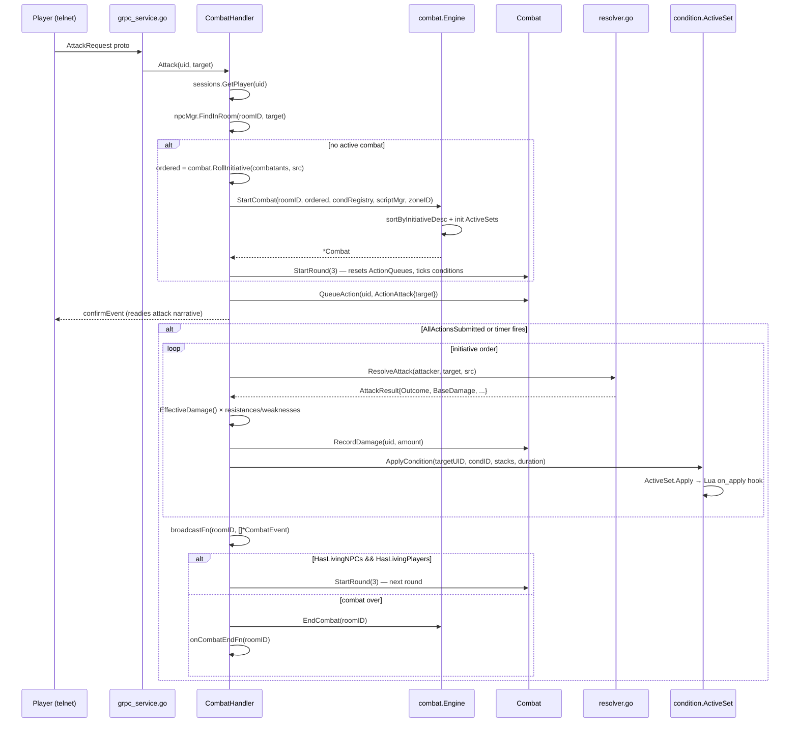
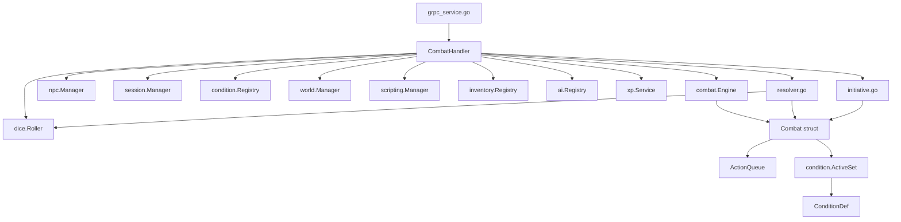

# Combat Architecture

**As of:** 2026-03-18 (commit: ff59c22a6ac2c4f63f8dc1aed3230f3b7b0f66c1)
**Skill:** `.claude/skills/mud-combat.md`
**Requirements:** `docs/requirements/COMBAT.md`

## Overview

The combat system implements PF2E 4-tier outcome mechanics (critical success, success, failure, critical failure) for a turn-based, action-point-economy combat model. Each combatant receives 3 AP per round; conditions may reduce this. The pure engine lives in `internal/game/combat/`; the gRPC shell that drives it is `internal/gameserver/combat_handler.go`. Conditions are defined as YAML files and managed through `internal/game/condition/`.

## Package Structure

```
internal/game/combat/
  combat.go        — Combatant, Outcome, OutcomeFor, proficiency/ability helpers
  engine.go        — Combat struct, Engine (room-keyed), StartCombat/EndCombat/StartRound
  action.go        — ActionType, QueuedAction, ActionQueue, AP tracking
  resolver.go      — ResolveAttack, ResolveFirearmAttack, ResolveSave, ResolveExplosive
  initiative.go    — RollInitiative, InitiativeBonusForMargin

internal/gameserver/
  combat_handler.go — CombatHandler imperative shell; Attack/Strike/Pass/Flee methods;
                      round timer; event broadcast

internal/game/condition/
  definition.go    — ConditionDef (YAML schema), Registry, LoadDirectory
  active.go        — ActiveCondition, ActiveSet, Apply/Remove/Tick, Lua hooks
  modifiers.go     — AttackBonus, ACBonus, APReduction, StunnedAPReduction, DamageBonus, etc.
```

## Core Data Structures

### Combat
| Field | Type | Description |
|-------|------|-------------|
| `RoomID` | `string` | Room where this encounter takes place |
| `Combatants` | `[]*Combatant` | Initiative-ordered (highest first) |
| `Round` | `int` | Current round number; 0 before first StartRound |
| `ActionQueues` | `map[string]*ActionQueue` | UID → current-round AP queue |
| `Conditions` | `map[string]*condition.ActiveSet` | UID → active condition set |
| `DamageDealt` | `map[string]int` | UID → cumulative damage dealt |
| `Participants` | `[]string` | Player UIDs ever active (for XP/loot) |
| `Over` | `bool` | True when combat is resolved |

### Combatant
Key fields: `ID`, `Kind` (KindPlayer/KindNPC), `Name`, `MaxHP`, `CurrentHP`, `AC`, `Level`, `StrMod`, `DexMod`, `Initiative`, `InitiativeBonus`, `Dead`, `Loadout`, `WeaponProficiencyRank`, `WeaponDamageType`, `Resistances`, `Weaknesses`, `GritMod`, `QuicknessMod`, `SavvyMod`, `ToughnessRank`, `HustleRank`, `CoolRank`, `ACMod`, `AttackMod`, `Hidden`, `Position`, `CoverTier`.

### ActionQueue
| Field | Description |
|-------|-------------|
| `MaxPoints` | AP available at round start (usually 3) |
| `remaining` | Unexpended AP; never negative |
| `actions` | Slice of QueuedAction for this round |

`IsSubmitted()` = true when `remaining == 0` or an `ActionPass` is queued.

### AttackResult
| Field | Description |
|-------|-------------|
| `AttackRoll` | Raw d20 value |
| `AttackTotal` | d20 + modifiers |
| `Outcome` | 4-tier: CritSuccess/Success/Failure/CritFailure |
| `BaseDamage` | Damage roll + ability modifier |
| `DamageType` | e.g. "fire", "piercing"; empty = untyped |

`EffectiveDamage()`: ×2 on CritSuccess, ×1 on Success, 0 on Failure/CritFailure.

### ConditionDef
YAML fields: `id`, `name`, `duration_type` ("rounds"|"until_save"|"permanent"), `max_stacks`, `attack_penalty`, `ac_penalty`, `ap_reduction`, `skip_turn`, `forced_action`, `restrict_actions`, `lua_on_apply`, `lua_on_remove`, `lua_on_tick`.

## Primary Data Flow



## Bonus Stacking (DEDUP Requirements)

All numeric bonuses to combat stats flow through `internal/game/effect/EffectSet` and `effect.Resolve`. No subsystem computes bonus totals outside this pipeline (DEDUP-10).

### Bonus Types

| Type | Stacking Rule |
|------|--------------|
| `status` | Only the highest single positive bonus contributes per stat; only the worst single penalty contributes |
| `circumstance` | Same as status |
| `item` | Same as status |
| `untyped` | All values stack additively |

### Dedup Key

Effects are deduplicated by `(source_id, caster_uid)`. Re-applying the same key overwrites the previous entry (DEDUP-1).

### Resolve Algorithm

`effect.Resolve(set, stat)` is a pure function (DEDUP-7). Per-type: highest-bonus-wins, worst-penalty-wins. Untyped: sum all. Ties broken lexicographically by `(SourceID, CasterUID)` ascending (DEDUP-6).

### Stat Inheritance

A bonus to `skill` contributes to any `skill:<id>` query (prefix-on-colon). A bonus to `skill:stealth` does NOT contribute to `skill:savvy` (DEDUP-16).

### Effect Sources

| Source prefix | Origin |
|--------------|--------|
| `condition:<id>` | Applied via `condition.ActiveSet` |
| `feat:<id>` | Passive `ClassFeature.PassiveBonuses` |
| `tech:<id>` | Passive `TechnologyDef.PassiveBonuses` |
| `item:<instance>` | Equipped weapon/armor item bonus |

### Combatant Effects Lifecycle

1. At combatant creation: `combat.BuildCombatantEffects()` populates `Combatant.Effects` from all sources.
2. On condition apply mid-combat: `combat.SyncConditionApply()` updates `Combatant.Effects`.
3. On condition removal: `combat.SyncConditionRemove()` updates `Combatant.Effects`.
4. On round tick: `combat.SyncConditionsTick()` removes expired condition effects.
5. `combat.OverrideNarrativeEvents()` diffs before/after Resolve to emit suppression log lines (DEDUP-14).

## Damage Pipeline (MULT Requirements)

All direct-damage computation flows through `combat.ResolveDamage(DamageInput) DamageResult`
in `internal/game/combat/damage.go`. This function is pure: no RNG, no mutation, no I/O.

### Stages (executed in order — MULT-1)

| Stage | Rule |
|-------|------|
| **Base** | Sum all `DamageAdditive.Value` entries (may be negative) |
| **Multiplier** | `effective = 1 + Σ(Factor_i − 1)`; apply `base × effective` (MULT-2) |
| **Halver** | `floor(after_mult / 2)`; multiple halvers collapse to one (MULT-3, MULT-4) |
| **Weakness** | `+ target.Weaknesses[damageType]` (MULT-5) |
| **Resistance** | `− target.Resistances[damageType]` (MULT-6) |
| **Floor** | `max(0, …)` (MULT-7) |

### Multiplier stacking rule (MULT-2)

PF2E: multiple ×M sources combine as `effective = 1 + Σ(M_i − 1)`.

| Sources | Effective factor |
|---------|-----------------|
| Crit (×2) alone | ×2 |
| Crit (×2) + Vulnerable (×2) | ×3 |
| Three ×2 sources | ×4 |

Multiplicative chaining (×4 from two ×2s) is **not** permitted.

### Halver semantics (MULT-9)

`TechEffect.Multiplier == 0.5` is interpreted as a halver (not a 0.5× multiplier).
Any other value in `(0, 1)` except `0.5` is rejected at YAML load time (MULT-10).

### buildDamageInput (MULT-12)

Every damage-producing call site in `round.go` assembles its input via
`BuildDamageInput(BuildDamageOpts)` in `damage_input.go`. Open-coded crit-doubling,
weakness, and resistance arithmetic are removed; those stages live only in the pipeline.
`AttackResult.EffectiveDamage()` is deprecated in favour of the pipeline (MULT-17).

### Reaction compatibility (MULT-16)

`TriggerOnDamageTaken` callbacks receive and may mutate `DamagePending *int` — the final
post-pipeline scalar — before `ApplyDamage`. They do not see the breakdown in v1.

### Breakdown output (MULT-13, MULT-14, MULT-15)

- `DamageResult.Breakdown` contains one entry per non-trivial stage in canonical order.
- `StageBase` is always present.
- `FormatBreakdownInline(steps)` returns `""` for trivial (base-only) inputs; otherwise
  an indented inline string wrapping at `→` boundaries within 80 cols.
- `FormatBreakdownVerbose(steps)` (with `handlers.RenderDamageBreakdown` as a thin wrapper)
  returns the verbose multi-line form.
- Players with `PlayerSession.ShowDamageBreakdown` receive the verbose block as a separate
  message; everyone sees the inline breakdown appended to the attack narrative.

## Cover (COVER Requirements)

### Requirements

- COVER-1: Cover tier is determined per attack-resolution event by reading the target combatant's `CoverTier` field (set when the target uses a cover-granting action). In the 1D linear combat model there is no Bresenham line walk; the tier is carried on the combatant.
- COVER-2: The highest cover tier present on the target is returned (`greater > standard > lesser`).
- COVER-3: Cover tier-to-bonus mapping: `lesser = +1 AC`; `standard = +2 AC, +2 Quickness`; `greater = +4 AC, +4 Quickness`.
- COVER-4: Cover bonuses are applied as `circumstance`-typed bonuses to `target.Effects` before each attack resolution and removed immediately after.
- COVER-5: Cover effects use `SourceID = "cover:<tier>"` and `CasterUID = ""`.
- COVER-6: `DetermineCoverTier` returns `NoCover` when the target has no cover tier set.
- COVER-8: Attack resolution derives effective AC as `target.AC + target.InitiativeBonus + effect.Resolve(target.Effects, StatAC).Total`.
- COVER-9: Attack resolution derives effective attack total as `r.AttackTotal + effect.Resolve(actor.Effects, StatAttack).Total`.
- COVER-10: The pre-existing inversion where the target's AC bonus was added to `r.AttackTotal` is removed; COVER-8/COVER-9 formulas apply at every call site.
- COVER-11: Cover absorb-miss: if the attack would have hit without the cover AC bonus, `ActionCoverHit` fires and the cover object degrades.
- COVER-13: When cover absorbs a miss, `ActionCoverHit` emits a dedicated `"<actor>'s attack hits <target>'s cover!"` event; per-attack narrative is unchanged.

### Tier-to-Bonus Table

| Tier     | AC Bonus | Quickness Bonus | SourceID         |
|----------|----------|-----------------|------------------|
| none     | 0        | 0               | —                |
| lesser   | +1       | 0               | `cover:lesser`   |
| standard | +2       | +2              | `cover:standard` |
| greater  | +4       | +4              | `cover:greater`  |

### AC Derivation (post-fix)

```
effectiveAC  = target.AC + target.InitiativeBonus + effect.Resolve(target.Effects, StatAC).Total
effectiveAtk = r.AttackTotal + effect.Resolve(actor.Effects, StatAttack).Total
```

Both include condition effects (via `Combatant.Effects` after #245), cover effects (ephemerally applied), and feat/tech/equip effects.

### Absorb-Miss Logic

```
if attack missed AND coverTier > NoCover:
    coverAC, _ := CoverBonus(coverTier)
    if r.AttackTotal >= effectiveAC - coverAC:
        fire ActionCoverHit for target.CoverEquipmentID
        degrade the cover object
```

### Implementation Files

| File | Responsibility |
|------|----------------|
| `internal/game/combat/cover_bonus.go` | `CoverTier` enum, `CoverBonus`, `DetermineCoverTier`, `BuildCoverEffect`, `WithCoverEffect` |
| `internal/game/combat/round.go` | 5 attack resolution sites; ephemeral apply/remove; absorb-miss check |
| `internal/game/effect/bonus.go` | `StatQuickness` constant |

## Terrain (TERRAIN Requirements)

### Requirements

- TERRAIN-1: Per-cell layer with types `normal`, `difficult`, `greater_difficult`, `hazardous`.
- TERRAIN-2: Absent cells default to `normal`.
- TERRAIN-3: Room YAML accepts explicit grid (shape A) or default+overrides (shape B); both in same room is a load error.
- TERRAIN-4: Hazardous cell requires exactly one of `hazard_id` or `hazard`; non-hazardous cells carrying either is a load error.
- TERRAIN-5: `greater_difficult` may not combine with `difficult` or any hazard.
- TERRAIN-6: Speed costs — `normal=1`, `difficult=2`, `hazardous=1` (+1 if `DifficultOverlay`), `greater_difficult=impassable`.
- TERRAIN-7: Stride terminates when next step would exceed budget or enter impassable cell.
- TERRAIN-8: `SpeedSquares()` deprecated; `SpeedBudget()` is canonical.
- TERRAIN-9: Entering hazardous cell fires `on_enter` hazard.
- TERRAIN-10: At `StartRound`, living combatants on hazardous cells fire `round_start` hazard.
- TERRAIN-11: Hazard damage routes through `ResolveDamage` (#246).
- TERRAIN-12: Combat-start placement fires `on_enter` once; `round_start` suppressed in round 1 (gameserver wiring is a follow-up).
- TERRAIN-17: Terrain-stopped stride emits explanatory narrative.
- TERRAIN-18: Zero-movement stride emits informational narrative.
- TERRAIN-19: Unresolved `hazard_id` resolves to `Def=nil`; the cell is treated as inert at runtime.
- TERRAIN-20: Terrain is static per combat (not mutated during a round).

### Type / Cost Table

| Type               | Entry Cost | Passable |
|--------------------|-----------|----------|
| `normal`           | 1         | yes      |
| `difficult`        | 2         | yes      |
| `hazardous`        | 1 (or 2 with `DifficultOverlay`) | yes |
| `greater_difficult`| —         | no       |

### Stride Budget Model

```
budget = actor.SpeedBudget()  // e.g. 5 for 25 ft
for budget > 0:
    cost, ok = cbt.EntryCost(newX, newY)
    if !ok or cost > budget: stop
    budget -= cost
    move to (newX, newY)
    if hazardous: fire on_enter hazard via applyCellHazard
```

### Implementation Files

| File | Responsibility |
|------|----------------|
| `internal/game/combat/terrain.go` | `GridCell`, `TerrainType`, `TerrainCell`, `CellHazard`, `TerrainAt`, `EntryCost`, `TerrainGlyph`, `TerrainLegendText` |
| `internal/game/world/terrain_load.go` | YAML loader for both authoring shapes |
| `internal/game/combat/round.go` | Budget-based stride, `applyCellHazard` |
| `internal/game/combat/engine.go` | `Combat.Terrain`, `RoomHazards`, `skipHazardRoundStart` fields; round_start hazard hook in `StartRoundWithSrc` |
| `internal/game/combat/combat.go` | `Combatant.SpeedBudget()` (replaces deprecated `SpeedSquares()`); `WeaknessFor`/`ResistanceFor` helpers |

## Area-of-Effect (AOE Requirements)

Typed AoE templates (burst / cone / line) flow from client to server to resolver via the
new `AoeTemplate` proto message. Content declares an `aoe_shape` plus shape-appropriate
dimensions; the resolver derives affected cells from the template, applies an optional
post-filter, then applies the action's effect to every living combatant in the resulting
cell set.

### Requirements (35 total, summarised by category)

| Category | Requirements | Summary |
|----------|-------------|---------|
| Content model | AOE-1..AOE-6 | `aoe_shape` enum (burst/cone/line) + `aoe_length` / `aoe_width` / `aoe_radius` per shape; loader defaults missing shape to `burst` (AOE-4); validator rejects mismatched dimensions (AOE-5/6). |
| Geometry helpers | AOE-7..AOE-11 | Pure-function `BurstCells / ConeCells / LineCells / FacingFrom` in `internal/game/combat/geometry.go`; cone/line exclude apex (AOE-10); no occlusion consulted (AOE-11). |
| Wire format | AOE-12..AOE-16 | `AoeTemplate{shape, anchor_x, anchor_y, facing, cells}` proto; `UseRequest.template` optional; cone/line require `template`, burst accepts either (AOE-13); legacy `target_x/y` retained for back-compat (AOE-16). |
| Resolver | AOE-17..AOE-21 | `CellsForTemplate -> PostFilterAffectedCells -> CombatantsInCells -> effect application`; empty intersection still consumes AP (AOE-20); `PostFilterAffectedCells` is a no-op extension point reserved for #267 (AOE-21). |
| Placement UX | AOE-22..AOE-32 | Telnet aim/face/confirm/cancel mode with 60s timeout; web `aoePlacement` state with mouse-driven anchor/facing and Enter/Esc bindings. *Deferred to a follow-up issue.* |
| Content migration | AOE-33..AOE-35 | Explicit `aoe_shape: burst` on existing entries (done); cone/line exemplar migration deferred. |

### Geometry helpers (`internal/game/combat/geometry.go`)

| Helper | Signature | Notes |
|--------|-----------|-------|
| `BurstCells` | `(center Cell, radiusFt int) []Cell` | Includes center; Chebyshev distance, 5 ft per cell. |
| `ConeCells` | `(apex Cell, dir Direction, lengthFt int) []Cell` | 90 degree octant wedge; excludes apex (AOE-10). |
| `LineCells` | `(apex Cell, dir Direction, lengthFt, widthFt int) []Cell` | Excludes apex; width defaults to 5 ft (one cell). |
| `FacingFrom` | `(from Cell, to Cell) Direction` | Rounds to nearest of 8 octants (N..NW), preferring axial in ties. |
| `CellsForTemplate` | `(tmpl *AoeTemplate, content AoeContent) []Cell` | Dispatches by `tmpl.Shape`; reads dimensions from content. |
| `combat.CombatantsInCells` | `(cbt *Combat, cells []Cell) []*Combatant` | Returns living combatants only; mirrors `CombatantsInRadius` filter (AOE-18). `CombatantsInRadius` retained as a thin wrapper (AOE-19). |

### Resolver pipeline

```
1. affectedCells   = geometry.CellsForTemplate(template, content)        // AOE-17
2. affectedCells   = resolver.PostFilterAffectedCells(cells, ctx)        // AOE-21 (identity in v1)
3. affectedTargets = combat.CombatantsInCells(cbt, affectedCells)        // AOE-18
4. for each target: applyEffect(action, target)                          // existing effect.Resolve path
```

`PostFilterAffectedCells` is the single seam where #267 (visibility / line-of-sight) will
plug in without further resolver edits. v1 returns the input slice unchanged.

### Back-compat

When a `UseRequest` arrives with `template == nil` and valid `target_x` / `target_y`, the
server synthesises a burst template centred on those coordinates using the content's
`aoe_radius` (AOE-16). This preserves existing macros and aliases. The synthetic template
is the only path by which `template == nil` is accepted; cone and line shapes always
require an explicit `template` (AOE-13).

### Validation

Shape-specific load-time validation rejects authoring mistakes:

| Shape | Required dimensions | Forbidden |
|-------|---------------------|-----------|
| `burst` | `aoe_radius > 0` | `aoe_length` / `aoe_width` set |
| `cone` | `aoe_length > 0` | `aoe_radius` / `aoe_width` set |
| `line` | `aoe_length > 0` (`aoe_width` defaults to 5 ft) | `aoe_radius` set |

### Implementation files

| File | Responsibility |
|------|----------------|
| `internal/game/combat/geometry.go` | `BurstCells`, `ConeCells`, `LineCells`, `FacingFrom`, `CellsForTemplate`, `Direction` |
| `internal/game/combat/aoe.go` | `CombatantsInCells`, `CombatantsInRadius` (back-compat wrapper) |
| `internal/gameserver/grpc_service.go` | Resolver swap (AOE-17): `CellsForTemplate -> PostFilterAffectedCells -> CombatantsInCells` |
| `api/proto/game/v1/game.proto` | `AoeTemplate` message; `UseRequest.template` field |
| `internal/game/loader/*.go` | `aoe_shape` / `aoe_length` / `aoe_width` parsing on `TechnologyDef`, `ClassFeatureDef`, `FeatDef`, `Explosive`; AOE-5 / AOE-6 validation |

### Follow-up

Interactive placement UX (telnet aim/face/confirm/cancel and the web `AoePlacement`
component) is tracked as a follow-up to #250. The core resolver is functional end-to-end
today: clients can submit programmatic `AoeTemplate` messages without an interactive
placement step.

## NPC Movement (#251 — Smarter NPC Movement)

NPCs choose stride destinations through a goal-based scorer rather than the
legacy "melee-closes / ranged-retreats" binary. Every reachable cell is
evaluated against four weighted goals; the highest-scoring cell wins. The
existing `ActionStride` machinery in `round.go` consumes the result via the
unchanged `npcMovementStrideLocked` wrapper, so NPC turn structure (HTN plan
→ stride → attack) is preserved.

### Decision flow

```
HTN planner emits actions
  └── npcMovementStrideLocked(cbt, actor)
        └── combat.ChooseMoveDestination(cbt, actor, target, ctx, flipRange)
              ├── CandidateCells(cbt, actor)            # reachable, in-bounds, passable
              └── for each cell: weighted sum of
                    Range·RangeGoal + Cover·CoverGoal +
                    Spread·SpreadGoal + Terrain·TerrainGoal
        └── translate destination into "toward" / "away"
  └── existing stride loop in round.go walks the destination
```

### Goal functions (`internal/game/combat/movement.go`)

| Goal | Score range | Intent |
|------|-------------|--------|
| `RangeGoal` | [0, 1] | 1.0 at the NPC's preferred engagement distance (adjacent for melee, range increment for ranged); falls linearly to 0.0 at the grid diagonal. Ranged NPCs explicitly score point-blank cells (Chebyshev ≤ 1) at 0.0 — they never prefer to be in melee. |
| `CoverGoal` | [0, 1] | 0.33 / 0.66 / 1.0 for lesser / standard / greater cover. Returns 0 when the NPC's strategy disables cover or no cover model is wired (the soft dependency on #247). |
| `SpreadGoal` | [0, 1] | Linearly scales with Chebyshev distance to the nearest faction-allied combatant; saturates at the ranged NPC's first range increment (or 6 cells / 30 ft for melee NPCs). NPCs without allies always score 1.0. |
| `TerrainGoal` | {0.0, 0.5, 1.0} | Hazardous → 0.0; difficult → 0.5; normal → 1.0. Greater-difficult cells are filtered out before scoring (`CandidateCells`). |

Weights default to `Range=1.0`, `Cover=0.5`, `Spread=0.3`, `Terrain=0.4`
(`combat.DefaultMoveWeights`). Per-NPC overrides via YAML `combat_strategy.move_weights`
are deferred to a follow-up; until then, `MoveWeights{}` zeros are filled from
the defaults via `WithDefaults()`.

### Wrapper translation

`npcMovementStrideLocked` translates the chosen destination into a single
"toward" / "away" string consumed by the existing per-cell stride loop in
`round.go`. The walk itself still uses `CompassDelta` against the live
target each step, which preserves multi-cell stride behaviour, terrain
budget enforcement, and reactive-strike triggers without further changes.

### Soft dependencies

| Concern | Plug-in seam | Status |
|---------|--------------|--------|
| Cover (positional, #247) | `MoveContext.CoverTierAt` (callback) | Stub returns "" today; `CoverGoal` returns 0. |
| Terrain (#248) | `Combat.TerrainAt` / `Combat.EntryCost` | Already wired (#248 landed). |

### Deferred

- HTN integration (`move_to_position` action + `WorldState.MoveScores`) — tracked as a follow-up so HTN domains can reserve movement decisions when desired.
- YAML weights on NPC templates — deferred; code defaults are sufficient for the first roll-out.
- Multi-stride decomposition with per-step direction queueing — the existing single "toward"/"away" stride loop is reused.

### Implementation files

| File | Responsibility |
|------|----------------|
| `internal/game/combat/movement.go` | `MoveWeights`, `MoveContext`, `CandidateCells`, `RangeGoal`, `CoverGoal`, `SpreadGoal`, `TerrainGoal`, `ChooseMoveDestination`, `StepToward` |
| `internal/game/combat/movement_test.go` | Goal/scenario tests + property tests (determinism, candidate-bounded, stride budget) |
| `internal/gameserver/combat_handler.go` | `npcMovementStrideLocked` wrapper translates the chooser's destination into the legacy stride direction |

## Component Dependencies



## Extension Points

### Adding a new combat action (CMD-1 through CMD-7)

All seven steps are required; omitting any step is a defect:

1. **CMD-1**: Add `Handler<Name>` constant to `internal/game/command/commands.go`.
2. **CMD-2**: Append `Command{...}` referencing the constant to `BuiltinCommands()`.
3. **CMD-3**: Implement `Handle<Name>` in `internal/game/command/<name>.go` with property-based TDD coverage.
4. **CMD-4**: Add proto request message to `api/proto/game/v1/game.proto`; add to `ClientMessage` oneof; run `make proto`.
5. **CMD-5**: Add `bridge<Name>` to `internal/frontend/handlers/bridge_handlers.go`; register in `bridgeHandlerMap`; verify `TestAllCommandHandlersAreWired` passes.
6. **CMD-6**: Implement `handle<Name>` in `internal/gameserver/grpc_service.go`; wire into `dispatch` type switch; call the appropriate `CombatHandler` method.
7. **CMD-7** (combat-specific): Add `ActionType` constant and `Cost()` case in `action.go`; add resolution logic in `resolver.go`; wire into round-resolution loop in `combat_handler.go`.

### Adding a new condition YAML

1. Create `data/conditions/<id>.yaml` with required fields: `id`, `name`, `duration_type`, `max_stacks`.
2. `condition.LoadDirectory` picks it up automatically at startup — no code changes for basic modifiers.
3. For special mechanical behavior beyond existing modifier fields, add a helper to `condition/modifiers.go` and call it from the round-resolution loop in `combat_handler.go`.
4. Write property-based tests for new mechanics.

## Known Constraints & Pitfalls

- Conditions MUST be applied via `Combat.ApplyCondition` or `ActiveSet.Apply` — never by direct Combatant field mutation.
- `ActionUseAbility` AP cost comes from `QueuedAction.AbilityCost`, not `ActionType.Cost()`. A zero `AbilityCost` means a free action.
- `CombatHandler.combatMu` serializes all combat state access. Code that reads or writes a `Combat` or `ActionQueue` outside the handler must acquire this lock.
- NPC death (`CurrentHP <= 0`) and player death (`Dead == true` after dying stack 4) differ. Use `IsDead()`, not direct HP checks.
- `StartRound` resets `ACMod` and `AttackMod` to 0 each round. Per-round modifiers from conditions do not carry over.
- `DurationRemaining = -1` means permanent/until_save. Passing `0` causes immediate expiry on the next tick.
- Firearm attacks use `DexMod` and weapon `DamageDice` via `ResolveFirearmAttack`; melee attacks use `StrMod` and a 1d6 baseline via `ResolveAttack`. Using the wrong resolver silently produces wrong numbers.
- `InitiativeBonus` is set on players who beat all NPCs, but is NOT applied automatically each round — `combat_handler.go` must propagate it to `AttackMod`/`ACMod`.

## Cross-References

- **Requirements**: `docs/requirements/COMBAT.md`
- **Skill reference**: `.claude/skills/mud-combat.md`
- **Proto definitions**: `api/proto/game/v1/game.proto` — `AttackRequest`, `CombatEvent`, `CombatEventType`
- **Command wiring rules**: `.claude/rules/AGENTS.md` sections CMD-1 through CMD-7
- **Condition YAML data**: `data/conditions/` directory
- **AI/NPC behavior**: `internal/game/ai/` — NPC action selection fed into the same `CombatHandler` round loop

## Reaction Economy

Each combatant has a per-round `reaction.Budget` (`internal/game/reaction/budget.go`) with `Max = 1 + sum(BonusReactions from active feats)`. `Budget.TrySpend` returns `true` iff `Spent < Max`; otherwise no-op. `Budget.Refund` decrements `Spent`, floored at 0. `Budget.Reset(n)` sets `Max = max(n, 0)` and zero-spent.

`Combat.StartRoundWithSrc` resets every living combatant's budget at the top of each round (base `Max = 1` per REACTION-14; feat bonuses are applied by the gameserver before it calls `ResolveRound` when bonus-granting feats are active).

### Fire-point ordering (REACTION-8)

At each trigger point in `ResolveRound`, `fireTrigger` runs the two-step dispatch:

1. **Ready first.** `Combat.ReadyRegistry.Consume(uid, trigger, sourceUID)` removes and returns a matching `ReadyEntry` if one exists. On match, `Budget.TrySpend()` must succeed; on failure the trigger is silently dropped. On success, the resolver re-validates the prepared action (e.g. attack target still alive) — if re-validation fails, `Budget.Refund()` and an `EventTypeReadyFizzled` RoundEvent is emitted. Otherwise an `EventTypeReactionFired` RoundEvent is emitted carrying the `ReadyEntry`; the gameserver layer resolves the prepared action after `ResolveRound` returns.
2. **Feat reactions.** If no Ready entry fired, `ReactionRegistry.Filter(uid, trigger, requirementChecker)` returns the eligible feat reactions. `Budget.TrySpend()` is attempted before invoking the interactive `ReactionCallback` (`ctx` carries the prompt timeout, default `config.DefaultReactionPromptTimeout` = 3s). On skip/timeout/error, `Budget.Refund()` runs. On accept, `EventTypeReactionFired` is emitted.

Interactive feat reactions travel end-to-end via the new gRPC pair:
- Server → client: `ServerEvent.ReactionPrompt` (`ReactionPromptEvent{prompt_id, deadline_unix_ms, options}`).
- Client → server: `ClientMessage.ReactionResponse` (`ReactionResponse{prompt_id, chosen}`; empty `chosen` = skip).

The gameserver's `reactionPromptHub` registers a per-prompt response channel; `buildReactionCallback` blocks on `select { ctx.Done | hub.chan }`.

## Ready Action

`ActionReady` (`internal/game/combat/action.go`, cost 2 AP) prepares a single 1-AP action bound to a fixed trigger. On `Combat.QueueAction(ActionReady)`, a `reaction.ReadyEntry` is added to `Combat.ReadyRegistry` keyed by `(UID, Trigger, optional TriggerTgt, RoundSet)`. At the matching trigger point the entry is atomically consumed (see Fire-point ordering above).

**Allowed triggers (REACTION-15):** `TriggerOnEnemyEntersRoom`, `TriggerOnEnemyMoveAdjacent`, `TriggerOnAllyDamaged`.

**Allowed prepared actions (REACTION-16):** `attack`, `stride`, `throw`, `reload`, `use_ability`, `use_tech`. For `use_ability` / `use_tech`, `AbilityCost` must equal 1.

Ready entries expire at the end of the round in which they were registered — `Combat.ReadyRegistry.ExpireRound(c.Round - 1)` runs at the top of each `StartRoundWithSrc` call.

### Frontend UIs

- **Web:** `ReactionPromptModal.tsx` renders the interactive prompt with a countdown. `ReadyActionPicker.tsx` is the two-step Ready composer on the combat action bar. The reaction-budget badge `R: N` appears alongside the AP tracker in `CombatBanner.tsx`, driven by the `ReactionMax` / `ReactionSpent` fields on `APUpdateEvent`.
- **Telnet:** tracked separately as issue #268 (reuses the same proto prompt/response pair).

### Configuration

- `config.GameServerConfig.ReactionPromptTimeout` (valid range 500ms–30s; defaults to 3s) is clamped by `ValidateReactionPromptTimeout`. Plumbed into `CombatHandler.SetReactionPromptTimeout` at startup.

## Targeting

The targeting subsystem (`internal/game/combat/targeting.go`, `internal/game/combat/targeting_state.go`) provides the enqueue-time validation seam for player combat actions (#249). It is intentionally split from the resolver pipeline: `Combat.QueueAction` validates, the resolver consumes already-validated `QueuedAction.TargetUID` values without re-checking allegiance or range.

### Categories (TARGET-1)

`combat.TargetCategory` enumerates seven action target shapes:

| Category | Meaning |
| --- | --- |
| `self` | actor targets self; no UID required |
| `single_ally` | exactly one living ally |
| `single_enemy` | exactly one living enemy |
| `single_any` | any single living combatant |
| `aoe_burst` | burst centered on a grid cell (cell layout via #250 `gamev1.AoeTemplate`) |
| `aoe_cone` | cone originating from the actor |
| `aoe_line` | line originating from the actor |

### Error codes (TARGET-2)

`combat.TargetingError` exposes eight discrete codes. `TargetOK` is the success sentinel; the others are terminal failures and the action MUST be refused:

`target_missing`, `target_not_in_combat`, `target_dead`, `out_of_range`, `line_of_fire_blocked`, `wrong_category`, `aoe_shape_invalid`.

`TargetingResult{Err, Detail}` carries the code plus a human-readable reason for narration. The zero value is `{TargetOK, ""}`.

### Two-phase validation

1. **Enqueue phase — `combat.ValidateSingleTarget(cbt, actor, uid, category, maxRangeFt, requiresLOF)`.** Six stages run in order: presence → combatant lookup → liveness → category match (allegiance) → range (Chebyshev × 5 ft) → line of fire. The line-of-fire stage is currently a no-op and reserved for a future LOF feature; AoE shape validation (`ValidateAoE`) is deferred to the same follow-up that wires #250's `CellsForTemplate` output through this pipeline.
2. **Resolution phase — combat resolver.** Already-validated `TargetUID` values flow through `QueuedAction.TargetUID` (additive field on `combat.QueuedAction`). The resolver does not re-validate allegiance.

### Sticky selection (TARGET-3)

`combat.CombatTargeting` holds per-player sticky selection. The auto-target rule fires from `OnCombatStart` and `OnTargetDeath`: when exactly one living enemy remains, that enemy becomes the sticky target. Selections survive across turns inside one combat and are cleared by `Clear()`, by combat end, or when the chosen target dies (post-death the rule re-evaluates).

`CombatTargeting` lives in the `combat` package — not in `session.PlayerSession` — because `combat` already imports `session`; closing the cycle would break the build. Per-player instances are held in a small registry on the gameserver side: `internal/gameserver/combat_targeting.go::targetingRegistry` (keyed by player UID, lazy-create, drop on combat end).

### Resolution helper (TARGET-4)

`(*CombatTargeting).ResolveAndValidate(cbt, actor, category, maxRangeFt, inlineUID)` is the single entry point for action handlers. Inline UID wins when non-empty; otherwise the sticky value is used. On a successful validation the sticky is updated to the resolved UID; on failure the sticky is left intact.

### Wiring status

The handler wiring (telnet `attack` / `strike` / `use` and the corresponding gRPC handlers) is **deferred to a follow-up of #249**. The same follow-up brings telnet/web `target` commands, AoE-cell validation, and feat/tech YAML targeting blocks online. The seam shipped in this iteration is the type and helper surface only.

## Skill Actions Against Combat NPCs (#252 MVP)

The `internal/game/skillaction/` package is the unified, data-driven framework
for non-combat (skill-based) actions taken against combat NPCs (Demoralize,
Feint, Trip, Recall Knowledge, etc). The MVP lands the framework plus
**Demoralize** as the exemplar; the remaining actions and the discovery RPC
(`ListCombatActions`), telnet `skills` command, web Skill Actions submenu,
telemetry, and the Task 6 audit-and-migrate of the eight other handlers are
deferred to follow-ups of #252.

### Pipeline

```
bindSkillAction
  → ValidateTarget          (target_kind + range + presence/liveness/allegiance + LoF seam)
  → spendAP                 (legacy combat handler)
  → Resolve                 (DoS computation + outcome lookup)
  → Apply effects           (ApplyCondition / Damage / Move / Narrative / Reveal)
  → emit narrative + log
  → refund AP if Outcome.APRefund (NCA-33)
```

`Resolve` itself is pure: every side-effect is dispatched via the
`ResolveContext.Apply` callback supplied by the handler. This keeps the
functional core deterministic and trivially testable.

### Degree of Success (NCA-7)

`skillaction.DoS(roll, bonus, dc)` returns the four-tier PF2E result band:

| Total vs DC | Band         |
|-------------|--------------|
| `>= dc+10`  | CritSuccess  |
| `>= dc`     | Success      |
| `>= dc-10`  | Failure      |
| `<  dc-10`  | CritFailure  |

The natural-1 / natural-20 step rule applies after band computation: nat 20
bumps the result up one step (capped at CritSuccess); nat 1 bumps the result
down one step (capped at CritFailure).

### ActionDef YAML schema

Each action lives at `content/skill_actions/<id>.yaml` and is loaded via
`skillaction.LoadDirectory`. The loader validates that every
`apply_condition.id` resolves against the live `condition.Registry` and that
all numeric fields (ap_cost, stacks, durations, fixed DCs, range feet) are
non-negative. See `content/skill_actions/demoralize.yaml` for the canonical
example.

Effect kinds supported by the `EffectEntry` discriminated union:

- `apply_condition` — adds a stacked condition with a duration in rounds
  (`-1` = until removed).
- `narrative` — emits a player-facing line. `{actor}` and `{target}` are
  substituted at resolve time.
- `damage` — rolls and applies an HP damage formula (deferred wiring; the
  damage routing lives in #246's `combat.ResolveDamage`).
- `move` — shifts the target by a number of feet.
- `reveal` — Recall Knowledge; surfaces NPC-metadata facts to a per-session
  store (deferred wiring).

### Target validation (NCA-12 / NCA-15 / NCA-16)

`skillaction.ValidateTarget` composes:

1. **Target-kind filter** — `npc` / `player` / `any` / `self`.
2. **Range gate** — `melee_reach` (5 ft / adjacency), `ranged` (≤ feet),
   `self`.
3. **Standard combat target pipeline** — delegates to
   `combat.ValidateSingleTarget` for presence, liveness, allegiance, and
   distance, plus the line-of-fire seam (`PostValidateTarget`, currently a
   no-op until #267 lands).

Failures return a structured `*PreconditionError{Field, Detail}` that the
handler surfaces to the client without consuming AP (NCA-17).

### MVP scope (#252)

Shipped in this iteration:

- `internal/game/skillaction/` — `def.go`, `loader.go`, `dos.go`, `target.go`,
  `resolve.go` plus full unit tests.
- `content/skill_actions/demoralize.yaml` — the canonical Demoralize def with
  the Frightened 1 / Frightened 2 ladder.
- `internal/gameserver/skillaction_catalog.go` — process-wide lazy-loaded
  catalog keyed off the existing condition registry.
- `handleDemoralize` integration — on success, the unified pipeline applies
  the canonical Frightened condition through `CombatHandler.ApplyConditionToNPC`
  in addition to the legacy `ACMod` / `AttackMod` flat decrements (preserved
  for backward compatibility until Task 6's audit-and-migrate completes).

Deferred (tracked as follow-ups of #252):

- Tasks 5/6/8/9/10 — `ListCombatActions` RPC, audit-and-migrate of the eight
  other handlers, telnet `skills` command, web Skill Actions submenu,
  structured telemetry.
- Task 7 (other actions) — Feint, Trip, Grapple, Recall Knowledge defs.
- The full canonical condition catalog (off_guard, clumsy, stupefied, etc.)
  beyond the four already present (frightened, fleeing, grabbed, prone).
