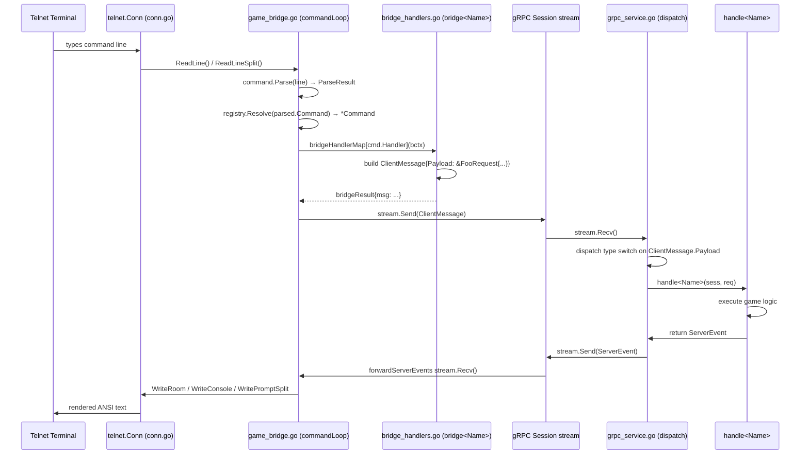
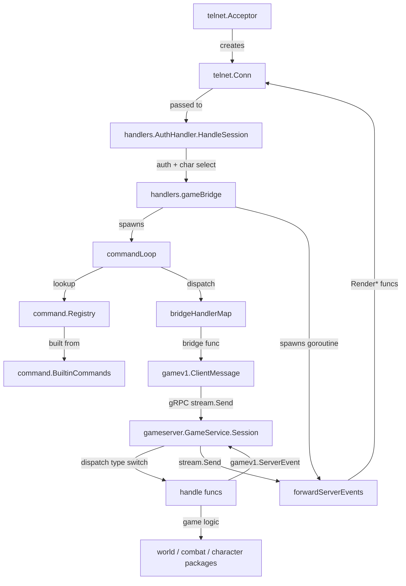

# Commands Architecture

**As of:** 2026-03-18 (commit: 881d9628fc6113f7182987ff87338f059088424d)
**Skill:** `.claude/skills/mud-commands.md`
**Requirements:** `docs/requirements/NETWORKING.md`, `docs/requirements/ARCHITECTURE.md`

## Overview

Player commands flow through a three-layer pipeline: a frontend telnet layer that reads raw input lines, a bridge dispatch layer that translates command strings into proto messages, and a gameserver gRPC layer that routes messages to game-logic handlers.

The command registry (`internal/game/command`) is the canonical list of every player-invocable action. Each entry carries a `Handler` string that acts as the key into the frontend bridge dispatch map and, by convention, corresponds to the proto `ClientMessage` oneof variant name. This single string ties the three layers together without any code generation dependency between them.

The gRPC `Session` stream is bidirectional and long-lived for the duration of a player session. The frontend sends `ClientMessage` frames upstream and receives `ServerEvent` frames downstream. A dedicated goroutine in the frontend (`forwardServerEvents`) processes incoming events concurrently with the command-reading loop, ensuring server-initiated events (time-of-day ticks, combat rounds, NPC broadcasts) are rendered without waiting for player input.

## Package Structure

| Package | Path | Role |
|---|---|---|
| `command` | `internal/game/command` | Handler constants, `Command` struct, `BuiltinCommands()`, `Registry`, `RegisterShortcuts()` |
| `handlers` | `internal/frontend/handlers` | `bridgeHandlerMap`, all `bridge<Name>` funcs, `gameBridge`, `commandLoop`, `forwardServerEvents`, prompt rendering |
| `telnet` | `internal/frontend/telnet` | `Acceptor`, `Conn` (ReadLine, WriteRoom, WriteConsole, InitScreen), NAWS, split-screen |
| `gameserver` | `internal/gameserver` | `GameService`, `Session` stream, `dispatch` type switch, all `handle<Name>` funcs |
| `gamev1` | `internal/gameserver/gamev1` | Generated proto types (`ClientMessage`, `ServerEvent` oneofs) |

## Core Data Structures

### `command.Command`
```go
type Command struct {
    Name     string   // canonical command name
    Aliases  []string // alternate invocation names
    Help     string   // short description for help output
    Category string   // movement | world | combat | communication | system | admin | character | hidden
    Handler  string   // key into bridgeHandlerMap; matches proto variant name
}
```

### `handlers.bridgeContext`
```go
type bridgeContext struct {
    reqID    string
    cmd      *command.Command
    parsed   command.ParseResult
    conn     *telnet.Conn
    charName string
    role     string
    stream   gamev1.GameService_SessionClient
    helpFn   func()
    promptFn func() string
}
```

### `handlers.bridgeResult`
```go
type bridgeResult struct {
    msg             *gamev1.ClientMessage
    done            bool
    quit            bool
    switchCharacter bool
}
```

### `gamev1.ClientMessage` (proto oneof)
One variant per command: `Move`, `Look`, `Exits`, `Say`, `Attack`, `SelectTech`, and ~60 others. Generated from `api/proto/game/v1/game.proto`.

### `gamev1.ServerEvent` (proto oneof)
One variant per response type: `RoomView`, `CombatEvent`, `CharacterSheet`, `ConditionEvent`, `HpUpdate`, `Disconnected`, and others. Generated from the same proto file.

## Primary Data Flow



### Unknown command fallback
If `registry.Resolve()` returns no match, `commandLoop` treats the input as a movement direction (custom exit name) and sends a `MoveRequest` directly, bypassing the bridge map entirely.

### Character switch
When `bridgeResult.switchCharacter` is true, `commandLoop` returns `ErrSwitchCharacter`. The `characterFlow` function in the acceptor handler catches this sentinel and loops back to character selection without disconnecting the telnet session.

## Component Dependencies



## Extension Points

Adding a new command requires ALL of the following steps. Omitting any step is a defect.

**CMD-1:** Add `HandlerFoo` constant to `internal/game/command/commands.go`

**CMD-2:** Add `Command{Handler: HandlerFoo, Name: "foo", Aliases: []string{"f"}, Help: "...", Category: CategoryXxx}` to `BuiltinCommands()` in the same file

**CMD-3:** Implement `HandleFoo(char, args) (string, error)` in `internal/game/command/foo.go` with full TDD coverage using property-based tests (SWENG-5, SWENG-5a)

**CMD-4:** Add `FooRequest` proto message to `api/proto/game/v1/game.proto` and add the variant to the `ClientMessage` oneof; run `make proto` to regenerate Go types

**CMD-5:** Add `bridgeFoo` func to `internal/frontend/handlers/bridge_handlers.go` and register it as `command.HandlerFoo: bridgeFoo` in `bridgeHandlerMap`; `TestAllCommandHandlersAreWired` MUST pass

**CMD-6:** Implement `handleFoo(sess *session, req *gamev1.FooRequest) *gamev1.ServerEvent` in `internal/gameserver/grpc_service.go` and add `case *gamev1.ClientMessage_Foo:` to the `dispatch` type switch

**CMD-7:** All steps complete; all tests pass (`make test`) before the command is considered done — a command registered in `BuiltinCommands()` but not wired end-to-end is a defect

## Known Constraints & Pitfalls

- **Incomplete wiring is a runtime failure.** A command in `BuiltinCommands()` with no `bridgeHandlerMap` entry produces the message "You don't know how to '...'" at runtime. `TestAllCommandHandlersAreWired` catches this before merge.
- **Silently dropped messages.** A bridge func that has no matching `case` in the `dispatch` type switch causes the gameserver to silently ignore the message with no error to the player.
- **`make proto` is required.** Editing `.proto` without running `make proto` leaves generated types stale; the build will fail with type-not-found errors.
- **`RegisterShortcuts` panics on collision.** Class feature shortcuts are registered at character-load time. Any name that matches an existing `Command.Name` or alias causes an immediate panic. Verify shortcut strings against `BuiltinCommands()` before adding them to a class feature definition.
- **Movement commands share one handler.** `north`, `south`, `east`, `west`, `up`, `down`, and their compass variants all use `HandlerMove`. The direction is carried in `parsed.Command` and forwarded as `MoveRequest.Direction`. The same handler also handles custom exit names through the unknown-command fallback path.
- **`CategoryHidden` commands are fully wired.** They appear in `BuiltinCommands()` and `bridgeHandlerMap` but are excluded from the `showGameHelp()` output by category filter. This is intentional for flow-control commands like `archetype_selection`.
- **`forwardServerEvents` runs concurrently.** The prompt and room region may be redrawn by the server-event goroutine at any time. All writes to `telnet.Conn` are serialized inside the `Conn` implementation; do not call `conn.Write*` methods from multiple goroutines without going through the provided methods.
- **Split-screen mode changes read/write paths.** `commandLoop` uses `ReadLineSplit` in split-screen mode (character-by-character echo at prompt row H) and `ReadLine` in scrolling mode. Bridge funcs must use `conn.WriteConsole` or `conn.WriteRoom` (not `conn.WriteLine`) when writing in split-screen mode; `game_bridge.go` handles this for bridge results that set `done: true`.

## Cross-References

- Requirements: `docs/requirements/NETWORKING.md`, `docs/requirements/ARCHITECTURE.md`
- Skill: `.claude/skills/mud-commands.md`
- Related architecture docs: `docs/architecture/overview.md`
