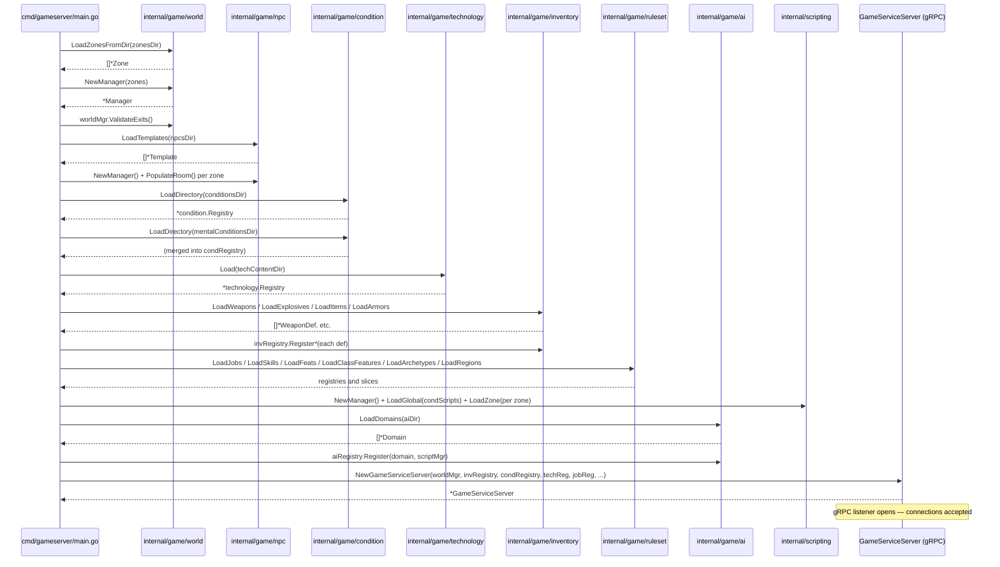
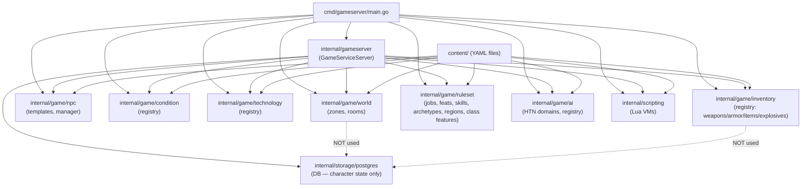

**As of:** 2026-03-18 (commit: 88d731d3663a40194307f56e9c659952e89d030f)

# Content Pipeline Architecture

## Overview

The content pipeline is the mechanism by which all static game data — zones, rooms, NPCs, weapons, armor, conditions, technologies, feats, jobs, skills, archetypes, and more — is loaded from YAML files on disk into in-memory registries at server startup. Once loaded, content is immutable for the lifetime of the process. The database (PostgreSQL) is never used to store or retrieve content; it is reserved exclusively for mutable character and session state.

All content loading is orchestrated in a single startup sequence in `cmd/gameserver/main.go` before the gRPC listener is opened. Any failure to load or validate content is treated as a fatal error, ensuring the server never starts in a partially-configured state.

---

## Responsibility Boundary

The content pipeline owns:

- Parsing and validating YAML content files from the `content/` directory tree.
- Populating typed, in-memory registries that are injected into game handlers.
- Cross-reference validation (e.g., ensuring NPC template IDs referenced by zone spawn configs actually exist).

The content pipeline delegates:

- Character state persistence to `internal/storage/postgres/`.
- Runtime mutation of game state (e.g., NPC instances, floor items) to `internal/game/npc/`, `internal/game/inventory/`, and `internal/gameserver/`.
- Script execution to `internal/scripting/`.

**Named packages:** `internal/game/world/`, `internal/game/inventory/`, `internal/game/ruleset/`, `internal/game/condition/`, `internal/game/technology/`, `internal/game/npc/`, `internal/game/ai/`.

---

## Key Files

| File | Description |
|------|-------------|
| `/home/cjohannsen/src/mud/cmd/gameserver/main.go` | Orchestrates all content loading at startup; injects registries into `GameServiceServer`. |
| `/home/cjohannsen/src/mud/internal/game/world/loader.go` | `LoadZonesFromDir`, `LoadZoneFromFile`, `LoadZoneFromBytes`; validates cross-zone exits. |
| `/home/cjohannsen/src/mud/internal/game/world/manager.go` | `Manager` struct holds all zones/rooms; provides `GetRoom`, `Navigate`, `AllZones`. |
| `/home/cjohannsen/src/mud/internal/game/inventory/registry.go` | Unified `Registry` for weapons, explosives, items, and armor with duplicate-ID detection. |
| `/home/cjohannsen/src/mud/internal/game/ruleset/feat.go` | `LoadFeats` and `FeatRegistry`; sibling files contain loaders for skills, jobs, archetypes, regions, class features. |
| `/home/cjohannsen/src/mud/internal/game/condition/definition.go` | `LoadDirectory` returns a `*Registry` of `ConditionDef` values. |
| `/home/cjohannsen/src/mud/internal/game/technology/registry.go` | `Load(dir)` returns a `*Registry` with tradition/usage-type query methods. |
| `/home/cjohannsen/src/mud/internal/game/npc/template.go` | `LoadTemplates(dir)` returns `[]*Template`; NPC instances are spawned into `npc.Manager` after load. |
| `/home/cjohannsen/src/mud/content/` | Root of all YAML content files. |

---

## Content Types

The following content types are loaded at startup. All are read from the `content/` directory tree:

| Type | Directory/File | Registry/Container |
|------|---------------|-------------------|
| Zones & Rooms | `content/zones/` | `world.Manager` |
| NPC Templates | `content/npcs/` | `map[string]*npc.Template` + `npc.Manager` |
| Conditions | `content/conditions/` (incl. `mental/`) | `condition.Registry` |
| Weapons | `content/weapons/` | `inventory.Registry` |
| Explosives | `content/explosives/` | `inventory.Registry` |
| Items | `content/items/` | `inventory.Registry` |
| Armor | `content/armor/` | `inventory.Registry` |
| Jobs | `content/jobs/` | `ruleset.JobRegistry` |
| Skills | `content/skills.yaml` | `[]*ruleset.Skill` slice |
| Feats | `content/feats.yaml` | `ruleset.FeatRegistry` |
| Class Features | `content/class_features.yaml` | `ruleset.ClassFeatureRegistry` |
| Archetypes | `content/archetypes/` | `map[string]*ruleset.Archetype` |
| Regions | `content/regions/` | `map[string]*ruleset.Region` |
| Technologies | `content/technologies/` | `technology.Registry` |
| AI Domains | `content/ai/` | `ai.Registry` |
| XP Config | `content/xp_config.yaml` | `xp.Config` |
| Loadouts | `content/loadouts/` | passed as directory path to `GameServiceServer` |
| Scripts | `content/scripts/` | `scripting.Manager` (Lua VMs) |
| Teams | `content/teams/` | exists in content/ and ruleset package but not wired into startup sequence |

---

## Core Data Structures

### `world.Zone` and `world.Room`

Zone is the primary structural content type, containing a map of rooms, each with exits, spawn configurations, and skill-check triggers.

```go
type Zone struct {
    ID                     string
    Name                   string
    Description            string
    StartRoom              string
    Rooms                  map[string]*Room   // keyed by room ID
    ScriptDir              string             // path to zone Lua scripts
    ScriptInstructionLimit int
}

type Room struct {
    ID          string
    ZoneID      string
    Title       string
    Description string
    Exits       []Exit
    Properties  map[string]string
    Spawns      []RoomSpawnConfig
    Equipment   []RoomEquipmentConfig
    MapX, MapY  int
    SkillChecks []skillcheck.TriggerDef
    Effects     []RoomEffect
    Terrain     string
}
```

### `inventory.WeaponDef`

A flat content definition with validation:

```go
type WeaponDef struct {
    ID                  string
    Name                string
    DamageDice          string
    DamageType          string
    Kind                WeaponKind       // one_handed, two_handed, shield, ...
    Group               string
    FiringModes         []FiringMode     // single, burst, automatic
    Traits              []string
    MagazineCapacity    int
    ReloadActions       int
    RangeIncrement      int
    ProficiencyCategory string
    TeamAffinity        string
    CrossTeamEffect     *CrossTeamEffect // nil = no side effect
}
```

---

## Primary Data Flow



---

## Package Dependency Diagram



---

## Invariants & Contracts

- **PIPE-INV-1:** Content MUST be immutable at runtime. Registries expose only read methods after startup. No registry method writes to disk or DB.
- **PIPE-INV-2:** All content MUST be fully loaded before the gRPC listener starts. Any load or validation error calls `logger.Fatal`, preventing partial startup.
- **PIPE-INV-3:** Every content cross-reference (NPC template IDs in zone spawn configs, exit target room IDs) MUST resolve to a known entity. Missing references are startup failures.
- **PIPE-INV-4:** Cross-zone exit targets MUST resolve to known room IDs. `worldMgr.ValidateExits()` enforces this after all zones are loaded.
- **PIPE-INV-5:** Content IDs MUST be unique within their type. Duplicate registration returns an error that triggers `logger.Fatal`.
- **PIPE-INV-6:** The DB is used exclusively for mutable character/session state. Content registries are never queried from or written to Postgres.

---

## Extension Points

To add a new content type:

1. Create a Go model file in `internal/game/<domain>/` defining the struct and a `Validate() error` method.
2. Add a `Load<Type>(path string) ([]*<Type>, error)` or `LoadFromDir(dir string) (*Registry, error)` function in the same package, reading `.yaml` files with `gopkg.in/yaml.v3`.
3. Define a `Registry` struct with `Register(*T) error`, `Get(id string) (*T, bool)`, and `All() []*T` methods.
4. Add a CLI flag in `cmd/gameserver/main.go` pointing to the content directory (e.g., `--foo-dir content/foo`).
5. Call the loader in `main.go`, wire `logger.Fatal` on error, and inject the registry into `NewGameServiceServer` and any handlers that need it.
6. Create YAML files under `content/<type>/`.
7. Write property-based tests covering parsing, validation, duplicate-ID rejection, and lookup (per SWENG-5, SWENG-5a).

---

## Common Pitfalls

- **Skipping `ValidateExits()`** after adding cross-zone exit references. Navigation will silently fail at runtime for the affected rooms.
- **Not injecting the registry** into `GameServiceServer` or a handler. This compiles successfully but causes a nil-pointer panic at the first runtime use.
- **Using a bare `map[string]*T`** instead of a `Registry` type. This skips duplicate-ID detection; duplicate IDs silently overwrite earlier entries.
- **Mutating a content definition struct** at runtime (e.g., `weaponDef.DamageDice = "..."` inside a handler). This violates PIPE-INV-1 and causes data races.
- **Placing content YAML in an unexpected sub-directory** that does not match the CLI flag default path. The file is silently ignored (empty directories produce zero items without error for most loaders).
- **Omitting `Validate()` in the loader.** Invalid field values (e.g., an unknown `FiringMode`) reach the registry and only fail at the first runtime use.
- **`content/teams/` is not wired into the startup sequence.** `LoadTeams` exists in `internal/game/ruleset/team.go` but is not called from `main.go`. Team definitions (`gun.yaml`, `machete.yaml`) are present on disk but are not loaded at runtime.

---

## Cross-References

- `docs/requirements/WORLD.md` — world and zone design requirements.
- `docs/requirements/CHARACTERS.md` — character creation requirements referencing jobs, archetypes, feats, skills.
- `docs/requirements/FEATURES.md` — class features and technology content requirements.
- `docs/requirements/COMBAT.md` — weapon and condition content used in combat.
- `docs/requirements/AI.md` — HTN AI domain content requirements.
- `docs/requirements/SCRIPTING.md` — Lua script loading as part of startup.
