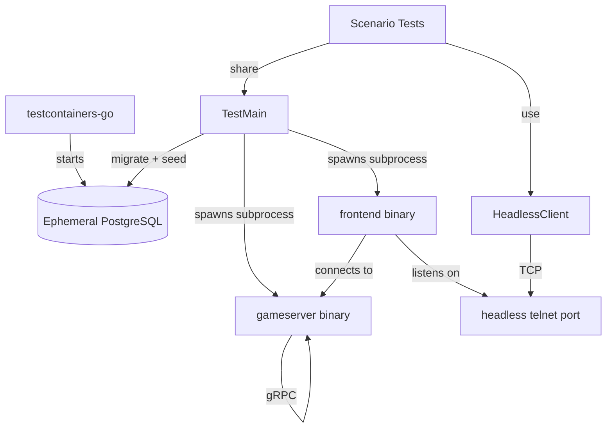

# E2E Test Suite Architecture

## Overview

The end-to-end test suite exercises the full game stack through the headless telnet port.
All test files live in `internal/e2e/` as a single flat package (`package e2e_test`) so
they can share a common `TestMain` lifecycle manager.

Go does not support a `TestMain` in a parent package governing tests in a child package,
so all scenario files must reside in the same directory as `suite_test.go`.

## Component Diagram

## Components

### TestMain (`suite_test.go`)

Orchestrates the full lifecycle:

1. Starts an ephemeral PostgreSQL container via testcontainers-go.
2. Allocates free TCP ports for gRPC, telnet, and headless.
3. Renders a config template with the ephemeral DB coordinates and port assignments.
4. Builds `gameserver`, `frontend`, `migrate`, and `seed-claude-accounts` binaries.
5. Applies database migrations.
6. Starts `gameserver` and `frontend` subprocesses; polls until their ports accept.
7. Seeds `claude_player` and `claude_editor` test accounts.
8. Runs all scenario tests via `m.Run()`.
9. Prints a timing summary table on exit.

Subprocesses are stopped with SIGTERM followed by a 5-second grace period and SIGKILL.

### HeadlessClient (`client.go`)

A thin TCP client for the headless telnet port. Provides:

- `Send(cmd)` — writes a command line terminated with CRLF.
- `Expect(pattern, timeout)` — reads lines until a substring match is found.
- `ExpectRegex(pattern, timeout)` — reads lines until a regexp match is found.
- `ExpectRegexReturn(pattern, timeout)` — like `ExpectRegex` but returns the matched line.
- `ReadLine(timeout)` — reads a single line.
- `Close()` — closes the TCP connection.

### Scenario Tests

Each scenario file exercises one feature domain:

| File | Domain |
|------|---------|
| `scenarios_auth_test.go` | Authentication and login flows |
| `scenarios_character_test.go` | Character creation and selection |
| `scenarios_navigation_test.go` | Movement, exits, locked exits |
| `scenarios_combat_test.go` | Combat initiation, actions, loot |
| `scenarios_inventory_test.go` | Item grant, get, drop, equip, inspect |
| `scenarios_npc_test.go` | Merchant browse, buy, sell |
| `scenarios_crafting_test.go` | Downtime queue, craft list |
| `scenarios_hotbar_test.go` | Hotbar slot management |
| `scenarios_editor_test.go` | Editor-only commands |

### Test Helpers (`helpers_test.go`)

Shared setup functions:

- `NewClientForTest` — dials headless port; registers `Close` on `t.Cleanup`.
- `loginAs` — authenticates with `testpass123`; waits for post-login prompt.
- `loginAsRaw` — sends credentials without waiting for the final prompt (used by auth failure tests).
- `selectCharacter` — parses the character list to find the line number for a named character and sends it.
- `createCharacter` — uses the editor session to create a character via `spawn_char`.
- `deleteCharacter` — non-fatal cleanup via `delete_char`.
- `enterGame` — combines `loginAs` + `selectCharacter` for a player session.
