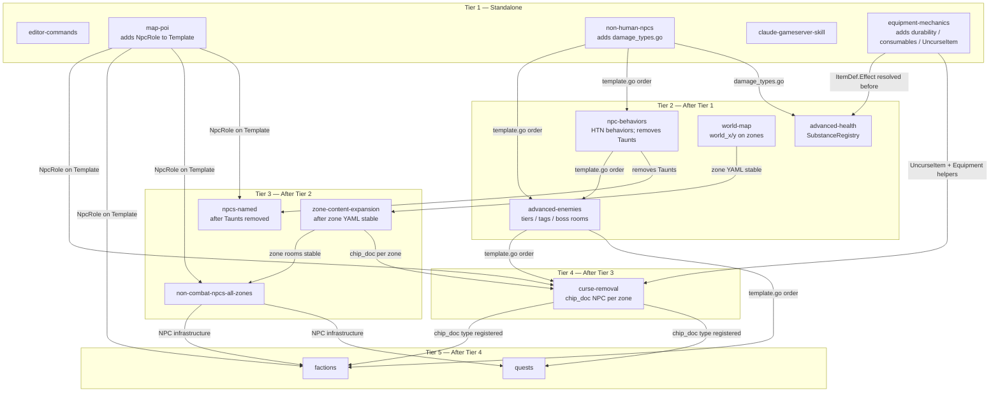

# Feature Dependency Graph

**Last updated:** 2026-03-22

This document captures the cross-feature dependency graph for all planned features,
the implementation tier ordering, and the concrete conflicts that must be resolved
before features in later tiers can be implemented. It is the authoritative reference
for scheduling implementation work.

---

## Tier Summary

| Tier | Features | Constraint |
|------|----------|------------|
| 1 | editor-commands, map-poi, non-human-npcs, claude-gameserver-skill, equipment-mechanics | No new dependencies — implement in any order or in parallel |
| 2 | advanced-health, advanced-enemies, npc-behaviors, world-map | Depend on Tier 1 outputs or must precede Tier 3 zone YAML work |
| 3 | non-combat-npcs-all-zones, npcs-named, zone-content-expansion | Depend on Tier 2 completions |
| 4 | curse-removal | Depends on equipment-mechanics + zone-content-expansion |
| 5 | quests, factions | Depend on Tier 4 completions + stable NPC/zone infrastructure |

---

## Dependency Graph (Mermaid)



---

## Resolved Conflicts

The following 7 conflicts were identified during cross-plan dependency analysis
(2026-03-22) and have been resolved in the respective plan documents.

### Conflict 1 — `MapTile` proto field 8 collision ✅ Resolved

**Plans affected:** `map-poi`, `advanced-enemies`

**Problem:** Both plans originally assigned field number 8 to `MapTile`:
- `map-poi` adds `repeated string pois = 8`
- `advanced-enemies` adds `bool boss_room = 8`

**Resolution:** `advanced-enemies` plan updated to use `bool boss_room = 9`.
Field 8 is reserved for `pois` (map-poi).

---

### Conflict 2 — DB migration number collision ✅ Resolved

**Plans affected:** `equipment-mechanics`, `quests`, `factions`

**Problem:** All three plans originally claimed migration `035`.

**Resolution:**
| Feature | Migrations |
|---------|-----------|
| equipment-mechanics | 035, 036, 037 (unchanged) |
| quests | 038, 039 |
| factions | 040, 041 |

---

### Conflict 3 — `ItemDef.Effect` type collision ✅ Resolved

**Plans affected:** `equipment-mechanics`, `advanced-health`

**Problem:**
- `equipment-mechanics` adds `Effect *ConsumableEffect` to `ItemDef`
- `advanced-health` adds `Effect string` (substance ID) to `ItemDef`
  Same field name, incompatible types.

**Resolution:** `advanced-health` plan updated — the substance ID field is
renamed to `SubstanceID string` (YAML key: `substance_id`). The two fields
coexist on `ItemDef` without collision.

---

### Conflict 4 — `npc-behaviors` removes `Taunts`; `npcs-named` depends on them ✅ Resolved

**Plans affected:** `npc-behaviors`, `npcs-named`

**Problem:** `npc-behaviors` removes `Taunts`/`TauntChance`/`TauntCooldown`
from `npc.Template` and `npc.Instance`. `npcs-named` originally tested for
`tmpl.Taunts` and included static `taunts:` YAML fields.

**Resolution:**
- `npcs-named` must be implemented **after** `npc-behaviors`.
- `npcs-named` plan updated: static taunts replaced with HTN `schedule:`
  entries using `operator: say`.

---

### Conflict 5 — Zone YAML edit ordering ✅ Resolved

**Plans affected:** `world-map`, `zone-content-expansion`

**Problem:** Both plans modify all 16 zone YAML files in `content/zones/`.
`world-map` adds `world_x`/`world_y`; `zone-content-expansion` adds rooms
and danger levels.

**Resolution:** `zone-content-expansion` must be implemented **after** `world-map`.
The plan includes a prerequisite check: verify `world_x` and `world_y` are
present in each zone YAML before proceeding.

---

### Conflict 6 — `PlayerSession` struct serialization ✅ Resolved

**Plans affected:** `advanced-health`, `quests`, `factions`

**Problem:** All three plans add new fields to `internal/game/session/manager.go`
and cannot be implemented in parallel without merge conflicts.

**Resolution:** All three plans updated with a serialization constraint note.
Implement in sequence: **advanced-health → quests → factions** (or any serial
order within Tier 2–5 that respects other tier constraints).

---

### Conflict 7 — `npc/template.go` hot zone ordering ✅ Resolved

**Plans affected:** map-poi, non-human-npcs, npc-behaviors, advanced-enemies, factions, curse-removal

**Problem:** Six features modify `internal/game/npc/template.go`.
`npc-behaviors` removes fields that `npcs-named` depends on.

**Resolution:** All six plans updated with an explicit implementation order note:

```
map-poi → non-human-npcs → npc-behaviors → advanced-enemies → factions → curse-removal
```

---

## Hot-Zone Files

These files are modified by **5 or more** features and must be touched
**one feature at a time** in tier order:

| File | Modified by |
|------|-------------|
| `internal/game/npc/template.go` | map-poi, non-human-npcs, npc-behaviors, advanced-enemies, factions, curse-removal |
| `internal/game/npc/instance.go` | map-poi, non-human-npcs, npc-behaviors, advanced-enemies, factions |
| `internal/gameserver/grpc_service.go` | editor-commands, map-poi, non-human-npcs, npc-behaviors, advanced-enemies, world-map, quests, factions, curse-removal |
| `internal/gameserver/combat_handler.go` | non-human-npcs, npc-behaviors, advanced-enemies, quests, factions |
| `internal/game/session/manager.go` | advanced-health, quests, factions |
| `internal/game/world/model.go` | advanced-enemies, world-map, factions |
| `internal/gameserver/deps.go` | quests, factions |
| `content/zones/*.yaml` (all 16) | world-map, zone-content-expansion |

---

## Implementation Sequencing Notes

### Tier 1 — Parallelizable
All Tier 1 features may be implemented in parallel. However, if implemented
sequentially: map-poi should go first (establishes `NpcRole` on Template which
is referenced in YAML content for later features).

### PlayerSession (Tier 2–5 — serialize strictly)
`advanced-health`, `quests`, and `factions` all modify `PlayerSession`. These
three features **must not** be implemented in parallel. Recommended order:
1. `advanced-health` (Tier 2)
2. `quests` (Tier 5)
3. `factions` (Tier 5)

### proto regeneration
Multiple features require proto regeneration (`make proto`):
- map-poi: `repeated string pois = 8` on `MapTile`
- advanced-enemies: `bool boss_room = 9` on `MapTile`; `BossAbility` messages
- world-map: `WorldZoneTile`, `TravelRequest`, `MapRequest.view`, `MapResponse.world_tiles`
- editor-commands: 6 new message types (fields 106–111)
- factions: 4 new message types
- curse-removal: `UncurseRequest` message

Each proto regeneration is non-breaking if field numbers don't collide.
Proto changes from different features **must** be merged before the next
`make proto` run to avoid field number drift.
