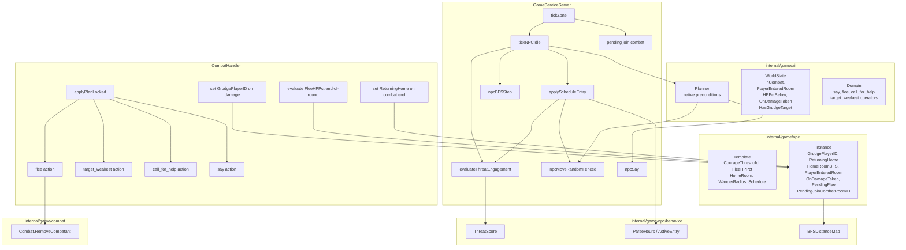

# NPC Behaviors Architecture

## Overview

The NPC behavior system provides HTN-based AI with threat assessment, schedule-driven patrol,
flee/call_for_help/target_weakest combat operators, wander-radius fencing, and home-room return.

## Component Relationships

## Data Flow

### Idle Tick (non-combat NPC)

1. `tickZone` calls `tickNPCIdle` for each non-combat NPC.
2. If `ReturningHome`, one BFS step toward `HomeRoomID` is taken and the tick returns.
3. Schedule evaluation: if the current game hour matches a schedule entry, `applyScheduleEntry` runs the behavior mode (idle/patrol/aggressive) and returns.
4. Threat assessment: hostile NPCs evaluate `ThreatScore` vs `CourageThreshold` to decide whether to initiate combat.
5. HTN planner runs with `WorldState` populated from NPC instance flags (`PlayerEnteredRoom`, `OnDamageTaken`, `GrudgePlayerID`).
6. Actions dispatched: `say`, `move_random` (fenced), `pass`.
7. One-shot flags (`PlayerEnteredRoom`, `OnDamageTaken`) cleared.

### Combat Round

1. `resolveAndAdvanceLocked` runs `ResolveRound` and fires `targetUpdater` as HP changes.
2. After round: scan events to set `GrudgePlayerID` and `OnDamageTaken` for NPCs hit by players.
3. Evaluate `FleeHPPct`: set `PendingFlee` if HP% < threshold.
4. `autoQueueNPCsLocked` calls `applyPlanLocked` for each living NPC.
5. `applyPlanLocked` checks `PendingFlee` first (inserts flee action), then processes the HTN plan.
6. On combat end: set `ReturningHome=true` for surviving NPCs away from home; clear `GrudgePlayerID`.

### Operator Implementations

| Operator | Location | Behavior |
|---|---|---|
| `say` | `grpc_service.go` (idle), `combat_handler.go` (combat) | Picks random string; enforces cooldown |
| `flee` | `combat_handler.go` applyPlanLocked | Removes NPC from combat, moves to random exit |
| `target_weakest` | `combat_handler.go` applyPlanLocked | Queues attack against lowest HP% player |
| `call_for_help` | `combat_handler.go` applyPlanLocked | Recruits adjacent idle hostile NPCs once per combat |
| `move_random` | `grpc_service.go` idle tick | Random exit walk, fenced by `WanderRadius` |

## Key Requirements

- REQ-NB-7: Threat assessment drives combat initiation.
- REQ-NB-10: `CourageThreshold` defaults to 999 (always engage).
- REQ-NB-12/13: `GrudgePlayerID` tracks last attacker; `OnDamageTaken` is a one-shot flag.
- REQ-NB-14: `FleeHPPct` triggers flee when HP% crosses threshold.
- REQ-NB-25–35: Flee, target_weakest, call_for_help operators with defined preconditions and side effects.
- REQ-NB-38–40: BFS distance map drives wander-radius fencing and home-room return.
- REQ-NB-41–44: `ReturningHome` drives step-by-step navigation back to `HomeRoomID`.
