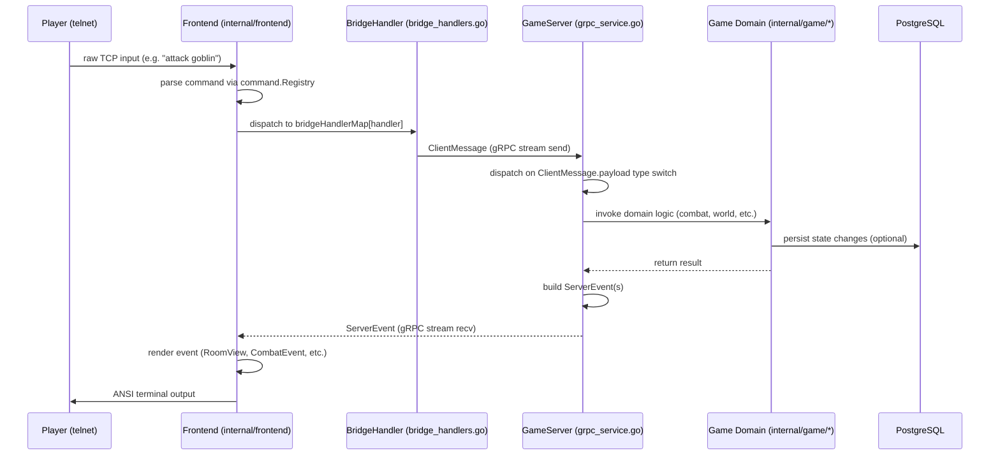
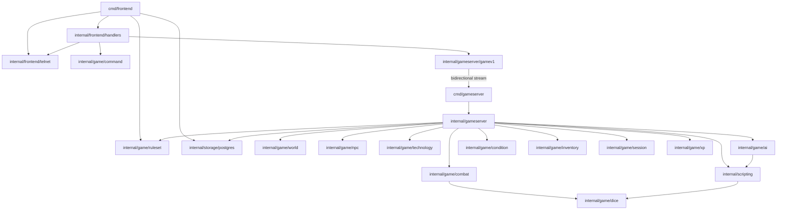

# System Architecture

**As of:** 2026-03-18 (commit: d1467887f360acb30142c0c25778a035fcb3384a)
**Skill:** `.claude/skills/mud-overview.md`
**Requirements:** docs/requirements/OVERVIEW.md, docs/requirements/FEATURES.md, docs/requirements/ARCHITECTURE.md

## Overview

Gunchete is a text-based multi-user dungeon (MUD) set in a sci-fi post-collapse Portland. The system is implemented as two cooperating Go binaries. The frontend binary (`cmd/frontend`) is a telnet server that accepts raw TCP connections from players, manages account authentication and character selection against PostgreSQL, and then enters a persistent bidirectional gRPC stream with the gameserver for the duration of each play session. The gameserver binary (`cmd/gameserver`) owns all game state: world navigation, NPC management, PF2E-derived combat, technology (the setting's term for spells/powers), inventory, conditions, and XP progression.

The two binaries communicate exclusively over gRPC using a single `Session` RPC that is a bidirectional streaming method. The client (frontend) sends `ClientMessage` frames containing one of ~80 typed request payloads; the server responds with `ServerEvent` frames containing one of ~25 typed event payloads. This proto oneof design means the wire protocol is self-describing and adding a new command always requires a new proto message type on both sides of the oneof.

All game content — zones, rooms, NPCs, weapons, armor, items, conditions, feats, class features, skills, archetypes, regions, jobs, technologies, loadouts, AI domains, and Lua scripts — is loaded from YAML files under `content/` at startup into typed in-memory registries. There is no runtime content hot-reload. Character state (HP, location, inventory, equipment, skills, feats, tech slots, XP) is persisted in PostgreSQL via repository interfaces in `internal/storage/postgres/`.

## Package Structure

| Package | Description |
|---|---|
| `cmd/frontend` | Telnet server entrypoint: config, content loading, auth wiring, telnet lifecycle |
| `cmd/gameserver` | gRPC server entrypoint: world loading, manager wiring, gRPC lifecycle |
| `cmd/migrate` | SQL schema migration runner |
| `cmd/import-content` | PF2E data importer (one-shot content pipeline) |
| `cmd/setrole` | Admin utility to set account role in database |
| `internal/config` | YAML config loader (`Config`, `DatabaseConfig`, `TelnetConfig`, `GameServerConfig`) |
| `internal/observability` | Zap logger factory |
| `internal/server` | `Lifecycle` manager — starts/stops named services in order, handles OS signals |
| `internal/frontend/telnet` | `Acceptor`, `Conn`: raw telnet TCP accept loop, ANSI/color utilities, split-screen control |
| `internal/frontend/handlers` | `AuthHandler` (login/char-select), `GameBridge` (command loop), `bridgeHandlerMap`, `TextRenderer` |
| `internal/gameserver` | `GameServiceServer` gRPC impl; sub-handlers: `WorldHandler`, `ChatHandler`, `CombatHandler`, `NPCHandler`, `ActionHandler`, `RegenManager`, `ZoneTickManager`, `GameClock` |
| `internal/gameserver/gamev1` | Generated gRPC stubs and proto types (do not edit manually — run `make proto`) |
| `internal/game/ai` | HTN planner (`Planner`), domain `Registry`, `ZoneTickManager` |
| `internal/game/character` | `Character` struct, `AbilityScores`, derived stat helpers |
| `internal/game/combat` | `Engine`: initiative, action points, attack resolution, MAP, death/unconscious logic |
| `internal/game/command` | `Registry`, `BuiltinCommands()`, `Handler*` constants, `RegisterShortcuts` |
| `internal/game/condition` | `Registry`, condition `Definition`, condition application/expiry logic |
| `internal/game/dice` | `CryptoSource`, `LoggedRoller`, dice expression parser |
| `internal/game/inventory` | `Registry`, `FloorManager`, `RoomEquipmentManager`, weapon/armor/item loaders |
| `internal/game/mentalstate` | Mental condition state manager (fear, confusion, etc.) |
| `internal/game/npc` | `Template` loader, `Manager` (live instances), `RespawnManager` |
| `internal/game/ruleset` | YAML loaders and registries for regions, teams, jobs, archetypes, skills, feats, class features |
| `internal/game/session` | `Manager`: active player session map, `PlayerSession` struct |
| `internal/game/skillcheck` | PF2E skill check resolution helpers |
| `internal/game/technology` | `Registry`, technology `Definition`, effect types; slot assignment in `internal/gameserver` |
| `internal/game/world` | `Zone`, `Room`, `Exit`, `Manager`: room lookup, exit validation, automap |
| `internal/game/xp` | `Service`, `XPConfig` loader, skill-increase persistence |
| `internal/scripting` | Lua sandbox `Manager`: per-zone and `__global__` VMs, callbacks (QueryRoom, GetEntityRoom, etc.) |
| `internal/storage/postgres` | Repository implementations: accounts, characters, skills, feats, class features, proficiencies, tech slots (hardwired/prepared/spontaneous/innate), automap, progress, inventory, equipment |
| `internal/importer` | PF2E content import pipeline (one-shot, not runtime) |

## Core Data Structures

**Proto messages (wire layer):**
- `ClientMessage` — oneof wrapping ~80 typed request messages (move, attack, equip, cast tech, etc.)
- `ServerEvent` — oneof wrapping ~25 typed event messages (RoomView, CombatEvent, CharacterSheetView, etc.)
- `RoomView` — room title, description, exits, NPC list, floor items, room equipment, time of day
- `CharacterSheetView` — full character snapshot: abilities, HP, AC, saves, skills, feats, class features, tech slots, XP
- `CombatEvent` — single combat narration beat: attacker, target, roll, outcome, damage, narrative

**Game domain types:**
- `character.Character` — ability scores, HP, level, location, equipment, inventory, currency, hero points
- `combat.Combat` — per-room active combat: combatant list, initiative order, action points, round counter
- `npc.Instance` — live NPC with HP, conditions, room placement, AI state
- `session.PlayerSession` — per-connection state: character snapshot, room ID, automap cache, combat flags
- `ruleset.Archetype`, `ruleset.Job`, `ruleset.ClassFeature`, `ruleset.Feat`, `ruleset.Skill` — content definition types
- `technology.Definition` — tech name, level, casting type (hardwired/prepared/spontaneous/innate), effect list
- `world.Zone` / `world.Room` — spatial graph nodes; rooms have exits, spawns, equipment slots, optional script dir
- `ai.Domain` — HTN task domain: compound tasks (decompose via Lua preconditions), primitive tasks (produce NPC actions)

## Primary Data Flow

## Component Dependencies

## Extension Points

- **New player command**: follow CMD-1 through CMD-7 in `.claude/rules/AGENTS.md`. Add `Handler*` constant, `BuiltinCommands()` entry, `Handle*` function, proto message in `ClientMessage` oneof, bridge handler function in `bridgeHandlerMap`, and `handle*` case in `grpc_service.go` dispatch switch.
- **New content type**: add YAML schema in `content/`, write a loader in the appropriate `internal/game/*` package, wire into the gameserver startup in `cmd/gameserver/main.go`, and pass the registry to `GameServiceServer`.
- **New Lua scripting hook**: add a callback field to `scripting.Manager`, wire it in `cmd/gameserver/main.go`, and expose it to Lua via a new registered function in the sandbox.
- **New HTN AI task**: add a compound or primitive task to a domain YAML file under `content/ai/`, with optional Lua precondition scripts in `content/scripts/ai/`.
- **New technology effect type**: define the effect type in `internal/game/technology`, handle it in `internal/gameserver/tech_effect_resolver.go`.

## Known Constraints & Pitfalls

- NEVER use DECSTBM (scroll region) telnet sequences — causes coordinate offset bugs in TinTin++ due to DECOM mode. Use the explicit row-addressed write functions in `screen.go` instead.
- The split-screen UI uses fixed row assignments: room region rows 1–8, divider row 9, console rows 10+, prompt row H (terminal height). Any resize handling must re-render via `RenderRoomView(rv, width)` using the stored `*gamev1.RoomView`, not a rendered string.
- `RenderRoomView` and `RenderCharacterSheet` both require a `width int` parameter for terminal-width-aware wrapping and layout.
- DB password must come from `.claude/rules/.env` only — never hardcode or read from memory.
- Kubernetes namespace is `mud`, not `default`. Helm release name is `mud`. Use `make k8s-redeploy` for all deploys.
- The command registry is built after class features are loaded (in `cmd/gameserver/main.go`) because `RegisterShortcuts` adds shortcut aliases from class feature `ActivateText`. Order matters.
- Proto regeneration (`make proto`) must be run after any change to `api/proto/game/v1/game.proto` before building.
- Postgres tests require Docker (testcontainers). Run `make test-fast` for the non-Docker suite, `make test-postgres` for the Docker suite.
- NEVER skip test hooks or commit with failing tests (SWENG-6).

## Cross-References

- [docs/requirements/OVERVIEW.md](../requirements/OVERVIEW.md) — high-level product vision and setting
- [docs/requirements/FEATURES.md](../requirements/FEATURES.md) — feature sub-project tracking with requirement identifiers
- [docs/requirements/ARCHITECTURE.md](../requirements/ARCHITECTURE.md) — architectural decisions and constraints
- [docs/requirements/CHARACTERS.md](../requirements/CHARACTERS.md) — character creation and progression requirements
- [docs/requirements/COMBAT.md](../requirements/COMBAT.md) — PF2E combat engine requirements
- [docs/requirements/WORLD.md](../requirements/WORLD.md) — world, zone, and room requirements
- [docs/requirements/PERSISTENCE.md](../requirements/PERSISTENCE.md) — database persistence requirements
- [docs/requirements/NETWORKING.md](../requirements/NETWORKING.md) — telnet and gRPC networking requirements
- [docs/requirements/AI.md](../requirements/AI.md) — HTN AI planner and NPC lifecycle requirements
- [docs/requirements/SCRIPTING.md](../requirements/SCRIPTING.md) — Lua scripting sandbox requirements
- [docs/requirements/FEATS.md](../requirements/FEATS.md) — feat system requirements
- [docs/requirements/SOCIAL.md](../requirements/SOCIAL.md) — social features (groups, chat) requirements
- [docs/requirements/SETTING.md](../requirements/SETTING.md) — Gunchete setting and lore requirements
- [docs/requirements/DEPLOYMENT.md](../requirements/DEPLOYMENT.md) — deployment and infrastructure requirements
- [docs/requirements/ADMIN.md](../requirements/ADMIN.md) — admin command requirements
- [docs/requirements/pf2e-import-reference.md](../requirements/pf2e-import-reference.md) — PF2E rule import reference
