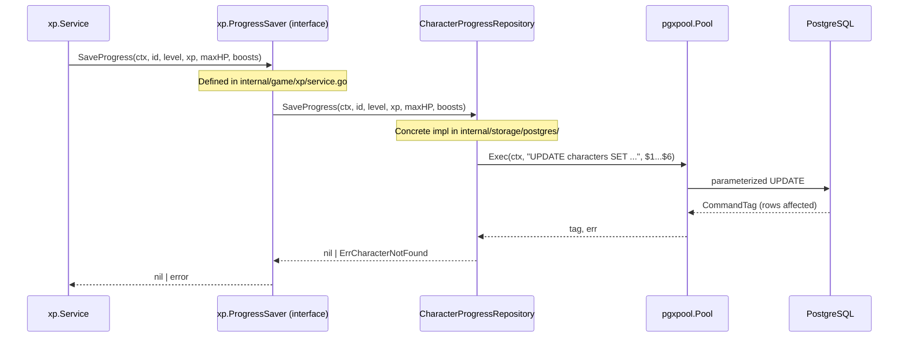

# Persistence Architecture

**As of:** 2026-03-18 (commit: 525d1823035a157f2de7f516f2fa087983e9833b)

## Overview

The MUD persistence layer uses the **Repository Pattern** with a strict separation of
concerns: interfaces are defined in game domain packages (`internal/game/`),
implementations live in `internal/storage/postgres/`, and schema changes are managed
through numbered SQL migration files in `migrations/`.

The database driver is **pgx v5** via a connection pool (`pgxpool.Pool`). All SQL uses
parameterized placeholders — no string interpolation.

Cross-reference: `docs/requirements/PERSISTENCE.md`

---

## Component Diagram

```mermaid
graph TD
    subgraph "Game Domain (internal/game/)"
        XP["xp.ProgressSaver<br/>xp.SkillIncreaseSaver<br/>(interfaces)"]
    end

    subgraph "Postgres Implementations (internal/storage/postgres/)"
        POOL["Pool<br/>(pgxpool.Pool)"]
        ACCT["AccountRepository"]
        CHAR["CharacterRepository"]
        PROG["CharacterProgressRepository"]
        FEAT["CharacterFeatsRepository"]
        SKILL["CharacterSkillsRepository"]
        PROF["CharacterProficienciesRepository"]
        CF["CharacterClassFeaturesRepository"]
        FC["CharacterFeatureChoicesRepo"]
        AB["CharacterAbilityBoostsRepository"]
        HW["CharacterHardwiredTechRepository"]
        PREP["CharacterPreparedTechRepository"]
        SPON["CharacterSpontaneousTechRepository"]
        SUP["CharacterSpontaneousUsePoolRepository"]
        INN["CharacterInnateTechRepository"]
        AMAP["AutomapRepository"]
    end

    subgraph "Database"
        PG[(PostgreSQL)]
        MIG["migrations/<br/>058 files<br/>(029 numbered)"]
    end

    subgraph "Migration Runner"
        MIGRATE["cmd/migrate/main.go<br/>(golang-migrate)"]
    end

    XP -->|"satisfied by"| PROG

    POOL --> ACCT
    POOL --> CHAR
    POOL --> PROG
    POOL --> FEAT
    POOL --> SKILL
    POOL --> PROF
    POOL --> CF
    POOL --> FC
    POOL --> AB
    POOL --> HW
    POOL --> PREP
    POOL --> SPON
    POOL --> SUP
    POOL --> INN
    POOL --> AMAP

    ACCT --> PG
    CHAR --> PG
    PROG --> PG
    FEAT --> PG
    SKILL --> PG
    PROF --> PG
    CF --> PG
    FC --> PG
    AB --> PG
    HW --> PG
    PREP --> PG
    SPON --> PG
    SUP --> PG
    INN --> PG
    AMAP --> PG

    MIG -->|"applied by"| MIGRATE
    MIGRATE --> PG
```

---

## Request Sequence: Saving Character Progress

---

## Migration Strategy

- Migration files are in `migrations/` as sequential integer pairs:
  `NNN_description.up.sql` / `NNN_description.down.sql`.
- Current count: **58 files** (029 numbered migrations).
- The runner is `cmd/migrate/main.go`, invoked via `make migrate`.
- **Never edit a committed migration.** Always append a new file with the next integer.
- The runner uses `golang-migrate/migrate` with the `file://` source driver and the
  `postgres` database driver.

---

## Adding a New Table / Repo

1. **Add migration file** — create `migrations/NNN_description.up.sql` and
   `migrations/NNN_description.down.sql` where NNN is the next sequential integer after 029.
2. **Add interface in game domain** — declare a minimal interface in the relevant
   `internal/game/<domain>/` package; method signatures MUST use only domain types.
3. **Implement in postgres package** — create `internal/storage/postgres/<name>.go`
   with a struct holding `*pgxpool.Pool`, a `New<Name>Repository(db *pgxpool.Pool)`
   constructor, and methods using parameterized SQL.
4. **Wire in service constructor** — instantiate `New<Name>Repository(pool.DB())` in
   the gameserver wiring and pass it to the domain service that declares the interface.

---

## Invariants

| ID | Rule |
|----|------|
| PERS-INV-1 | Repo interfaces MUST be defined in `internal/game/` domain packages — never in `internal/storage/`. |
| PERS-INV-2 | Raw SQL MUST appear only in `internal/storage/postgres/` — never in game logic. |
| PERS-INV-3 | All SQL MUST use parameterized placeholders (`$1`, `$2`, …). |
| PERS-INV-4 | Committed migration files MUST NOT be edited; new behaviour requires a new file. |
| PERS-INV-5 | Current migration count is 58 files (029 numbered migrations × 2 files each). |
| PERS-INV-6 | Every repository constructor MUST accept a `*pgxpool.Pool` from `Pool.DB()`. |
| PERS-INV-7 | `pgx.ErrNoRows` MUST be mapped to a domain sentinel error at the repo boundary. |
