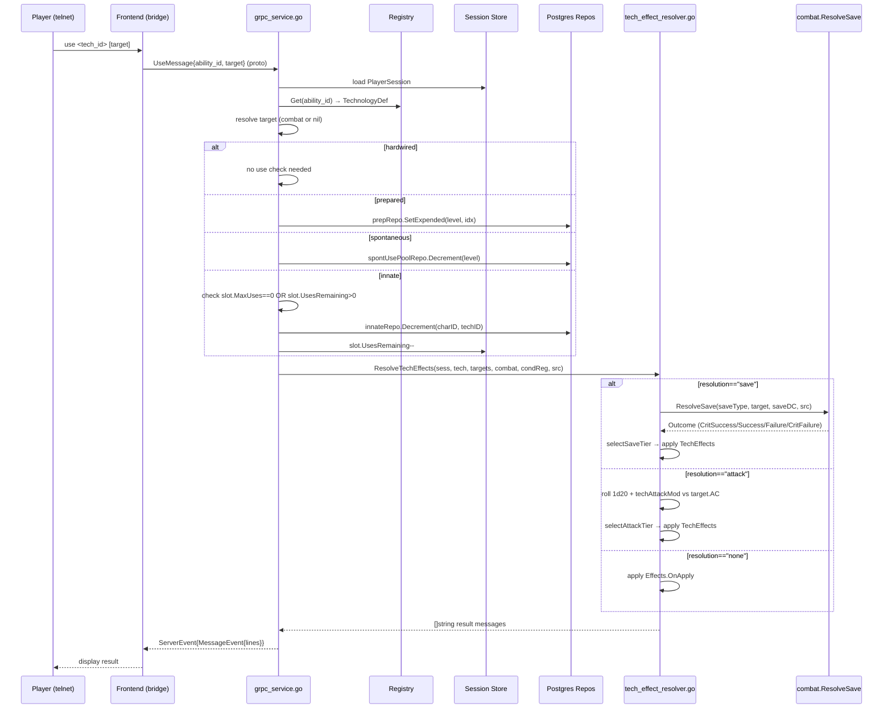
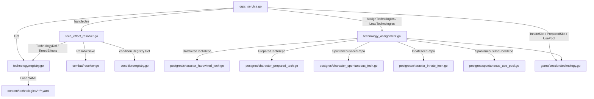

# Technology Architecture

**As of:** 2026-03-18 (commit: 4a7bbbed78dc090a0f2ed6d6e004f311d8c08577)
**Skill:** `.claude/skills/mud-technology.md`
**Requirements:** `docs/requirements/FEATURES.md`

## Overview

The technology system is the game's analog to PF2E's spell system. Technologies are activated abilities granted to characters through their job, archetype, and region of origin. The system manages four usage types — hardwired (always available), prepared (slot-based, expended per use), spontaneous (known pool with daily uses), and innate (region/archetype grants with per-tech daily uses) — and resolves their effects via a tiered effect model that mirrors PF2E's critical success/success/failure/critical failure outcomes.

Technology definitions live as YAML content files loaded at startup into an in-memory registry. All runtime state (which techs a character knows, how many uses remain) is persisted to PostgreSQL and hydrated into `session.PlayerSession` at login.

## Package Structure

```
internal/game/technology/       Pure model + registry (no side effects)
  model.go                      TechnologyDef, TieredEffects, TechEffect, constants
  registry.go                   Registry — YAML load, index by ID/tradition/level/usage

internal/gameserver/
  technology_assignment.go      Assignment at creation/level-up; repo interfaces; LoadTechnologies
  tech_effect_resolver.go       ResolveTechEffects — damage, heal, condition, movement, utility
  grpc_service_tech_helpers.go  Snapshot/diff helpers for slot change tracking
  grpc_service.go               handleUse, handleRest, handleChar (technology paths)

internal/game/session/
  technology.go                 InnateSlot, PreparedSlot, UsePool — runtime session state

internal/storage/postgres/
  character_innate_tech.go      InnateTechRepo impl (Get/Set/Decrement/RestoreAll/DeleteAll)
  character_prepared_tech.go    PreparedTechRepo impl
  character_spontaneous_tech.go SpontaneousTechRepo impl
  character_hardwired_tech.go   HardwiredTechRepo impl
  spontaneous_use_pool.go       SpontaneousUsePoolRepo impl

content/technologies/
  neural/                       Spontaneous neural tradition techs (mind_spike, etc.)
  innate/                       Innate techs granted by region (11 files)
  (technical/, bio_synthetic/, fanatic_doctrine/ as created)

api/proto/game/v1/game.proto    UseMessage, InnateSlotView, CharacterSheetView.innate_slots
```

## Core Data Structures

### `TechnologyDef`

| Field | Type | Description |
|-------|------|-------------|
| `ID` | `string` | Unique snake_case identifier |
| `Name` | `string` | Display name |
| `Tradition` | `Tradition` | "technical" \| "neural" \| "bio_synthetic" \| "fanatic_doctrine" (YAML string values, not subsystems) |
| `Level` | `int` | 1–10 |
| `UsageType` | `UsageType` | "hardwired" \| "prepared" \| "spontaneous" \| "innate" |
| `ActionCost` | `int` | Actions required to activate |
| `Range` | `Range` | "self" \| "melee" \| "ranged" \| "zone" |
| `Targets` | `Targets` | "single" \| "all_enemies" \| "all_allies" \| "zone" |
| `Duration` | `string` | e.g. "instant", "rounds:1", "minutes:1" |
| `Resolution` | `string` | "save" \| "attack" \| "none" (empty = "none") |
| `SaveType` | `string` | "toughness" \| "hustle" \| "cool" — required when Resolution=="save" |
| `SaveDC` | `int` | Required when Resolution=="save" |
| `Effects` | `TieredEffects` | Per-outcome effect lists |
| `AmpedLevel` | `int` | Min level for amped variant; 0 = no amped |
| `AmpedEffects` | `TieredEffects` | Effects at AmpedLevel+ |

### `TieredEffects`

Holds per-outcome effect slices. Only tiers relevant to the `Resolution` type need to be populated:
- Save-based: `OnCritSuccess`, `OnSuccess`, `OnFailure`, `OnCritFailure`
- Attack-based: `OnMiss`, `OnHit`, `OnCritHit`
- No-roll: `OnApply`

### `InnateSlot` (`internal/game/session/technology.go`)

```go
type InnateSlot struct {
    MaxUses       int  // 0 = unlimited
    UsesRemaining int  // decremented on use; restored on rest
}
```

## Primary Data Flow



### Rest / Use Restoration

On `handleRest`:
1. Prepared slot expended flags are cleared via `prepRepo`.
2. Spontaneous use pools restored via `spontUsePoolRepo.RestoreAll`.
3. Innate uses restored via `innateRepo.RestoreAll`; session reloaded via `innateRepo.GetAll`.

### Character Creation Assignment

`AssignTechnologies` is called once during character creation:
1. Merges grants from `archetype.TechnologyGrants` and `job.TechnologyGrants`.
2. Assigns hardwired IDs → `hwRepo.SetAll`.
3. Assigns innate slots (archetype grants, then region grants) → `innateRepo.Set` (sets `uses_remaining = max_uses`).
4. Fills prepared slots (fixed, then pool; prompts player if pool > open slots) → `prepRepo.Set`.
5. Fills spontaneous known techs similarly → `spontRepo.Add`; initializes use pools → `usePoolRepo.Set`.

## Component Dependencies



## Extension Points

### Adding a new technology (YAML + wiring)

1. Create a YAML file in `content/technologies/<tradition>/` (or `content/technologies/innate/` for innate).
2. Set all required fields: `id`, `name`, `tradition`, `level`, `usage_type`, `action_cost`, `range`, `targets`, `duration`.
3. Set `resolution` (`"save"`, `"attack"`, or `"none"`); for `"save"` also set `save_type` and `save_dc`.
4. Populate `effects:` with at least one effect in the appropriate tier(s).
5. Run `make test` — the registry test suite loads all YAML files and catches validation errors.
6. Grant the tech by adding its ID to the relevant job/archetype YAML under `technology_grants` (hardwired, prepared.fixed, spontaneous.fixed, or pool equivalents), or to a region YAML under `innate_technologies:`.

### Adding a new effect type

1. Add a `EffectFoo EffectType = "foo"` constant to `model.go` and add it to `validEffectTypes`.
2. Add a `case technology.EffectFoo:` branch to `applyEffect` in `tech_effect_resolver.go` returning a result message.
3. Write property-based tests (SWENG-5a) for the new effect type.

### Adding a new usage type

1. Add a `UsageBar UsageType = "bar"` constant to `model.go` and add it to `validUsageTypes`.
2. Define a new repo interface in `technology_assignment.go`.
3. Add the assignment logic to `AssignTechnologies` and `LoadTechnologies`.
4. Add the use-check and decrement logic to `handleUse` in `grpc_service.go`.
5. Implement the repo in `internal/storage/postgres/`.

## Known Constraints & Pitfalls

- **`innateRepo.Set` resets `uses_remaining`**: only call at character creation or full re-assignment; use `GetAll` at login. Calling `Set` at login would reset daily uses incorrectly.
- **Traditions are content-level YAML values only**: `TraditionNeural`, `TraditionBioSynthetic`, etc. are typed string constants used for attack modifier dispatch in `techAttackMod`. They are not implemented Go subsystems.
- **`range` validation**: valid values are `"self"`, `"melee"`, `"ranged"`, `"zone"`. Innate tech YAML that uses `"touch"`, `"close"`, or `"emanation"` must have those values added to `validRanges` in `model.go` before they can be used.
- **`ResolveTechEffects` does not expend uses**: the caller must decrement slots/pools before calling the resolver.
- **Condition effects silently skip when `condRegistry` or `cbt` is nil**: out-of-combat activations of condition-applying techs produce no error but no condition effect.
- **`CritSuccess`/`CritFailure` tier fallback**: `OnCritSuccess` falls back to `OnSuccess` when empty; `OnCritFailure` falls back to `OnFailure` when empty. This is intentional PF2E convention.
- **Area targeting (`all_enemies`)**: `handleUse` is responsible for building the full target slice from the combat engine. `ResolveTechEffects` only iterates what it receives.
- **Amped Technology is out of scope**: `AmpedLevel` and `AmpedEffects` are stored but the amped activation path is not yet wired in `handleUse`.

## Cross-References

- Innate technology design (region grants, `InnateSlot.UsesRemaining`, DB migration, `handleUse` innate path, `handleRest` restoration, character sheet): `docs/superpowers/specs/2026-03-18-innate-technologies-design.md`
- Tech effect resolution design (tiered effect model, `ResolveTechEffects`, YAML updates for all 14 techs, condition definitions, target resolution in `handleUse`): `docs/superpowers/specs/2026-03-18-tech-effect-resolution-design.md`
- Feature requirements and completion status: `docs/requirements/FEATURES.md`
- PF2E save-type mapping and source spell data: `docs/requirements/pf2e-import-reference.md`
