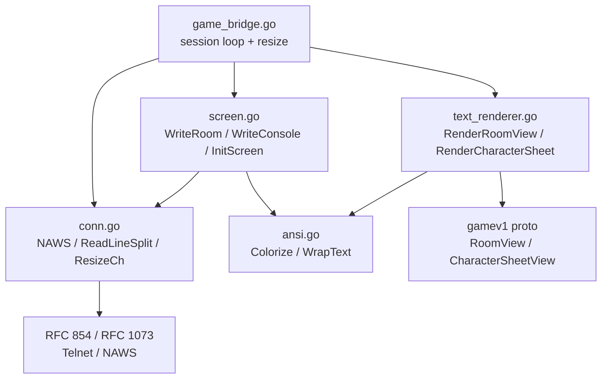

# UI Architecture

**As of:** 2026-03-18 (commit: c6e294d2af5dbdbf9f127a7718da5c46c553dbd6)
**Skill:** `.claude/skills/mud-ui.md`
**Requirements:** `docs/requirements/NETWORKING.md`

Cross-reference: [docs/requirements/NETWORKING.md](../requirements/NETWORKING.md)

## Overview

The MUD presents a split-screen telnet terminal UI. The screen is divided into
a pinned room region at the top, a scrolling console in the middle, and a fixed
input prompt at the bottom. All layout is achieved with absolute ANSI cursor
positioning — no DECSTBM scroll regions are used.

## Split-Screen Layout

```
+--------------------------------------------------+
| Row  1  | Room title (BrightYellow)              |
| Row  2  | Room description line 1 (White)        |
| Row  3  | Room description line 2 ...            |
| Row  4  | Exits: north  south  east  west        |
| Row  5  | Also here: PlayerA, PlayerB            |
| Row  6  | Items: sword  shield                   |
| Row  7  | (NPCs, conditions, etc.)               |
| Row  8  |                                        |
| Row  9  |                                        |
| Row 10  | (last room content row)                |
+--------------------------------------------------+
| Row 11  | ════════════════════════════ (divider) |
+--------------------------------------------------+
| Row 12  | Console message (oldest visible)       |
| ...     | ...                                    |
| Row H-1 | Console message (newest)               |
+--------------------------------------------------+
| Row  H  | > input prompt + user keystrokes       |
+--------------------------------------------------+
```

Constants (from `internal/frontend/telnet/screen.go`):

| Symbol | Value | Meaning |
|--------|-------|---------|
| `RoomRegionRows` | 10 | Number of room content rows (rows 1–10) |
| dividerRow | 11 | `RoomRegionRows + 1` |
| consoleTop | 12 | `RoomRegionRows + 2` |
| promptRow | H | Terminal height (from NAWS) |

## Window Resize Sequence

```mermaid
sequenceDiagram
    participant C as Telnet Client
    participant CO as conn.go (NAWS)
    participant GB as game_bridge.go
    participant SC as screen.go
    participant TR as text_renderer.go

    C->>CO: IAC SB NAWS W-hi W-lo H-hi H-lo IAC SE
    CO->>CO: Update conn.width / conn.height
    CO->>GB: resizeCh <- struct{}{}
    GB->>CO: conn.Dimensions() → (rw, rh)
    GB->>SC: conn.InitScreen()
    SC->>C: ESC[?25l ESC[2J ESC[H (clear) … ESC[H;1H ESC[?25h
    GB->>GB: lastRoomView.Load() → *gamev1.RoomView
    GB->>TR: RenderRoomView(rv, rw, RoomRegionRows) → string
    GB->>SC: conn.WriteRoom(rendered)
    SC->>C: ESC[1;1H + room rows 1–11 + ESC[H;1H
    SC->>SC: roomBuf = rendered
```

## Console Write Sequence

```mermaid
sequenceDiagram
    participant GS as Gameserver (gRPC)
    participant GB as game_bridge.go
    participant SC as screen.go
    participant C as Telnet Client

    GS->>GB: ServerEvent (combat/speech/system)
    GB->>SC: conn.WriteConsole(text)
    SC->>SC: wrapText(text, w) → lines
    SC->>SC: appendConsoleLine(line) for each line
    SC->>C: ESC[H;1H ESC[2K + \r\n per line (scrolls terminal up)
    SC->>C: appendRoomRedraw → ESC[1;1H + room rows 1–11
    SC->>C: ESC[H;1H ESC[2K + inputBuf
```

## Component Dependencies



## Key Design Decisions

### No DECSTBM (scroll regions)

`\033[top;botR` is never sent. TinTin++ remaps `\033[1;1H` to physical row
`scrollTop` when a non-1-based scroll region is active, silently shifting all
room-region writes into the scrolling console area where they get scrolled away.
The default full-screen scroll region (rows 1..H) is kept; `\r\n` at row H
scrolls the whole screen, and `appendRoomRedraw` restores rows 1–11 after every
scroll.

### Raw proto stored for resize

`game_bridge.go` stores `*gamev1.RoomView` (not the rendered string) in
`lastRoomView atomic.Value`. On resize, `RenderRoomView(rv, newWidth, ...)` is
called fresh so word-wrap, column layout, and exit formatting all adapt to the
new terminal width.

### Server-driven echo

`SuppressEcho()` (`IAC WILL Echo`) is sent on entering split-screen mode.
`ReadLineSplit` echoes each keystroke individually and never sends `\r\n`, which
would scroll the terminal at row H and corrupt the layout.

### Console scroll buffer

`consoleBuf` is a ring buffer of at most 1000 lines. While `scrollOffset > 0`
(user scrolled back), `WriteConsole` appends to the buffer and increments
`pendingNew` but does not update the screen. A status line
`[scrolled back — N new message(s)]` appears at row H-1. Returning to live view
(`scrollOffset == 0`) clears `pendingNew` and triggers `redrawConsole`.

## File Index

| Path | Responsibility |
|------|---------------|
| `internal/frontend/telnet/screen.go` | Layout constants, `InitScreen`, `WriteRoom`, `WriteConsole`, `WritePromptSplit`, `appendRoomRedraw`, `wrapText`, scroll ops |
| `internal/frontend/telnet/conn.go` | `Conn` struct, Telnet IAC/NAWS parsing, `AwaitNAWS`, `ReadLineSplit`, `ResizeCh` |
| `internal/frontend/telnet/ansi.go` | ANSI escape constants, `Colorize`, `Colorf`, `StripANSI` |
| `internal/frontend/handlers/text_renderer.go` | `RenderRoomView`, `RenderCharacterSheet`, `renderExits`, `renderEquipment` |
| `internal/frontend/handlers/game_bridge.go` | Session loop, resize goroutine, `lastRoomView atomic.Value`, prompt builder |
