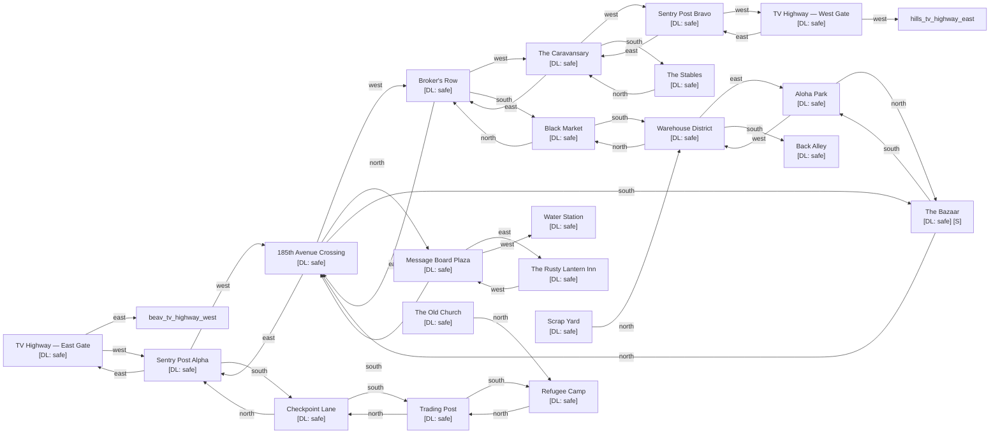

# The Aloha Neutral Zone

Zone ID: `aloha` | Danger Level: safe | World Position: (-4, 2)

## Legend

- `[S]` — Safe room (no hostile spawns, services available)
- DL values: `safe` `low` `med` `high` `xtr`
- `direction*` — Locked exit

## Room Table

| ID | Name | Danger Level | map_x | map_y |
|----|------|-------------|-------|-------|
| aloha_tv_highway_east | TV Highway — East Gate | safe | 0 | 0 |
| aloha_sentry_post_alpha | Sentry Post Alpha | safe | -2 | 0 |
| aloha_185th_crossing | 185th Avenue Crossing | safe | -4 | 0 |
| aloha_the_bazaar | The Bazaar | safe | -4 | 2 |
| aloha_brokers_row | Broker's Row | safe | -6 | 0 |
| aloha_sentry_post_bravo | Sentry Post Bravo | safe | -10 | 0 |
| aloha_tv_highway_west | TV Highway — West Gate | safe | -12 | 0 |
| aloha_caravansary | The Caravansary | safe | -8 | 0 |
| aloha_park | Aloha Park | safe | -4 | 4 |
| aloha_refugee_camp | Refugee Camp | safe | -2 | 6 |
| aloha_warehouse_district | Warehouse District | safe | -6 | 4 |
| aloha_trading_post | Trading Post | safe | -2 | 4 |
| aloha_black_market | Black Market | safe | -6 | 2 |
| aloha_checkpoint_lane | Checkpoint Lane | safe | -2 | 2 |
| aloha_message_board_plaza | Message Board Plaza | safe | -4 | -2 |
| aloha_water_station | Water Station | safe | -6 | -2 |
| aloha_inn | The Rusty Lantern Inn | safe | -2 | -2 |
| aloha_stables | The Stables | safe | -8 | 2 |
| aloha_back_alley | Back Alley | safe | -6 | 6 |
| aloha_scrap_yard | Scrap Yard | safe | 202 | 0 |
| aloha_old_church | The Old Church | safe | 202 | 2 |
