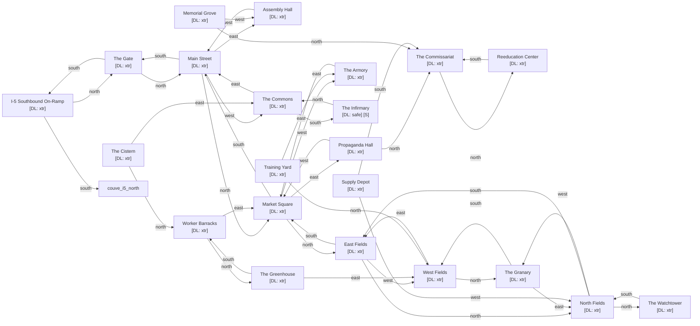

# Battleground Socialist Collective

Zone ID: `battleground` | Danger Level: all_out_war | World Position: (4, -6)

## Legend

- `[S]` — Safe room (no hostile spawns, services available)
- DL values: `safe` `low` `med` `high` `xtr`
- `direction*` — Locked exit

## Room Table

| ID | Name | Danger Level | map_x | map_y |
|----|------|-------------|-------|-------|
| battle_i5_south | I-5 Southbound On-Ramp | xtr | 0 | 0 |
| battle_the_gate | The Gate | xtr | 0 | -2 |
| battle_main_street | Main Street | xtr | 0 | -4 |
| battle_assembly_hall | Assembly Hall | xtr | 2 | -4 |
| battle_the_commons | The Commons | xtr | -2 | -4 |
| battle_market_square | Market Square | xtr | 0 | -6 |
| battle_propaganda_hall | Propaganda Hall | xtr | 2 | -6 |
| battle_the_commissariat | The Commissariat | xtr | 2 | -8 |
| battle_reeducation_center | Reeducation Center | xtr | 2 | -10 |
| battle_worker_barracks | Worker Barracks | xtr | 202 | 16 |
| battle_armory | The Armory | xtr | -2 | -6 |
| battle_infirmary | The Infirmary | safe | -2 | -2 |
| battle_farm_east | East Fields | xtr | 0 | -8 |
| battle_farm_west | West Fields | xtr | -2 | -8 |
| battle_the_granary | The Granary | xtr | -2 | -10 |
| battle_north_fields | North Fields | xtr | 0 | -10 |
| battle_the_watchtower | The Watchtower | xtr | 0 | -12 |
| battle_memorial_grove | Memorial Grove | xtr | 202 | 32 |
| battle_greenhouse | The Greenhouse | xtr | 202 | 34 |
| battle_training_yard | Training Yard | xtr | 202 | 36 |
| battle_supply_depot | Supply Depot | xtr | 202 | 38 |
| battle_cistern | The Cistern | xtr | 202 | 40 |
