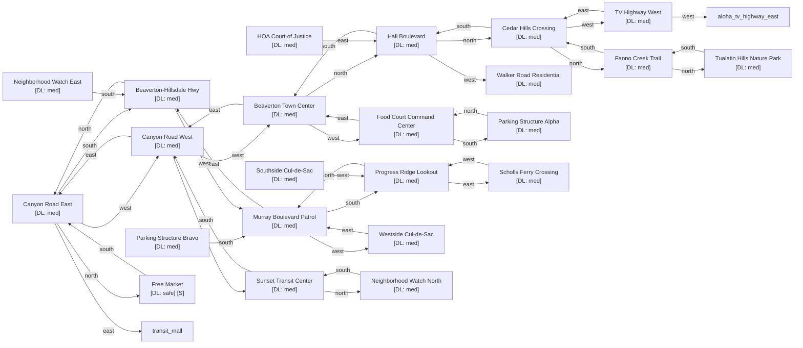

# The Free State of Beaverton

Zone ID: `beaverton` | Danger Level: sketchy | World Position: (-2, 0)

## Legend

- `[S]` — Safe room (no hostile spawns, services available)
- DL values: `safe` `low` `med` `high` `xtr`
- `direction*` — Locked exit

## Room Table

| ID | Name | Danger Level | map_x | map_y |
|----|------|-------------|-------|-------|
| beav_canyon_road_east | Canyon Road East | med | 0 | 0 |
| beav_canyon_road_west | Canyon Road West | med | -2 | 0 |
| beav_town_center | Beaverton Town Center — Capitol Building | med | -4 | 0 |
| beav_food_court_command | Food Court Command Center | med | -6 | 0 |
| beav_cedar_hills | Cedar Hills Crossing | med | -4 | -4 |
| beav_murray_blvd | Murray Boulevard Patrol Corridor | med | -2 | 2 |
| beav_nature_park | Tualatin Hills Nature Park | med | -4 | -8 |
| beav_sunset_transit | Sunset Transit Center | med | -2 | -2 |
| beav_tv_highway_west | TV Highway West | med | -6 | -4 |
| beav_progress_ridge | Progress Ridge Lookout | med | -2 | 4 |
| beav_walker_road | Walker Road Residential Patrol | med | -6 | -2 |
| beav_hall_boulevard | Hall Boulevard | med | -4 | -2 |
| beav_parking_garage_a | Parking Structure Alpha | med | -6 | 2 |
| beav_parking_garage_b | Parking Structure Bravo | med | 202 | 24 |
| beav_cul_de_sac_west | Westside Cul-de-Sac Compound | med | -4 | 2 |
| beav_hoa_court | HOA Court of Justice | med | 202 | 28 |
| beav_bike_path_north | Fanno Creek Trail Patrol | med | -4 | -6 |
| beav_neighborhood_watch_north | Neighborhood Watch Post North | med | -2 | -4 |
| beav_neighborhood_watch_east | Neighborhood Watch Post East | med | 202 | 34 |
| beav_beaverton_hillsdale | Beaverton-Hillsdale Highway | med | 0 | 2 |
| beav_scholls_ferry | Scholls Ferry Crossing | med | 0 | 4 |
| beav_cul_de_sac_south | Southside Cul-de-Sac Compound | med | 202 | 40 |
| beav_free_market | Free Market | safe | 0 | -2 |
