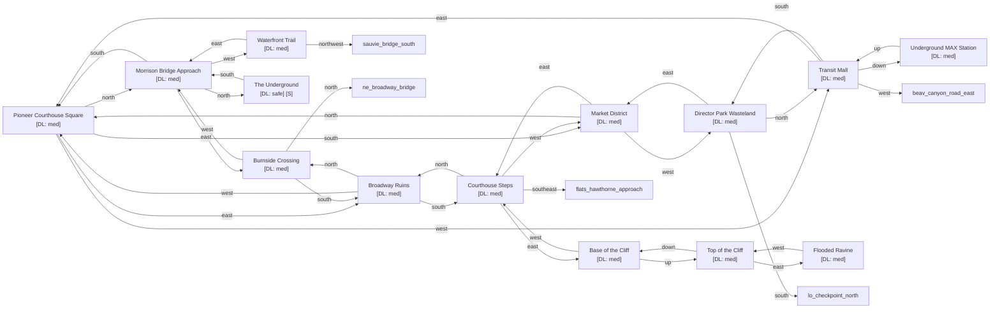

# Downtown Portland

Zone ID: `downtown` | Danger Level: sketchy | World Position: (0, 0)

## Legend

- `[S]` — Safe room (no hostile spawns, services available)
- DL values: `safe` `low` `med` `high` `xtr`
- `direction*` — Locked exit

## Room Table

| ID | Name | Danger Level | map_x | map_y |
|----|------|-------------|-------|-------|
| pioneer_square | Pioneer Courthouse Square | med | 0 | 0 |
| morrison_bridge | Morrison Bridge Approach | med | 0 | -2 |
| broadway_ruins | Broadway Ruins | med | 2 | 0 |
| market_district | Market District | med | 0 | 2 |
| waterfront_trail | Waterfront Trail | med | -2 | -2 |
| transit_mall | Transit Mall | med | -2 | 0 |
| director_park | Director Park Wasteland | med | -2 | 2 |
| burnside_crossing | Burnside Crossing | med | 2 | -2 |
| underground_max | Underground MAX Station | med | 202 | 0 |
| courthouse_steps | Courthouse Steps | med | 2 | 2 |
| cliff_base | Base of the Cliff | med | 4 | 2 |
| cliff_top | Top of the Cliff | med | 4 | 0 |
| ravine_flooded | Flooded Ravine | med | 4 | -2 |
| downtown_underground | The Underground | safe | 0 | -4 |
