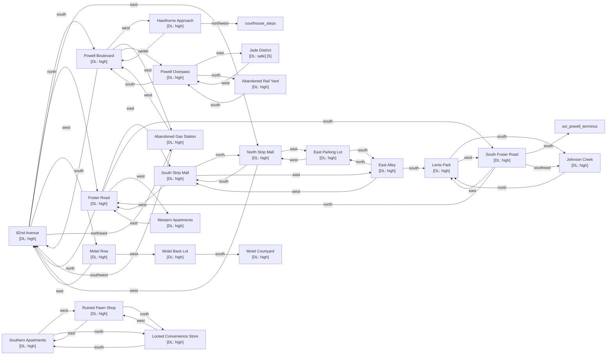

# Felony Flats

Zone ID: `felony_flats` | Danger Level: dangerous | World Position: (4, 2)

## Legend

- `[S]` — Safe room (no hostile spawns, services available)
- DL values: `safe` `low` `med` `high` `xtr`
- `direction*` — Locked exit
- Note: `flats_alley_east` south exit to `flats_lents_park` is hidden

## Room Table

| ID | Name | Danger Level | map_x | map_y |
|----|------|-------------|-------|-------|
| flats_82nd_ave | 82nd Avenue | high | 0 | 0 |
| flats_motel_row | Motel Row | high | -2 | 0 |
| flats_strip_mall_north | North Strip Mall | high | 2 | 0 |
| flats_strip_mall_south | South Strip Mall | high | 2 | 2 |
| flats_foster_road | Foster Road | high | 0 | 2 |
| flats_johnson_creek | Johnson Creek | high | 2 | 6 |
| flats_powell_blvd | Powell Boulevard | high | 0 | -2 |
| flats_lents_park | Lents Park | high | 2 | 4 |
| flats_jade_district | Jade District | safe | 2 | -4 |
| flats_hawthorne_approach | Hawthorne Approach | high | -2 | -2 |
| flats_foster_south | South Foster Road | high | 0 | 4 |
| flats_motel_courtyard | Motel Courtyard | high | -4 | 2 |
| flats_motel_back_lot | Motel Back Lot | high | -4 | 0 |
| flats_parking_lot_east | East Parking Lot | high | 4 | 0 |
| flats_alley_east | East Alley | high | 4 | 2 |
| flats_apartments_west | Western Apartments | high | -2 | 2 |
| flats_apartments_south | Southern Apartments | high | 202 | 0 |
| flats_gas_station | Abandoned Gas Station | high | 2 | -2 |
| flats_powell_overpass | Powell Overpass | high | 0 | -4 |
| flats_pawn_shop | Ruined Pawn Shop | high | 202 | 2 |
| flats_convenience_store | Looted Convenience Store | high | 202 | 4 |
| flats_rail_yard | Abandoned Rail Yard | high | 0 | -6 |
