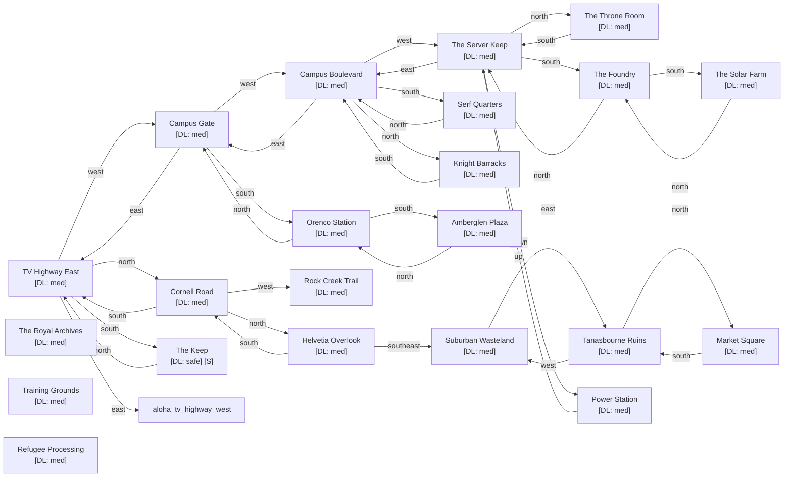

# Kingdom of Hillsboro

Zone ID: `hillsboro` | Danger Level: sketchy | World Position: (-4, 0)

## Legend

- `[S]` — Safe room (no hostile spawns, services available)
- DL values: `safe` `low` `med` `high` `xtr`
- `direction*` — Locked exit

## Room Table

| ID | Name | Danger Level | map_x | map_y |
|----|------|-------------|-------|-------|
| hills_tv_highway_east | TV Highway East | med | 0 | 0 |
| hills_campus_gate | Campus Gate | med | -2 | 0 |
| hills_campus_boulevard | Campus Boulevard | med | -4 | 0 |
| hills_server_keep | The Server Keep | med | -6 | 0 |
| hills_throne_room | The Throne Room | med | -6 | -2 |
| hills_royal_archives | The Royal Archives | med | 202 | 0 |
| hills_solar_farm | The Solar Farm | med | -6 | 4 |
| hills_serf_quarters | Serf Quarters | med | -4 | 2 |
| hills_knight_barracks | Knight Barracks | med | -4 | -2 |
| hills_training_grounds | Training Grounds | med | 202 | 2 |
| hills_the_foundry | The Foundry | med | -6 | 2 |
| hills_market_square | Market Square | med | 4 | -4 |
| hills_orenco_station | Orenco Station | med | -2 | 2 |
| hills_rock_creek_trail | Rock Creek Trail | med | -2 | -2 |
| hills_tanasbourne_ruins | Tanasbourne Ruins | med | 4 | -2 |
| hills_cornell_road | Cornell Road | med | 0 | -2 |
| hills_power_station | Power Station | med | 202 | 8 |
| hills_refugee_processing | Refugee Processing | med | 202 | 10 |
| hills_amberglen_plaza | Amberglen Plaza | med | -2 | 4 |
| hills_suburban_wasteland | Suburban Wasteland | med | 2 | -2 |
| hills_helvetia_overlook | Helvetia Overlook | med | 0 | -4 |
| hills_the_keep | The Keep | safe | 0 | 2 |
