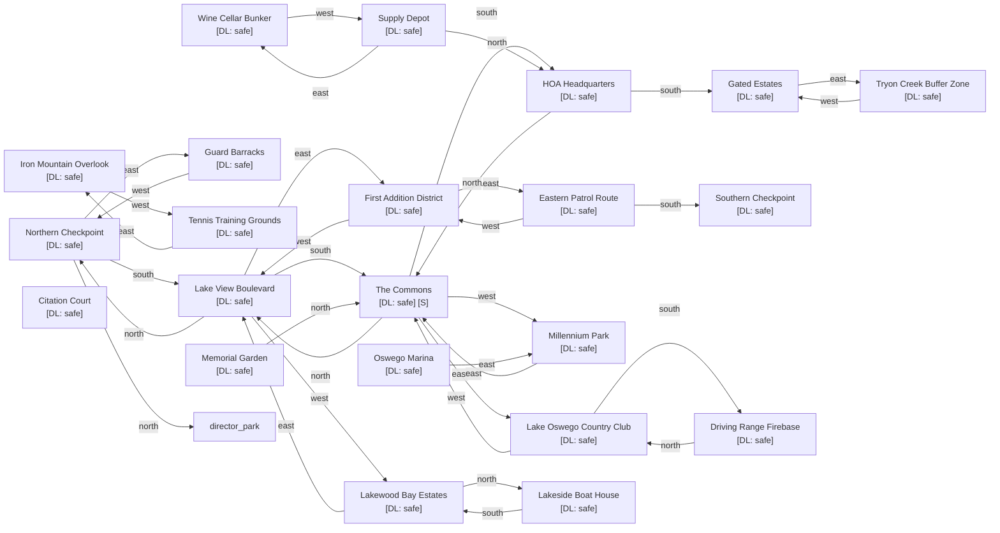

# Lake Oswego Nation

Zone ID: `lake_oswego` | Danger Level: safe | World Position: (0, 4)

## Legend

- `[S]` — Safe room (no hostile spawns, services available)
- DL values: `safe` `low` `med` `high` `xtr`
- `direction*` — Locked exit

## Room Table

| ID | Name | Danger Level | map_x | map_y |
|----|------|-------------|-------|-------|
| lo_checkpoint_north | Northern Checkpoint | safe | 0 | 0 |
| lo_lake_view_blvd | Lake View Boulevard | safe | 0 | 2 |
| lo_country_club | Lake Oswego Country Club | safe | 2 | 4 |
| lo_lakewood_bay | Lakewood Bay Estates | safe | -2 | 2 |
| lo_hoa_headquarters | HOA Headquarters | safe | 0 | 6 |
| lo_the_commons | The Commons | safe | 0 | 4 |
| lo_iron_mountain | Iron Mountain Overlook | safe | 202 | 0 |
| lo_tryon_creek | Tryon Creek Buffer Zone | safe | 2 | 8 |
| lo_first_addition | First Addition District | safe | 2 | 2 |
| lo_millennium_park | Millennium Park | safe | -2 | 4 |
| lo_guard_barracks | Guard Barracks | safe | 2 | 0 |
| lo_marina | Oswego Marina | safe | 202 | 2 |
| lo_tennis_grounds | Tennis Training Grounds | safe | 202 | 4 |
| lo_wine_cellar_bunker | Wine Cellar Bunker | safe | 202 | 6 |
| lo_gated_estates | Gated Estates | safe | 0 | 8 |
| lo_patrol_route_east | Eastern Patrol Route | safe | 4 | 2 |
| lo_checkpoint_south | Southern Checkpoint | safe | 4 | 4 |
| lo_boat_house | Lakeside Boat House | safe | -2 | 0 |
| lo_supply_depot | Supply Depot | safe | 202 | 8 |
| lo_driving_range | Driving Range Firebase | safe | 2 | 6 |
| lo_citation_court | Citation Court | safe | 202 | 10 |
| lo_memorial_garden | Memorial Garden | safe | 202 | 12 |
