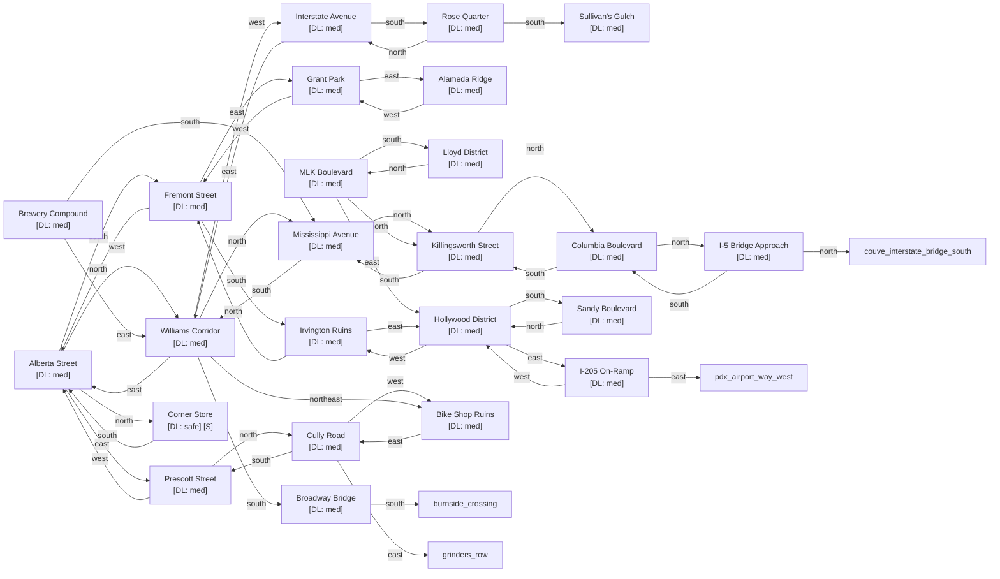

# Northeast Portland

Zone ID: `ne_portland` | Danger Level: sketchy | World Position: (2, 0)

## Legend

- `[S]` — Safe room (no hostile spawns, services available)
- DL values: `safe` `low` `med` `high` `xtr`
- `direction*` — Locked exit

## Room Table

| ID | Name | Danger Level | map_x | map_y |
|----|------|-------------|-------|-------|
| ne_alberta_street | Alberta Street | med | 0 | 0 |
| ne_mississippi_ave | Mississippi Avenue | med | -2 | -2 |
| ne_mlk_boulevard | MLK Boulevard | med | 202 | 0 |
| ne_irvington_ruins | Irvington Ruins | med | 0 | 4 |
| ne_hollywood_district | Hollywood District | med | 2 | 4 |
| ne_sullivans_gulch | Sullivan's Gulch | med | -4 | 4 |
| ne_alameda_ridge | Alameda Ridge | med | 4 | 2 |
| ne_lloyd_district | Lloyd District | med | 202 | 2 |
| ne_broadway_bridge | Broadway Bridge | med | -2 | 2 |
| ne_i205_onramp | I-205 On-Ramp | med | 4 | 4 |
| ne_cully_road | Cully Road | med | 2 | -2 |
| ne_interstate_ave | Interstate Avenue | med | -4 | 0 |
| ne_killingsworth | Killingsworth Street | med | -2 | -4 |
| ne_fremont_street | Fremont Street | med | 0 | 2 |
| ne_sandy_boulevard | Sandy Boulevard | med | 2 | 6 |
| ne_grant_park | Grant Park | med | 2 | 2 |
| ne_rose_quarter | Rose Quarter | med | -4 | 2 |
| ne_brewery_compound | Brewery Compound | med | 202 | 4 |
| ne_bike_shop_ruins | Bike Shop Ruins | med | 0 | -2 |
| ne_williams_corridor | Williams Corridor | med | -2 | 0 |
| ne_prescott_street | Prescott Street | med | 2 | 0 |
| ne_columbia_blvd | Columbia Boulevard | med | -2 | -6 |
| ne_i5_bridge_approach | I-5 Bridge Approach | med | -2 | -8 |
| ne_corner_store | Corner Store | safe | 0 | -4 |
