# PDX International

Zone ID: `pdx_international` | Danger Level: sketchy | World Position: (2, -2)

```mermaid
graph LR
    pdx_airport_way_west["Airport Way West\n[DL: med]"]
    pdx_airport_way_east["Airport Way East\n[DL: med]"]
    pdx_i84_east["I-84 Eastbound On-Ramp\n[DL: med]"]
    pdx_terminal_entrance["Terminal Entrance\n[DL: med]"]
    pdx_ticketing_hall["Ticketing Hall\n[DL: med]"]
    pdx_the_carpet["The Carpet\n[DL: med]"]
    pdx_concourse_a["Concourse A\n[DL: med]"]
    pdx_concourse_b["Concourse B\n[DL: med]"]
    pdx_concourse_c["Concourse C\n[DL: med]"]
    pdx_concourse_d["Concourse D\n[DL: med]"]
    pdx_concourse_e["Concourse E\n[DL: med]"]
    pdx_food_court["Food Court\n[DL: med]"]
    pdx_baggage_claim["Baggage Claim\n[DL: med]"]
    pdx_the_tarmac["The Tarmac\n[DL: med]"]
    pdx_hangar_row["Hangar Row\n[DL: med]"]
    pdx_control_tower["Control Tower\n[DL: med]"]
    pdx_cargo_terminal["Cargo Terminal\n[DL: med]"]
    pdx_parking_garage["Parking Garage\n[DL: med]"]
    pdx_max_station["MAX Station\n[DL: med]"]
    pdx_jet_bridge["Jet Bridge\n[DL: med]"]
    pdx_runway_south["South Runway\n[DL: med]"]
    pdx_fuel_depot["Fuel Depot\n[DL: med]"]
    pdx_rental_car_lot["Rental Car Lot\n[DL: med]"]
    pdx_terminal_b["Terminal B\n[DL: safe] [S]"]

    pdx_airport_way_west -->|west| ne_i205_onramp
    pdx_airport_way_west -->|east| pdx_airport_way_east
    pdx_airport_way_west -->|south| pdx_terminal_b
    pdx_airport_way_east -->|west| pdx_airport_way_west
    pdx_airport_way_east -->|east| pdx_terminal_entrance
    pdx_airport_way_east -->|south| pdx_parking_garage
    pdx_i84_east -->|east| trout_i84_west_junction
    pdx_i84_east -->|south| pdx_cargo_terminal
    pdx_terminal_entrance -->|west| pdx_airport_way_east
    pdx_terminal_entrance -->|north| pdx_ticketing_hall
    pdx_terminal_entrance -->|south| pdx_max_station
    pdx_ticketing_hall -->|south| pdx_terminal_entrance
    pdx_ticketing_hall -->|north| pdx_the_carpet
    pdx_ticketing_hall -->|east| pdx_baggage_claim
    pdx_the_carpet -->|south| pdx_ticketing_hall
    pdx_the_carpet -->|north| pdx_concourse_a
    pdx_the_carpet -->|east| pdx_concourse_b
    pdx_the_carpet -->|west| pdx_concourse_e
    pdx_concourse_a -->|south| pdx_the_carpet
    pdx_concourse_a -->|north| pdx_jet_bridge
    pdx_concourse_c -->|south| pdx_concourse_d
    pdx_concourse_c -->|east| pdx_food_court
    pdx_concourse_d -->|north| pdx_concourse_c
    pdx_concourse_d -->|east| pdx_concourse_e
    pdx_concourse_e -->|west| pdx_concourse_d
    pdx_concourse_e -->|down| pdx_the_tarmac
    pdx_food_court -->|west| pdx_concourse_c
    pdx_baggage_claim -->|west| pdx_ticketing_hall
    pdx_the_tarmac -->|up| pdx_concourse_e
    pdx_the_tarmac -->|east| pdx_hangar_row
    pdx_the_tarmac -->|south| pdx_runway_south
    pdx_the_tarmac -->|north| pdx_fuel_depot
    pdx_hangar_row -->|west| pdx_the_tarmac
    pdx_hangar_row -->|north| pdx_cargo_terminal
    pdx_hangar_row -->|east| pdx_control_tower
    pdx_control_tower -->|west| pdx_hangar_row
    pdx_cargo_terminal -->|south| pdx_hangar_row
    pdx_cargo_terminal -->|north| pdx_i84_east
    pdx_max_station -->|north| pdx_terminal_entrance
    pdx_max_station -->|east| pdx_rental_car_lot
    pdx_jet_bridge -->|south| pdx_concourse_a
    pdx_runway_south -->|north| pdx_the_tarmac
    pdx_runway_south -->|east| pdx_fuel_depot
    pdx_fuel_depot -->|south| pdx_the_tarmac
    pdx_fuel_depot -->|west| pdx_runway_south
    pdx_rental_car_lot -->|west| pdx_max_station
    pdx_terminal_b -->|north| pdx_airport_way_west
```

## Legend

- `[S]` — Safe room (no hostile spawns, services available)
- DL values: `safe` `low` `med` `high` `xtr`
- `direction*` — Locked exit

## Room Table

| ID | Name | Danger Level | map_x | map_y |
|----|------|-------------|-------|-------|
| pdx_airport_way_west | Airport Way West | med | 0 | 0 |
| pdx_airport_way_east | Airport Way East | med | 2 | 0 |
| pdx_i84_east | I-84 Eastbound On-Ramp | med | 202 | 2 |
| pdx_terminal_entrance | Terminal Entrance | med | 4 | 0 |
| pdx_ticketing_hall | Ticketing Hall | med | 4 | -2 |
| pdx_the_carpet | The Carpet | med | 4 | -4 |
| pdx_concourse_a | Concourse A | med | 4 | -6 |
| pdx_concourse_b | Concourse B | med | 6 | -4 |
| pdx_concourse_c | Concourse C | med | 0 | -6 |
| pdx_concourse_d | Concourse D | med | 0 | -4 |
| pdx_concourse_e | Concourse E | med | 2 | -4 |
| pdx_food_court | Food Court | med | 2 | -6 |
| pdx_baggage_claim | Baggage Claim | med | 6 | -2 |
| pdx_the_tarmac | The Tarmac | med | 202 | 24 |
| pdx_hangar_row | Hangar Row | med | 202 | 26 |
| pdx_control_tower | Control Tower | med | 202 | 28 |
| pdx_cargo_terminal | Cargo Terminal | med | 202 | 30 |
| pdx_parking_garage | Parking Garage | med | 2 | 2 |
| pdx_max_station | MAX Station | med | 4 | 2 |
| pdx_jet_bridge | Jet Bridge | med | 4 | -8 |
| pdx_runway_south | South Runway | med | 202 | 38 |
| pdx_fuel_depot | Fuel Depot | med | 202 | 40 |
| pdx_rental_car_lot | Rental Car Lot | med | 6 | 2 |
| pdx_terminal_b | Terminal B | safe | 0 | 2 |
