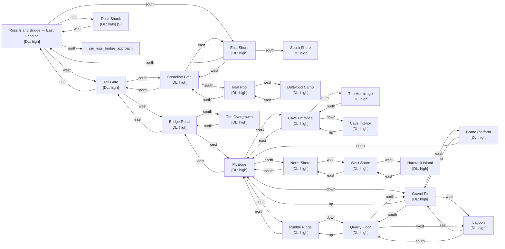

# Ross Island

Zone ID: `ross_island` | Danger Level: dangerous | World Position: (0, 2)

## Legend

- `[S]` — Safe room (no hostile spawns, services available)
- DL values: `safe` `low` `med` `high` `xtr`
- `direction*` — Locked exit

## Room Table

| ID | Name | Danger Level | map_x | map_y |
|----|------|-------------|-------|-------|
| ross_bridge_east | Ross Island Bridge — East Landing | high | 0 | 0 |
| ross_toll_gate | Toll Gate | high | -2 | 0 |
| ross_bridge_road | Bridge Road | high | -4 | 0 |
| ross_east_shore | East Shore | high | 0 | 2 |
| ross_shoreline_path | Shoreline Path | high | -2 | 2 |
| ross_south_shore | South Shore | high | 0 | 4 |
| ross_tidal_pool | Tidal Pool | high | -2 | 4 |
| ross_driftwood_camp | Driftwood Camp | high | -4 | 4 |
| ross_the_overgrowth | The Overgrowth | high | -4 | 2 |
| ross_the_hermitage | The Hermitage | high | -8 | 2 |
| ross_cave_entrance | Cave Entrance | high | -8 | 0 |
| ross_cave_interior | Cave Interior | high | 202 | 0 |
| ross_rubble_ridge | Rubble Ridge | high | -6 | 2 |
| ross_pit_edge | Pit Edge | high | -6 | 0 |
| ross_gravel_pit | Gravel Pit | high | 202 | 2 |
| ross_quarry_floor | Quarry Floor | high | 202 | 4 |
| ross_lagoon | Lagoon | high | 202 | 6 |
| ross_crane_platform | Crane Platform | high | 202 | 8 |
| ross_north_shore | North Shore | high | -6 | -2 |
| ross_west_shore | West Shore | high | -8 | -2 |
| ross_hardtack_island | Hardtack Island | high | -10 | -2 |
| ross_dock_shack | Dock Shack | safe | 2 | 0 |
