# Rustbucket Ridge

Zone ID: `rustbucket_ridge` | Danger Level: dangerous | World Position: (4, 0)

```mermaid
graph LR
    grinders_row["Grinder's Row\n[DL: high]"]
    wayne_dawgs_trailer["Wayne Dawg's Trailer\n[DL: high]"]
    the_rusty_oasis["The Rusty Oasis\n[DL: high]"]
    roach_haven["Roach Haven\n[DL: high]"]
    last_stand_lodge["Last Stand Lodge\n[DL: high]"]
    junkers_dream["Junker's Dream\n[DL: high]"]
    the_green_hell["The Green Hell\n[DL: high]"]
    rotgut_alley["Rotgut Alley\n[DL: high]"]
    the_bottle_shack["The Bottle Shack\n[DL: high]"]
    the_heap["The Heap\n[DL: high]"]
    the_tinkers_den["The Tinker's Den\n[DL: high]"]
    scrapshack_23["Scrapshack 23\n[DL: high]"]
    wreckers_rest["Wrecker's Rest\n[DL: high]"]
    salvage_hut["Salvage Hut\n[DL: high]"]
    the_still["The Still\n[DL: high]"]
    rotgut_shack["Rotgut Shack\n[DL: high]"]
    the_barrel_house["The Barrel House\n[DL: high]"]
    snakepit["Snakepit\n[DL: high]"]
    the_keg_hole["The Keg Hole\n[DL: high]"]
    the_graveyard["The Graveyard\n[DL: high]"]
    the_mausoleum["The Mausoleum\n[DL: high]"]
    ghosts_rest["Ghost's Rest\n[DL: high]"]
    the_forgotten_trailer["The Forgotten Trailer\n[DL: high]"]
    bonepickers_roost["Bonepicker's Roost\n[DL: high]"]
    ashen_hollow["Ashen Hollow\n[DL: high]"]
    smokers_den["Smoker's Den\n[DL: high]"]
    the_furnace["The Furnace\n[DL: high]"]
    scorchside_camp["Scorchside Camp\n[DL: high]"]
    the_embers_edge["The Ember's Edge\n[DL: high]"]
    blade_house["Blade House\n[DL: high]"]
    the_cutthroat["The Cutthroat\n[DL: high]"]
    blood_camp["Blood Camp\n[DL: high]"]
    the_slashers_den["The Slasher's Den\n[DL: high]"]
    the_razor_nest["The Razor Nest\n[DL: high]"]
    rust_scrap_office["Scrap Office\n[DL: safe] [S]"]

    grinders_row -->|north| rotgut_alley
    grinders_row -->|east| last_stand_lodge
    grinders_row -->|south| the_rusty_oasis
    grinders_row -->|west| ne_cully_road
    wayne_dawgs_trailer -->|north| the_green_hell
    the_rusty_oasis -->|north| grinders_row
    the_rusty_oasis -->|east| roach_haven
    the_rusty_oasis -->|south| junkers_dream
    the_rusty_oasis -->|west| the_green_hell
    roach_haven -->|west| the_rusty_oasis
    last_stand_lodge -->|west| grinders_row
    last_stand_lodge -->|east| rust_scrap_office
    junkers_dream -->|north| the_rusty_oasis
    junkers_dream -->|south| the_still
    the_green_hell -->|east| the_rusty_oasis
    the_green_hell -->|south| wayne_dawgs_trailer
    rotgut_alley -->|south| grinders_row
    rotgut_alley -->|east| the_bottle_shack
    rotgut_alley -->|west| the_heap
    rotgut_alley -->|north| the_graveyard
    the_bottle_shack -->|west| rotgut_alley
    the_heap -->|east| rotgut_alley
    the_heap -->|north| the_tinkers_den
    the_heap -->|west| scrapshack_23
    the_tinkers_den -->|south| the_heap
    the_tinkers_den -->|west| wreckers_rest
    scrapshack_23 -->|east| the_heap
    scrapshack_23 -->|south| salvage_hut
    wreckers_rest -->|east| the_tinkers_den
    salvage_hut -->|north| scrapshack_23
    the_still -->|north| junkers_dream
    the_still -->|south| rotgut_shack
    the_still -->|west| the_barrel_house
    rotgut_shack -->|north| the_still
    rotgut_shack -->|south| snakepit
    the_barrel_house -->|east| the_still
    the_barrel_house -->|south| the_keg_hole
    snakepit -->|north| rotgut_shack
    snakepit -->|east| ashen_hollow
    the_keg_hole -->|north| the_barrel_house
    the_graveyard -->|south| rotgut_alley
    the_graveyard -->|east| the_mausoleum
    the_graveyard -->|north| ghosts_rest
    the_mausoleum -->|west| the_graveyard
    the_mausoleum -->|north| the_forgotten_trailer
    ghosts_rest -->|south| the_graveyard
    the_forgotten_trailer -->|south| the_mausoleum
    the_forgotten_trailer -->|east| bonepickers_roost
    bonepickers_roost -->|west| the_forgotten_trailer
    ashen_hollow -->|west| snakepit
    ashen_hollow -->|east| smokers_den
    ashen_hollow -->|north| the_furnace
    smokers_den -->|west| ashen_hollow
    smokers_den -->|south| scorchside_camp
    the_furnace -->|south| ashen_hollow
    the_furnace -->|east| the_embers_edge
    scorchside_camp -->|north| smokers_den
    the_embers_edge -->|west| the_furnace
    the_embers_edge -->|north| blade_house
    blade_house -->|south| the_embers_edge
    blade_house -->|east| blood_camp
    blade_house -->|north| the_slashers_den
    the_cutthroat -->|west| blade_house
    blood_camp -->|west| blade_house
    the_slashers_den -->|south| blade_house
    the_slashers_den -->|east| the_razor_nest
    the_razor_nest -->|west| the_slashers_den
    rust_scrap_office -->|west| last_stand_lodge
```

## Legend

- `[S]` — Safe room (no hostile spawns, services available)
- DL values: `safe` `low` `med` `high` `xtr`
- `direction*` — Locked exit

## Room Table

| ID | Name | Danger Level | map_x | map_y |
|----|------|-------------|-------|-------|
| grinders_row | Grinder's Row | high | 0 | 0 |
| wayne_dawgs_trailer | Wayne Dawg's Trailer | high | -2 | 4 |
| the_rusty_oasis | The Rusty Oasis | high | 0 | 2 |
| roach_haven | Roach Haven | high | 2 | 2 |
| last_stand_lodge | Last Stand Lodge | high | 2 | 0 |
| junkers_dream | Junker's Dream | high | 0 | 4 |
| the_green_hell | The Green Hell | high | -2 | 2 |
| rotgut_alley | Rotgut Alley | high | 0 | -2 |
| the_bottle_shack | The Bottle Shack | high | 2 | -2 |
| the_heap | The Heap | high | -2 | -2 |
| the_tinkers_den | The Tinker's Den | high | -2 | -4 |
| scrapshack_23 | Scrapshack 23 | high | -4 | -2 |
| wreckers_rest | Wrecker's Rest | high | -4 | -4 |
| salvage_hut | Salvage Hut | high | -4 | 0 |
| the_still | The Still | high | 0 | 6 |
| rotgut_shack | Rotgut Shack | high | 0 | 8 |
| the_barrel_house | The Barrel House | high | -2 | 6 |
| snakepit | Snakepit | high | 0 | 10 |
| the_keg_hole | The Keg Hole | high | -2 | 8 |
| the_graveyard | The Graveyard | high | 0 | -4 |
| the_mausoleum | The Mausoleum | high | 2 | -4 |
| ghosts_rest | Ghost's Rest | high | 0 | -6 |
| the_forgotten_trailer | The Forgotten Trailer | high | 2 | -6 |
| bonepickers_roost | Bonepicker's Roost | high | 4 | -6 |
| ashen_hollow | Ashen Hollow | high | 2 | 10 |
| smokers_den | Smoker's Den | high | 4 | 10 |
| the_furnace | The Furnace | high | 2 | 8 |
| scorchside_camp | Scorchside Camp | high | 4 | 12 |
| the_embers_edge | The Ember's Edge | high | 4 | 8 |
| blade_house | Blade House | high | 4 | 6 |
| the_cutthroat | The Cutthroat | high | 6 | 6 |
| blood_camp | Blood Camp | high | 5 | 6 |
| the_slashers_den | The Slasher's Den | high | 4 | 4 |
| the_razor_nest | The Razor Nest | high | 6 | 4 |
| rust_scrap_office | Scrap Office | safe | 4 | 0 |
