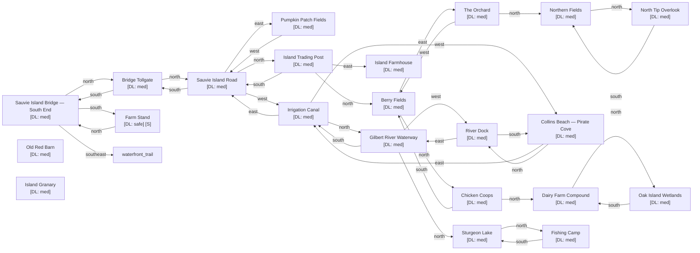

# Sauvie Island

Zone ID: `sauvie_island` | Danger Level: sketchy | World Position: (-2, -2)

## Legend

- `[S]` — Safe room (no hostile spawns, services available)
- DL values: `safe` `low` `med` `high` `xtr`
- `direction*` — Locked exit

## Room Table

| ID | Name | Danger Level | map_x | map_y |
|----|------|-------------|-------|-------|
| sauvie_bridge_south | Sauvie Island Bridge — South End | med | 0 | 0 |
| sauvie_tollgate | Bridge Tollgate | med | 0 | -2 |
| sauvie_road | Sauvie Island Road | med | 0 | -4 |
| sauvie_pumpkin_patch | Pumpkin Patch Fields | med | 2 | -4 |
| sauvie_berry_fields | Berry Fields | med | 0 | -8 |
| sauvie_farmhouse | Island Farmhouse | med | 2 | -6 |
| sauvie_barn | Old Red Barn | med | 202 | 0 |
| sauvie_chicken_coop | Chicken Coops | med | 0 | -10 |
| sauvie_dairy_farm | Dairy Farm Compound | med | 0 | -12 |
| sauvie_granary | Island Granary | med | 202 | 2 |
| sauvie_irrigation_canal | Irrigation Canal | med | -2 | -4 |
| sauvie_collins_beach | Collins Beach — Pirate Cove | med | -4 | -4 |
| sauvie_river_dock | River Dock | med | -4 | -6 |
| sauvie_gilbert_river | Gilbert River Waterway | med | -2 | -6 |
| sauvie_oak_island | Oak Island Wetlands | med | 0 | -14 |
| sauvie_the_orchard | The Orchard | med | 2 | -8 |
| sauvie_north_fields | Northern Fields | med | 2 | -10 |
| sauvie_sturgeon_lake | Sturgeon Lake | med | -2 | -8 |
| sauvie_fishing_camp | Fishing Camp | med | -2 | -10 |
| sauvie_north_tip | North Tip Overlook | med | 2 | -12 |
| sauvie_trading_post | Island Trading Post | med | 0 | -6 |
| sauvie_farm_stand | Farm Stand | safe | 0 | 2 |
