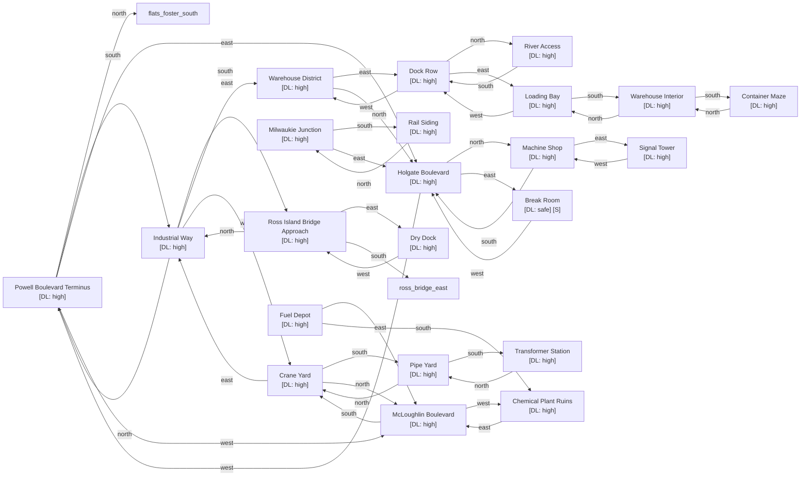

# Southeast Industrial

Zone ID: `se_industrial` | Danger Level: dangerous | World Position: (2, 2)

## Legend

- `[S]` — Safe room (no hostile spawns, services available)
- DL values: `safe` `low` `med` `high` `xtr`
- `direction*` — Locked exit

## Room Table

| ID | Name | Danger Level | map_x | map_y |
|----|------|-------------|-------|-------|
| sei_powell_terminus | Powell Boulevard Terminus | high | 0 | 0 |
| sei_dock_row | Dock Row | high | 4 | 2 |
| sei_warehouse_district | Warehouse District | high | 2 | 2 |
| sei_crane_yard | Crane Yard | high | -2 | 2 |
| sei_mcloughlin_blvd | McLoughlin Boulevard | high | -2 | 0 |
| sei_milwaukie_junction | Milwaukie Junction | high | 202 | 0 |
| sei_dry_dock | Dry Dock | high | 2 | 4 |
| sei_industrial_way | Industrial Way | high | 0 | 2 |
| sei_holgate_blvd | Holgate Boulevard | high | 2 | 0 |
| sei_ross_bridge_approach | Ross Island Bridge Approach | high | 0 | 4 |
| sei_loading_bay | Loading Bay | high | 6 | 2 |
| sei_chemical_plant | Chemical Plant Ruins | high | -4 | 0 |
| sei_pipe_yard | Pipe Yard | high | -2 | 4 |
| sei_river_access | River Access | high | 4 | 0 |
| sei_rail_siding | Rail Siding | high | 200 | 6 |
| sei_machine_shop | Machine Shop | high | 2 | -2 |
| sei_signal_tower | Signal Tower | high | 4 | -2 |
| sei_warehouse_interior | Warehouse Interior | high | 6 | 4 |
| sei_container_maze | Container Maze | high | 6 | 6 |
| sei_transformer_station | Transformer Station | high | -2 | 6 |
| sei_fuel_depot | Fuel Depot | high | 202 | 2 |
| sei_break_room | Break Room | safe | 6 | 0 |
