# The Couve

Zone ID: `the_couve` | Danger Level: sketchy | World Position: (0, -4)

```mermaid
graph LR
    couve_interstate_bridge_south["Interstate Bridge — South End\n[DL: med]"]
    couve_jantzen_beach["Jantzen Beach\n[DL: med]"]
    couve_hayden_island_causeway["Hayden Island Causeway\n[DL: med]"]
    couve_waterfront["Vancouver Waterfront\n[DL: med]"]
    couve_columbia_way["Columbia Way\n[DL: med]"]
    couve_esther_short_park["Esther Short Park\n[DL: med]"]
    couve_officers_row["Officers' Row\n[DL: med]"]
    couve_fort_vancouver["Fort Vancouver\n[DL: med]"]
    couve_mill_plain_blvd["Mill Plain Boulevard\n[DL: med]"]
    couve_strip_mall_east["Strip Mall Compound — East\n[DL: med]"]
    couve_strip_mall_west["Strip Mall Compound — West\n[DL: med]"]
    couve_applebees_fortress["Applebee's Fortress\n[DL: med]"]
    couve_residential_blocks["Residential Blocks\n[DL: med]"]
    couve_i5_corridor["I-5 Corridor\n[DL: med]"]
    couve_i5_north["I-5 Northbound\n[DL: med]"]
    couve_fourth_plain["Fourth Plain Boulevard\n[DL: med]"]
    couve_fourth_plain_east["Fourth Plain — East End\n[DL: med]"]
    couve_vancouver_mall["Vancouver Mall\n[DL: med]"]
    couve_chkalov_drive["Chkalov Drive\n[DL: med]"]
    couve_river_access["River Access Point\n[DL: med]"]
    couve_the_crossing["The Crossing\n[DL: safe] [S]"]

    couve_interstate_bridge_south -->|north| couve_jantzen_beach
    couve_interstate_bridge_south -->|south| ne_i5_bridge_approach
    couve_interstate_bridge_south -->|west| couve_the_crossing
    couve_jantzen_beach -->|south| couve_interstate_bridge_south
    couve_jantzen_beach -->|north| couve_hayden_island_causeway
    couve_jantzen_beach -->|east| couve_waterfront
    couve_hayden_island_causeway -->|south| couve_jantzen_beach
    couve_waterfront -->|west| couve_jantzen_beach
    couve_waterfront -->|north| couve_esther_short_park
    couve_waterfront -->|east| couve_columbia_way
    couve_columbia_way -->|west| couve_waterfront
    couve_columbia_way -->|north| couve_officers_row
    couve_esther_short_park -->|south| couve_waterfront
    couve_esther_short_park -->|east| couve_officers_row
    couve_esther_short_park -->|north| couve_mill_plain_blvd
    couve_officers_row -->|west| couve_esther_short_park
    couve_officers_row -->|south| couve_columbia_way
    couve_officers_row -->|east| couve_fort_vancouver
    couve_fort_vancouver -->|west| couve_officers_row
    couve_mill_plain_blvd -->|south| couve_esther_short_park
    couve_mill_plain_blvd -->|east| couve_strip_mall_east
    couve_mill_plain_blvd -->|west| couve_strip_mall_west
    couve_mill_plain_blvd -->|north| couve_fourth_plain
    couve_strip_mall_east -->|west| couve_mill_plain_blvd
    couve_strip_mall_east -->|north| couve_applebees_fortress
    couve_strip_mall_east -->|east| couve_vancouver_mall
    couve_strip_mall_west -->|east| couve_mill_plain_blvd
    couve_strip_mall_west -->|north| couve_residential_blocks
    couve_applebees_fortress -->|south| couve_strip_mall_east
    couve_residential_blocks -->|south| couve_strip_mall_west
    couve_i5_north -->|north| battle_i5_south
    couve_fourth_plain -->|south| couve_mill_plain_blvd
    couve_fourth_plain -->|north| couve_i5_north
    couve_fourth_plain_east -->|east| vantucky_fourth_plain_west
    couve_vancouver_mall -->|west| couve_strip_mall_east
    couve_vancouver_mall -->|north| couve_chkalov_drive
    couve_chkalov_drive -->|south| couve_vancouver_mall
    couve_chkalov_drive -->|east| couve_fourth_plain_east
    couve_river_access -->|north| couve_waterfront
    couve_river_access -->|east| couve_columbia_way
    couve_the_crossing -->|east| couve_interstate_bridge_south
```

## Legend

- `[S]` — Safe room (no hostile spawns, services available)
- DL values: `safe` `low` `med` `high` `xtr`
- `direction*` — Locked exit

## Room Table

| ID | Name | Danger Level | map_x | map_y |
|----|------|-------------|-------|-------|
| couve_interstate_bridge_south | Interstate Bridge — South End | med | 0 | 0 |
| couve_jantzen_beach | Jantzen Beach | med | 0 | -2 |
| couve_hayden_island_causeway | Hayden Island Causeway | med | 0 | -4 |
| couve_waterfront | Vancouver Waterfront | med | 2 | -2 |
| couve_columbia_way | Columbia Way | med | 4 | -2 |
| couve_esther_short_park | Esther Short Park | med | 2 | -4 |
| couve_officers_row | Officers' Row | med | 4 | -4 |
| couve_fort_vancouver | Fort Vancouver | med | 6 | -4 |
| couve_mill_plain_blvd | Mill Plain Boulevard | med | 2 | -6 |
| couve_strip_mall_east | Strip Mall Compound — East | med | 4 | -6 |
| couve_strip_mall_west | Strip Mall Compound — West | med | 0 | -6 |
| couve_applebees_fortress | Applebee's Fortress | med | 4 | -8 |
| couve_residential_blocks | Residential Blocks | med | 0 | -8 |
| couve_i5_corridor | I-5 Corridor | med | 202 | 0 |
| couve_i5_north | I-5 Northbound | med | 2 | -10 |
| couve_fourth_plain | Fourth Plain Boulevard | med | 2 | -8 |
| couve_fourth_plain_east | Fourth Plain — East End | med | 8 | -8 |
| couve_vancouver_mall | Vancouver Mall | med | 6 | -6 |
| couve_chkalov_drive | Chkalov Drive | med | 6 | -8 |
| couve_river_access | River Access Point | med | 202 | 2 |
| couve_the_crossing | The Crossing | safe | -2 | 0 |
