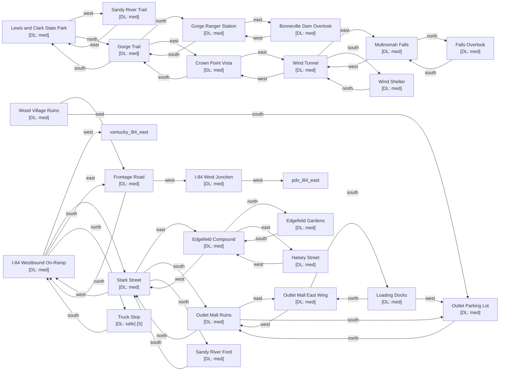

# Troutdale

Zone ID: `troutdale` | Danger Level: sketchy | World Position: (6, 0)

## Legend

- `[S]` — Safe room (no hostile spawns, services available)
- DL values: `safe` `low` `med` `high` `xtr`
- `direction*` — Locked exit

## Room Table

| ID | Name | Danger Level | map_x | map_y |
|----|------|-------------|-------|-------|
| trout_i84_west | I-84 Westbound On-Ramp | med | 0 | 0 |
| trout_i84_west_junction | I-84 West Junction | med | -2 | 2 |
| trout_outlet_mall | Outlet Mall Ruins | med | 2 | 2 |
| trout_outlet_east_wing | Outlet Mall East Wing | med | 4 | 2 |
| trout_stark_street | Stark Street | med | 2 | 0 |
| trout_sandy_river | Sandy River Ford | med | 2 | -2 |
| trout_lewis_clark_park | Lewis and Clark State Park | med | 202 | 10 |
| trout_crown_point | Crown Point Vista | med | 202 | 12 |
| trout_multnomah_falls | Multnomah Falls | med | 202 | 14 |
| trout_wind_tunnel | Wind Tunnel | med | 202 | 16 |
| trout_edgefield | Edgefield Compound | med | 4 | 0 |
| trout_wood_village | Wood Village Ruins | med | 202 | 20 |
| trout_parking_lot | Outlet Parking Lot | med | 2 | 4 |
| trout_ranger_station | Gorge Ranger Station | med | 202 | 24 |
| trout_dam_overlook | Bonneville Dam Overlook | med | 202 | 26 |
| trout_gorge_trail | Gorge Trail | med | 202 | 28 |
| trout_wind_shelter | Wind Shelter | med | 202 | 30 |
| trout_frontage_road | Frontage Road | med | 0 | 2 |
| trout_river_trail | Sandy River Trail | med | 202 | 34 |
| trout_halsey_street | Halsey Street | med | 6 | 0 |
| trout_edgefield_gardens | Edgefield Gardens | med | 4 | -2 |
| trout_loading_docks | Loading Docks | med | 4 | 4 |
| trout_falls_overlook | Falls Overlook | med | 202 | 42 |
| trout_truck_stop | Truck Stop | safe | 0 | -2 |
