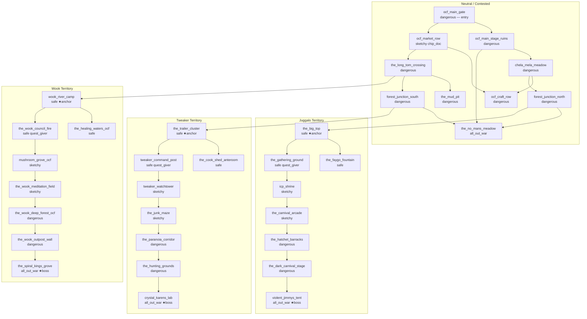

# Oregon Country Fair Zone

**Slug:** oregon-country-fair
**Status:** done
**Priority:** 340
**Category:** world
**Effort:** XL

## Overview

The Oregon Country Fair (OCF) zone occupies the Veneta, OR fairgrounds (13 miles west of Eugene on Hwy 126) — a forested river-adjacent festival site that has become a three-way contested warzone. The Wooks, Juggalos, and Tweakers each control a distinct pocket of the fairgrounds and are in continuous open combat for dominance. No single faction owns the zone. Each faction maintains its own safe cluster with merchants, healers, and quest givers whose missions target the other two factions. There are three bosses — one per faction — entrenched in their respective strongholds.

The zone introduces two new factions (`juggalos`, `tweakers`) and extends the existing `wooks` faction with an outpost presence here. It introduces four new NPC types, two new substances, a new room-level ambient substance mechanic (`ambient_substance`), and three-way faction rivalry quest hooks.

## Dependencies

- `factions` — full faction mechanics; Juggalos and Tweakers defined here; Wooks extended with outpost
- `advanced-health` — `tweaker_crystal` and `wook_spore` substances; `ambient_substance` room field drives ticker dosing
- `quests` — quest givers in each safe cluster require quest system; faction-targeted objectives
- `wooklyn` — `wooks` faction and `wook_spore` substance must already be defined; Wook boss variant here
- `non-combat-npcs` — safe cluster NPC types
- `advanced-enemies` — three boss rooms, boss abilities
- `npc-behaviors` — faction NPC aggro thresholds, call-for-help on faction territory breach
- `zone-content-expansion` — safe cluster patterns and danger level conventions

---

## Requirements

### Zone

- REQ-OCF-1: The zone MUST have `id: oregon_country_fair`, `name: "Oregon Country Fair"`, `faction_id: ""` (no controlling faction), `default_danger_level: dangerous`, and `world_x`/`world_y` coordinates placing it south of Eugene, west of the highway cluster.
- REQ-OCF-2: The zone MUST contain 30–45 rooms divided across three faction territories and a contested neutral zone connecting them.
- REQ-OCF-3: Each of the three factions MUST have exactly one safe cluster of 3–5 contiguous Safe rooms within the zone. Safe clusters are faction-specific: non-member players entering a faction's safe cluster are tolerated at `curious` tier and above, and attacked on sight at base tier.
- REQ-OCF-4: The zone MUST contain three boss rooms (`boss_room: true`), one per faction, each located in the deepest dangerous room of that faction's territory.
- REQ-OCF-5: Neutral/contested rooms MUST have `danger_level: dangerous`. Faction territory edge rooms MUST have `danger_level: sketchy`. Faction territory core and boss rooms MUST have `danger_level: dangerous` or `all_out_war`.
- REQ-OCF-6: Each faction's safe cluster MUST contain: 1 merchant NPC, 1 healer NPC, 1 quest_giver NPC (faction-branded, requires quests feature), and 1 Fixer NPC. The three safe clusters share the zone's chip_doc NPC placed in the neutral `ocf_market_row` room.

### Room-Level Ambient Substance (new mechanic)

- REQ-OCF-7: `world.Room` MUST gain an `AmbientSubstance string` field (YAML: `ambient_substance`; empty means no ambient dosing). This field names a substance ID from the SubstanceRegistry.
- REQ-OCF-8: The 5-second substance ticker in `grpc_service.go` MUST check the player's current room's `AmbientSubstance` field. If non-empty and the player has not received a dose in the last 60 seconds from this room, one micro-dose of that substance MUST be applied (resetting duration timer). This replaces the zone-wide ambient dose approach used in Wooklyn; the Wooklyn spec MUST be updated to use `ambient_substance` on all Wooklyn room YAMLs instead of the zone-level ticker.
- REQ-OCF-9: `AmbientSubstance` MUST be validated at startup: if non-empty, the substance ID MUST exist in the SubstanceRegistry. A missing substance ID MUST be a fatal startup error.

### Neutral / Contested Area (10 rooms)

- REQ-OCF-10: The following rooms MUST exist as the contested neutral zone connecting all three faction territories. All have `danger_level: dangerous` and no `ambient_substance`.
  - `ocf_main_gate` — The old fairground entrance. Faction checkpoint chaos. Entry point from world map.
  - `ocf_main_stage_ruins` — The destroyed main performance stage. Open combat ground.
  - `chela_mela_meadow` — The large open meadow. Crossfire zone.
  - `ocf_craft_row` — Former craft booths, scavenged bare.
  - `ocf_market_row` — Former food vendor row. Uneasy truce area. chip_doc NPC here. (`danger_level: sketchy`)
  - `the_long_tom_crossing` — Bridge over Long Tom River. Contested chokepoint.
  - `the_mud_pit` — Former art installation, now a battlefield.
  - `forest_junction_north` — Wooded path splitting to Juggalo and Wook territory.
  - `forest_junction_south` — Wooded path splitting to Tweaker and Wook territory.
  - `the_no_mans_meadow` — Open field between all three territories. All-out-war erupts here.

### Juggalo Territory (8 rooms)

Juggalos hold the old carnival and stage area of the fairgrounds. Their aesthetic is ICP face paint, Faygo, and hatchets. Rooms in Juggalo territory have `ambient_substance: ""` (no substance effect — Juggalos are straight-edge in their own twisted way).

- REQ-OCF-11: The following rooms MUST exist in Juggalo territory:
  - `the_big_top` — Circus tent, Juggalo safe cluster anchor. `danger_level: safe`. Merchant + banker NPCs.
  - `the_faygo_fountain` — Sacred Faygo dispenser. `danger_level: safe`. Healer NPC.
  - `the_gathering_ground` — ICP shrine and gathering space. `danger_level: safe`. Quest giver + Fixer NPCs.
  - `icp_shrine` — Altar of Dark Carnival scripture. `danger_level: sketchy`. 1–2 juggalo spawns.
  - `the_carnival_arcade` — Former midway games, now trials of Juggalo worthiness. `danger_level: sketchy`. 1–2 spawns.
  - `the_hatchet_barracks` — Juggalo fighter quarters. `danger_level: dangerous`. 2–3 spawns.
  - `the_dark_carnival_stage` — Ritual performance space. `danger_level: dangerous`. 2–3 spawns.
  - `violent_jimmys_tent` — Boss room. `danger_level: all_out_war`. `boss_room: true`. Violent Jimmy spawn + 2 juggalo_prophet guards.

### Tweaker Territory (8 rooms)

Tweakers hold the old utility and workshop area of the fairgrounds. Their aesthetic is corrugated metal, bare bulbs, paranoid surveillance, and methamphetamine production.

- REQ-OCF-12: The following rooms MUST exist in Tweaker territory:
  - `the_trailer_cluster` — A ring of converted trailers. Tweaker safe cluster anchor. `danger_level: safe`. `ambient_substance: tweaker_crystal`. Merchant + banker NPCs.
  - `the_cook_shed_anteroom` — Supply intake for the meth operation. `danger_level: safe`. `ambient_substance: tweaker_crystal`. Healer NPC.
  - `tweaker_command_post` — Central nerve center, wall covered in string and photos. `danger_level: safe`. `ambient_substance: tweaker_crystal`. Quest giver + Fixer NPCs.
  - `tweaker_watchtower` — Elevated lookout. `danger_level: sketchy`. `ambient_substance: tweaker_crystal`. 1–2 tweaker_paranoid spawns.
  - `the_junk_maze` — Labyrinth of scavenged materials. `danger_level: sketchy`. `ambient_substance: tweaker_crystal`. 1–2 spawns.
  - `the_paranoia_corridor` — Dark passage with trip-wire alarms. `danger_level: dangerous`. `ambient_substance: tweaker_crystal`. 2–3 spawns.
  - `the_hunting_grounds` — Tweaker patrol sweep zone. `danger_level: dangerous`. `ambient_substance: tweaker_crystal`. 2–3 spawns.
  - `crystal_karens_lab` — Boss room. `danger_level: all_out_war`. `boss_room: true`. `ambient_substance: tweaker_crystal`. Crystal Karen spawn + 2 tweaker_cook guards.

### Wook Territory (8 rooms)

Wooks hold the forested river-adjacent areas of the fairgrounds, closest to the Long Tom River. Their space overlaps with Wooklyn aesthetic but this is an outpost, not their home. Rooms have `ambient_substance: wook_spore`.

- REQ-OCF-13: The following rooms MUST exist in Wook territory:
  - `wook_river_camp` — Riverside drum circle. Wook safe cluster anchor. `danger_level: safe`. `ambient_substance: wook_spore`. Merchant + banker NPCs.
  - `the_healing_waters_ocf` — Sacred river access point. `danger_level: safe`. `ambient_substance: wook_spore`. Healer NPC.
  - `the_wook_council_fire` — Evening council fire circle. `danger_level: safe`. `ambient_substance: wook_spore`. Quest giver + Fixer NPCs.
  - `mushroom_grove_ocf` — Dense mushroom cluster, sacred. `danger_level: sketchy`. `ambient_substance: wook_spore`. 1–2 wook spawns.
  - `the_wook_meditation_field` — Silent meditation area (combat breaks the silence). `danger_level: sketchy`. `ambient_substance: wook_spore`. 1–2 spawns.
  - `the_wook_deep_forest_ocf` — Old-growth forest, dangerous. `danger_level: dangerous`. `ambient_substance: wook_spore`. 2–3 spawns.
  - `the_wook_outpost_wall` — Perimeter defense, wook guards. `danger_level: dangerous`. `ambient_substance: wook_spore`. 2–3 spawns.
  - `the_spiral_kings_grove` — Boss room. Ancient oak clearing. `danger_level: all_out_war`. `boss_room: true`. `ambient_substance: wook_spore`. The Spiral King spawn + 2 wook_shaman guards.

### NPC Types

#### Juggalo NPCs

- REQ-OCF-14: A `juggalo` NPC type MUST be defined: humanoid, ICP face paint, faction_id `juggalos`. Attack verb `swings a hatchet at`. Weapon `hatchet`. Loot: credits (5–20) and a chance at a Faygo bottle (consumable item). Disposition: hostile to players with Juggalos rep < 10.
- REQ-OCF-15: A `juggalette` NPC type MUST be defined: always female, identical mechanics to juggalo. Attack verb `hurls a Faygo bottle at`. Applies `faygo_splash` item effect on hit (minor acid damage, humiliation condition, not a substance). Disposition: hostile to players with Juggalos rep < 10.
- REQ-OCF-16: A `juggalo_prophet` NPC type MUST be defined: elder Juggalo in full ceremonial paint, recites ICP scripture before attacking. Uses HTN `say` operator (random ICP lyric lines) on room entry. High HP. Attack verb `raises a hatchet at`. Appears only in `dangerous` and `all_out_war` rooms.
- REQ-OCF-17: A `violent_jimmy` NPC type MUST be defined as the Juggalo boss. Enormous face-painted warrior in a velvet robe. Boss abilities: `faygo_bomb` (AoE acid damage to all in room, 2d6), `hatchet_dance` (multi-attack: attacks twice in one action), `dark_carnival_prayer` (heals self for 2d8, usable once per combat). Appears only in `violent_jimmys_tent`.

#### Tweaker NPCs

- REQ-OCF-18: A `tweaker` NPC type MUST be defined: gaunt, manic humanoid, faction_id `tweakers`. High initiative (Quickness 18). Attack verb `claws at`. Low HP but attacks twice per round (frenetic). Loot: credits (1–15) and scrap materials. Disposition: hostile to all players with Tweakers rep < 10.
- REQ-OCF-19: A `tweaker_paranoid` NPC type MUST be defined: uses `call_for_help` HTN operator immediately on player room entry (before combat begins) regardless of initiative. Attack verb `screams and swings at`. Applies a paranoid tag (−2 to player Savvy for 2 rounds) on successful hit via Grit-DC-14 save.
- REQ-OCF-20: A `tweaker_cook` NPC type MUST be defined: older, methodical tweaker who manages production. Applies `tweaker_crystal` substance on hit (immediate onset, forces player into substance effects). Attack verb `sprays a cloud at`. Appears only in `dangerous` and `all_out_war` rooms.
- REQ-OCF-21: A `crystal_karen` NPC type MUST be defined as the Tweaker boss. Brilliant, terrifying woman in a lab coat covered in chemical burns. Boss abilities: `paranoid_burst` (all players in room make Savvy-DC-16 save or lose 1 AP next round from paranoia), `meth_bomb` (applies immediate `tweaker_crystal` dose to all players in room), `speed_rush` (Crystal Karen gains 2 extra AP next round, usable twice per combat). Appears only in `crystal_karens_lab`.

#### Wook OCF Boss

- REQ-OCF-22: A `spiral_king` NPC type MUST be defined as the Wook boss for this zone (distinct from `papa_wook` in Wooklyn). Ancient wook elder in a robe of vines and feathers. Boss abilities: `eternal_groove` (all players lose 1 AP next round from psychedelic time distortion), `spore_cloud` (AoE `wook_spore` dose to all in room), `spiral_vision` (single target Reasoning-DC-15 save or stunned for 1 round). Appears only in `the_spiral_kings_grove`.

### Boss Rooms

- REQ-OCF-23: `violent_jimmys_tent` MUST have `boss_room: true` and hazard `faygo_rain` (1d4 acid damage to all players at round start). Violent Jimmy respawns after 72 in-game hours.
- REQ-OCF-24: `crystal_karens_lab` MUST have `boss_room: true` and hazard `toxic_fumes` (applies `tweaker_crystal` micro-dose at round start to all players) and `trip_wire_grid` (1d6 damage on entering room if Quickness-DC-12 save fails). Crystal Karen respawns after 72 in-game hours.
- REQ-OCF-25: `the_spiral_kings_grove` MUST have `boss_room: true` and hazard `psychedelic_fog` (applies `wook_spore` micro-dose at round start). The Spiral King respawns after 72 in-game hours.
- REQ-OCF-26: The three bosses MUST use coordinated respawn per advanced-enemies mechanics — all three respawn simultaneously at the 72-hour mark to maintain the three-way balance.

### Substances

- REQ-OCF-27: A `tweaker_crystal` substance MUST be defined in `content/substances/tweaker_crystal.yaml`: type `stimulant`, onset 0, duration 300s. Effects: Quickness +4, Reasoning −3, Savvy −2. Addiction potential: high. Withdrawal (on expiry without re-dose): Quickness −2, Grit −1 for 120s.
- REQ-OCF-28: A `faygo_splash` item effect (NOT a substance — a one-time consumable effect) MUST be defined: 1d4 acid damage + applies `humiliated` condition (−2 Flair for 2 rounds). Juggalette attack applies this on hit; it is also available as a throwable consumable item in the Juggalo faction store.

### Factions

#### Juggalos Faction

- REQ-OCF-29: A `juggalos` faction MUST be defined in `content/factions/juggalos.yaml` with `zone_id: ""` (they do not own a zone, only territory within OCF), `hostile_factions: [tweakers, wooks]`, and four reputation tiers:
  - Tier 1: `normie` — label "Normie", min_rep 0, price_discount 0.0. Attacked on sight.
  - Tier 2: `down` — label "Down with the Clown", min_rep 10, price_discount 0.05. Tolerated in safe cluster; no discount.
  - Tier 3: `wicked` — label "Wicked", min_rep 25, price_discount 0.15. Allowed in Juggalo sketchy territory; discount at Juggalo vendors.
  - Tier 4: `family` — label "Juggalo Family", min_rep 50, price_discount 0.25. Full Juggalo territory access; faction exclusive items available.
- REQ-OCF-30: Juggalos faction exclusive items (available at `family` tier) MUST include: `hatchet_man_pendant` (necklace, +1 AC), `faygo_grenade` (throwable consumable, AoE acid), `icp_mixtape` (consumable, applies +2 Flair for 120s).
- REQ-OCF-31: Rep is earned by: killing Tweakers and Wooks (+rep × NPC level, capped at +5/kill below `wicked`), completing Juggalo quests, paying Juggalo Fixer NPC.

#### Tweakers Faction

- REQ-OCF-32: A `tweakers` faction MUST be defined in `content/factions/tweakers.yaml` with `zone_id: ""`, `hostile_factions: [juggalos, wooks]`, and four reputation tiers:
  - Tier 1: `paranoid_stranger` — label "Paranoid Stranger", min_rep 0, price_discount 0.0. Attacked on sight.
  - Tier 2: `known` — label "Known Associate", min_rep 10, price_discount 0.05. Tolerated in Tweaker safe cluster.
  - Tier 3: `trusted` — label "Trusted Tweaker", min_rep 25, price_discount 0.15. Access to tweaker territory; discount.
  - Tier 4: `inner_circle` — label "Inner Circle", min_rep 50, price_discount 0.30. Full access; exclusive items.
- REQ-OCF-33: Tweakers faction exclusive items (at `inner_circle` tier) MUST include: `crystal_shard_pipe` (consumable, delivers tweaker_crystal dose), `speed_rig` (wearable, +2 initiative permanently while equipped), `paranoia_grenade` (throwable, applies paranoid_burst to all in room).
- REQ-OCF-34: Rep is earned by: killing Juggalos and Wooks, completing Tweaker quests, paying Tweaker Fixer NPC.

#### Wooks at OCF

- REQ-OCF-35: The `wooks` faction (already defined in Wooklyn) MUST have its `zone_id` updated from `wooklyn` to `""` (Wooks own Wooklyn zone but not the OCF zone; their OCF presence is an outpost). OCF Wook territory rooms do NOT have `min_faction_tier_id` gating — anyone can enter but NPCs apply rep-based hostility.
- REQ-OCF-36: Rep with Wooks is earned in OCF by the same mechanics as in Wooklyn: killing Juggalos and Tweakers here awards Wook rep at the same rate as killing non-wooks in Wooklyn.

### Quest Givers (hooks for quests feature)

- REQ-OCF-37: Each faction safe cluster MUST contain one `quest_giver` NPC (requires quests feature). Quest givers provide:
  - Juggalo quest giver: quests targeting Tweakers and Wooks (kill N enemies of faction, steal item from rival safe cluster, disrupt rival boss respawn).
  - Tweaker quest giver: quests targeting Juggalos and Wooks (same objective types).
  - Wook quest giver: quests targeting Juggalos and Tweakers (same objective types).
- REQ-OCF-38: Quest completion awards faction rep with the quest-giver's faction AND negative rep (−5) with the targeted faction.
- REQ-OCF-39: Quest givers MUST be present and interactive even before the quests feature is implemented; they display a stub message ("I've got work for you, but the time isn't right yet.") until quest system is active. This is a no-op handler registered in `grpc_service_quest_giver.go`.

### Non-Combat NPC Content

#### Merchants

- REQ-OCF-45: The Juggalo merchant (`the_big_top`) MUST stock: `hatchet` (weapon, 30cr), `faygo_bottle` (consumable, 5cr, restores 10 HP), `icp_face_paint` (cosmetic consumable, 2cr), `leather_jacket` (light armor, 80cr). Faction exclusive items (`hatchet_man_pendant`, `faygo_grenade`, `icp_mixtape`) MUST also be stocked but only purchasable at `family` tier.
- REQ-OCF-46: The Tweaker merchant (`the_trailer_cluster`) MUST stock: `shiv` (weapon, 20cr), `scrap_armor` (light armor, 60cr), `energy_drink` (consumable, 8cr, restores 15 HP and grants +1 Quickness for 60s), `duct_tape` (crafting material, 3cr). Faction exclusive items (`crystal_shard_pipe`, `speed_rig`, `paranoia_grenade`) MUST be stocked but only purchasable at `inner_circle` tier.
- REQ-OCF-47: The Wook merchant (`wook_river_camp`) MUST stock: `walking_staff` (weapon, 25cr), `woven_vest` (light armor, 70cr), `herbal_poultice` (consumable, 10cr, restores 20 HP over 30s), `mushroom_tea` (consumable, 6cr, restores 8 HP). Wook faction exclusive items from the Wooklyn merchant MUST also be available here at the same tier requirements.
- REQ-OCF-48: The neutral `chip_doc` NPC in `ocf_market_row` MUST stock the standard chip_doc inventory (cybernetic implants and augmentation chips as defined by the non-combat-npcs feature). All three factions tolerate the chip_doc's neutral presence; no faction rep required.

#### Healers

- REQ-OCF-49: The Juggalo healer (`the_faygo_fountain`) MUST offer: full HP restore (15cr), cure `poison` condition (20cr), cure `stunned` condition (10cr). Flavor: "Faygo washes all wounds clean, homie." Requires Juggalos rep ≥ `down` tier to use; hostile-tier players are turned away.
- REQ-OCF-50: The Tweaker healer (`the_cook_shed_anteroom`) MUST offer: full HP restore (12cr), cure `poison` condition (18cr), remove `paranoid` condition (8cr), remove `tweaker_crystal` withdrawal (25cr). Flavor: "You look rough. I can fix that." Requires Tweakers rep ≥ `known` tier.
- REQ-OCF-51: The Wook healer (`the_healing_waters_ocf`) MUST offer: full HP restore (18cr), cure `poison` condition (15cr), cure any active substance effect including withdrawal (30cr), cure `stunned` condition (12cr). Flavor: "The river knows what you need." Requires Wooks rep ≥ `curious` tier (inherited from Wooklyn faction tier naming).

#### Fixers

- REQ-OCF-52: The Juggalo Fixer (`the_gathering_ground`) MUST offer rep purchases at: 10cr → +1 Juggalos rep (cap: once per in-game day), 50cr → +5 Juggalos rep (cap: once per in-game week). Flavor: "You wanna be Family, you gotta pay the Gathering toll."
- REQ-OCF-53: The Tweaker Fixer (`tweaker_command_post`) MUST offer rep purchases at: 8cr → +1 Tweakers rep (cap: once per in-game day), 40cr → +5 Tweakers rep (cap: once per in-game week). Flavor: "Trust is earned. Around here, it's also bought."
- REQ-OCF-54: The Wook Fixer (`the_wook_council_fire`) MUST offer rep purchases at: 12cr → +1 Wooks rep (cap: once per in-game day), 60cr → +5 Wooks rep (cap: once per in-game week). Flavor: "The council sees your offering. The vibe is shifting."

#### Banker NPCs

- REQ-OCF-55: The Juggalo banker (`the_big_top`) and Tweaker banker (`the_trailer_cluster`) and Wook banker (`wook_river_camp`) MUST each provide standard deposit/withdraw/balance services per the non-combat-npcs banker spec. Faction rep requirement: same as the healer for that faction's cluster (turned away at hostile tier).

### Spawn Distribution

- REQ-OCF-40: Safe cluster rooms in all three territories MUST have 0 combat NPC spawns.
- REQ-OCF-41: Neutral/contested rooms MUST have 2–3 spawns drawn randomly from any of the three factions' basic NPC types (`juggalo`, `juggalette`, `tweaker`, `wook`), maintaining the chaotic contested feel.
- REQ-OCF-42: Faction territory sketchy rooms MUST have 1–2 spawns of that faction's basic NPC types only.
- REQ-OCF-43: Faction territory dangerous rooms MUST have 2–3 spawns including at least one elite type (`juggalo_prophet`, `tweaker_cook`, `wook_shaman` or `wook_enforcer`).
- REQ-OCF-44: Boss rooms MUST have the named boss + 2 elite guard spawns of that faction.

---

## Zone Map (Mermaid)

