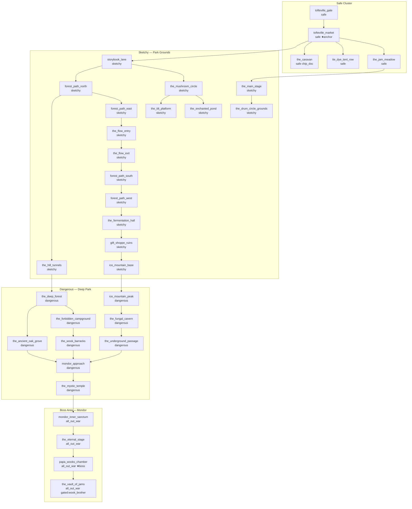

# Wooklyn

**Slug:** wooklyn
**Status:** done
**Priority:** 339
**Category:** world
**Effort:** XL

## Overview

Wooklyn is a new zone built on the grounds of the Enchanted Forest theme park (Turner, OR, I-5 exit 248), converted by the Wooks — descendants of jam-band-following hippies — into an eternal open-air festival compound. The park's original fairy-tale architecture, forested paths, and amusement rides persist under layers of tie-dye, compost, patchouli, and mycelium. The zone introduces the Wooks faction, three new NPC types (Wook, Ginger Wook, Wook Shaman), and a boss (Papa Wook). A persistent psychedelic zone effect ties into the advanced-health substance system.

## Dependencies

- `zone-content-expansion` — establishes safe cluster patterns and danger level conventions Wooklyn follows
- `factions` — Wooks faction uses all faction mechanics (rep tiers, zone ownership, gated rooms, price discount, Fixer NPC)
- `advanced-health` — zone effect uses SubstanceRegistry (`wook_spore` substance)
- `non-combat-npcs` — zone's safe cluster uses merchant/healer/banker/job_trainer NPC types
- `advanced-enemies` — Papa Wook uses boss room / ability mechanics
- `npc-behaviors` — Ginger Wook seduction uses HTN `say` + custom `seduce` operator

---

## Requirements

### Zone

- REQ-WK-1: The zone MUST have `id: wooklyn`, `name: "Wooklyn"`, `faction_id: wooks`, `default_danger_level: sketchy`, and `world_x`/`world_y` coordinates placing it south of the existing Portland zones on the world map.
- REQ-WK-2: Wooklyn MUST contain 30–40 rooms spanning the Enchanted Forest park grounds, forested paths, amusement structures, and underground passages.
- REQ-WK-3: Wooklyn MUST contain exactly one safe cluster of 3–5 contiguous Safe rooms (Tofteville Market area) serving as the neutral trading hub.
- REQ-WK-4: Zone edge rooms MUST have `danger_level: sketchy`. Zone core rooms MUST have `danger_level: dangerous` or `danger_level: all_out_war` for the boss area.
- REQ-WK-5: The zone MUST contain a boss room (`boss_room: true`) — Papa Wook's Chamber — located in the Challenge of Mondor attraction.
- REQ-WK-6: The zone MUST contain one `chip_doc` NPC in a safe cluster room (required by curse-removal).

### Room Map

Rooms are organized into four areas:

**Safe Cluster — Tofteville Market (5 rooms):**
- REQ-WK-7: `tofteville_gate` — The park entrance gate, now a wook checkpoint. Danger: `safe`. Entry point from world map.
- REQ-WK-8: `tofteville_market` — The old western town storefronts, now barter stalls. Danger: `safe`. Anchor room. Contains merchant and banker NPCs.
- REQ-WK-9: `the_jam_meadow` — Open field with a permanent stage and campfire rings. Danger: `safe`. Contains healer NPC.
- REQ-WK-10: `tie_dye_tent_row` — Row of canvas tents selling goods and services. Danger: `safe`. Contains job_trainer NPC.
- REQ-WK-11: `the_caravan` — A converted school bus serving as the zone's chip_doc clinic. Danger: `safe`. Contains chip_doc NPC.

**Sketchy Area — Park Grounds (16 rooms):**
- REQ-WK-12: `storybook_lane` — Fairy-tale sculptures in states of surreal decay, wooks camped among them.
- REQ-WK-13: `the_mushroom_circle` — A ring of giant painted mushroom sculptures. Sacred Wook gathering ground.
- REQ-WK-14: `the_enchanted_pond` — Former bumper boat lake, now a murky ritual bath.
- REQ-WK-15: `the_tilt_platform` — The rusted Tilt-a-Whirl, still spinning occasionally.
- REQ-WK-16: `the_main_stage` — Permanent concert stage. Music never stops. Wooks dance in rings.
- REQ-WK-17: `forest_path_north`
- REQ-WK-18: `forest_path_east`
- REQ-WK-19: `forest_path_south`
- REQ-WK-20: `forest_path_west`
- REQ-WK-21: `the_flow_entry` — Top of the log flume ride. Water still runs.
- REQ-WK-22: `the_flow_exit` — Bottom of the flume. Always wet.
- REQ-WK-23: `gift_shoppe_ruins` — Former gift shop. Wooks sell trade goods here.
- REQ-WK-24: `the_fermentation_hall` — Old food court, now a brewery/kitchen serving infused foods.
- REQ-WK-25: `ice_mountain_base` — Base of the former bobsled ride. Ice melted long ago.
- REQ-WK-26: `the_hill_tunnels` — Tunnels through the hill connecting north and south park grounds.
- REQ-WK-27: `the_drum_circle_grounds` — Permanent outdoor drum circle, day and night.

**Dangerous Area — Deep Park (9 rooms):**
- REQ-WK-28: `the_deep_forest` — Dense old-growth beyond the maintained paths. Danger: `dangerous`.
- REQ-WK-29: `the_forbidden_campground` — Wook barracks and training area. Danger: `dangerous`.
- REQ-WK-30: `ice_mountain_peak` — Bobsled peak, overlooking the compound. Danger: `dangerous`.
- REQ-WK-31: `the_fungal_cavern` — Underground cave system beneath the park. Danger: `dangerous`.
- REQ-WK-32: `the_ancient_oak_grove` — A circle of massive oaks at the park's wild edge. Danger: `dangerous`.
- REQ-WK-33: `the_underground_passage` — Maintenance tunnel connecting deep forest to Mondor approach. Danger: `dangerous`.
- REQ-WK-34: `the_wook_barracks` — Elite wook enforcer quarters. Danger: `dangerous`.
- REQ-WK-35: `mondor_approach` — The winding path leading to the Challenge of Mondor attraction. Danger: `dangerous`.
- REQ-WK-36: `the_mystic_temple` — Antechamber to Mondor, covered in murals and offerings. Danger: `dangerous`.

**Boss Area — Challenge of Mondor (4 rooms):**
- REQ-WK-37: `mondor_inner_sanctum` — The ride's inner chamber, now a throne room. Danger: `all_out_war`.
- REQ-WK-38: `the_eternal_stage` — An underground stage where Papa Wook holds court. Danger: `all_out_war`.
- REQ-WK-39: `papa_wooks_chamber` — Boss room (`boss_room: true`). Papa Wook's private chamber. Danger: `all_out_war`.
- REQ-WK-40: `the_vault_of_jams` — A sealed vault of rare recordings and trade goods. Gated: requires `wook_brother` tier. Danger: `all_out_war`.

### NPC Types

- REQ-WK-41: A `wook` NPC type MUST be defined: humanoid, dreadlocked, faction_id `wooks`, attack verb `swings a drum stick at`, weapon `drum_stick`, loot table includes credits (5–30) and organic drops (herbs, mushrooms). Disposition `hostile` to players with Wooks rep < 10 (Narc tier), `neutral` otherwise.
- REQ-WK-42: A `ginger_wook` NPC type MUST be defined: always female (name generator uses female names only), red dreadlocks in description, faction_id `wooks`. The Ginger Wook uses an HTN `seduce` operator that fires a Flair-vs-Savvy opposed check; on player failure, the player loses their next action (stunned/distracted). Attack verb `blows a kiss at`. Disposition `hostile` to players with Wooks rep < 10.
- REQ-WK-43: A `wook_shaman` NPC type MUST be defined: elder wook with painted face, faction_id `wooks`. On attack, applies the `wook_spore` substance (see zone effect) to the target with onset 0. Attack verb `exhales a cloud at`. Danger level: `dangerous` rooms only.
- REQ-WK-44: A `wook_enforcer` NPC type MUST be defined: large, muscular wook with a tie-dye leather jacket, faction_id `wooks`. Higher HP and AC than standard wook. Attack verb `slams`. Appears only in `dangerous` and `all_out_war` rooms.
- REQ-WK-45: A `papa_wook` NPC type MUST be defined as the zone boss: enormous wook in a ceremonial robe with a 12-foot dreadlock crown. Faction_id `wooks`. Boss abilities: `summon_drum_circle` (calls 2 wook reinforcements), `psychedelic_burst` (applies `wook_spore` substance to all players in room), `the_eternal_groove` (reduces all player AP by 1 for next round). Placed only in `papa_wooks_chamber`.

### Boss Room

- REQ-WK-46: `papa_wooks_chamber` MUST be defined with `boss_room: true` and `hazards:` including `drumming_resonance` (deals 1d4 sonic damage to all players at round start) and `psychedelic_fog` (applies mild `wook_spore` dose each round to players in room).
- REQ-WK-47: When Papa Wook is killed, `the_vault_of_jams` exit MUST unlock (gate removed).
- REQ-WK-48: Papa Wook MUST respawn after 72 in-game hours (coordinated boss respawn per advanced-enemies mechanics).

### Zone Effect

- REQ-WK-49: A `wook_spore` substance MUST be defined in `content/substances/wook_spore.yaml` with: type `psychedelic`, onset 0 (immediate), duration 600 seconds (10 in-game minutes), effects: Reasoning −2, Savvy −2, Flair +3 (hallucinations make the player gregarious). Addiction potential: low.
- REQ-WK-50: While a player is in any Wooklyn room, the 5-second ticker MUST apply one micro-dose of `wook_spore` every 60 seconds, resetting the duration timer. This represents ambient spore exposure throughout the zone.
- REQ-WK-51: Exiting Wooklyn stops the ambient dosing. The active effect continues to run its remaining duration after exit.
- REQ-WK-52: The `wook_spore` substance MUST be cross-validated against the condition system to ensure Reasoning and Savvy penalties are applied as temporary attribute modifiers during the effect window.

### Faction: The Wooks

- REQ-WK-53: A `wooks` faction MUST be defined in `content/factions/wooks.yaml` with `zone_id: wooklyn` and four reputation tiers:
  - Tier 1: `narc` — label "Narc", min_rep 0, price_discount 0.0. NPCs attack on sight.
  - Tier 2: `curious` — label "Curious Traveler", min_rep 10, price_discount 0.05. Allowed in safe cluster; NPCs tolerate but watch.
  - Tier 3: `fellow_traveler` — label "Fellow Traveler", min_rep 25, price_discount 0.15. Allowed in sketchy area without aggro; discount at market.
  - Tier 4: `wook_brother` — label "Wook Brother/Sister", min_rep 50, price_discount 0.25. Full zone access; `the_vault_of_jams` gating removed; 25% discount.
- REQ-WK-54: The Wooks MUST be defined as hostile to `team_gun` and `team_machete` factions (`hostile_factions: [team_gun, team_machete]`). Players of those factions are treated as Narc regardless of rep.
- REQ-WK-55: Rep is earned by: killing wooks (base rep × NPC level, capped at +5 per kill while below `fellow_traveler`; killing wooks above `fellow_traveler` costs −10 rep), completing Wook-faction quests (when quests feature is implemented), paying a Fixer NPC in the zone.
- REQ-WK-56: `the_vault_of_jams` room MUST have `min_faction_tier_id: wook_brother` in its room YAML.
- REQ-WK-57: A Fixer NPC (`wook_fixer`) MUST be present in `tofteville_market` to provide `change_rep` service.

### Spawn Distribution

- REQ-WK-58: Safe cluster rooms MUST have 0 combat NPC spawns.
- REQ-WK-59: Sketchy rooms MUST contain 1–2 spawns of `wook` or `ginger_wook` (ratio ~60% wook / 40% ginger_wook).
- REQ-WK-60: Dangerous rooms MUST contain 2–3 spawns: `wook_enforcer`, `wook_shaman`, or `wook` (ratio ~40% enforcer / 30% shaman / 30% wook).
- REQ-WK-61: `all_out_war` rooms (boss area excluding boss room) MUST contain 3–4 spawns of `wook_enforcer`.
- REQ-WK-62: `papa_wooks_chamber` MUST contain exactly 1 spawn of `papa_wook` and 2 spawns of `wook_enforcer`.

---

## Zone Map (Mermaid)

