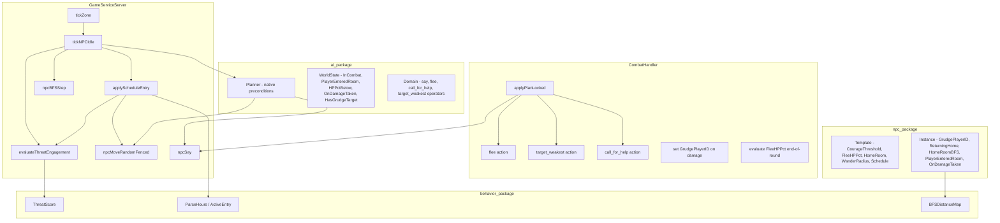

# Per-NPC Custom Behaviors Implementation Plan

> **For agentic workers:** REQUIRED SUB-SKILL: Use superpowers:subagent-driven-development (recommended) or superpowers:executing-plans to implement this plan task-by-task. Steps use checkbox (`- [ ]`) syntax for tracking.

**Implementation Order:** Implement in this sequence to avoid conflicts on `npc/template.go`: (1) map-poi [adds NpcRole], (2) non-human-npcs [adds AttackVerb/Immobile], (3) **npc-behaviors** [removes Taunts, adds behavior fields], (4) advanced-enemies [adds Tier/Tags/Feats], (5) factions [adds FactionID], (6) curse-removal [adds ChipDocConfig].

**Goal:** Add HTN-based NPC behavior system with dialog templates, daily schedule/patrol patterns, threat assessment, flee/call_for_help operators, target_weakest combat AI, wander radius fencing, and home-room return.

**Architecture:** New `internal/game/npc/behavior/` package with HTN precondition evaluator; NPC Template gains `CourageThreshold`, `FleeHPPct`, `HomeRoom`, `WanderRadius`, `Schedule` fields; NPC Instance gains `GrudgePlayerID`, `ReturningHome`, `HomeRoomBFS`, `PlayerEnteredRoom`, `OnDamageTaken`; operator implementations for `say`, `flee`, `call_for_help`, `target_weakest`, and updated `move_random`; behavior tick driven by existing `tickNPCIdle`/`tickZone` in `grpc_service.go`.

**Tech Stack:** Go, HTN planning (`internal/game/ai`), existing NPC/room/combat packages, YAML behavior profiles, `pgregory.net/rapid` for property-based tests.

---

## File Map

### New Files
- `internal/game/npc/behavior/threat.go` — `ThreatAssess(players []PlayerSnapshot, npcLevel int) int` threat score formula (REQ-NB-7–11)
- `internal/game/npc/behavior/threat_test.go` — unit + property tests for threat formula
- `internal/game/npc/behavior/schedule.go` — `ScheduleEntry`, `ParseHours(s string) ([]int, error)`, `ActiveEntry(entries []ScheduleEntry, hour int) *ScheduleEntry` (REQ-NB-16–22, 45)
- `internal/game/npc/behavior/schedule_test.go` — unit + property tests for schedule parsing and matching
- `internal/game/npc/behavior/bfs.go` — `BFSDistanceMap(zoneRooms []*world.Room, originID string) (map[string]int, error)` (REQ-NB-38–39)
- `internal/game/npc/behavior/bfs_test.go` — unit + property tests for BFS

### Modified Files
- `internal/game/npc/template.go` — add `CourageThreshold int`, `FleeHPPct int`, `HomeRoom string`, `WanderRadius int`, `Schedule []behavior.ScheduleEntry`; remove `Taunts`, `TauntChance`, `TauntCooldown`; update `Validate()` (REQ-NB-6, 10, 11, 17, 36, 37)
- `internal/game/npc/instance.go` — add `GrudgePlayerID string`, `ReturningHome bool`, `HomeRoomBFS map[string]int`, `PlayerEnteredRoom bool`, `OnDamageTaken bool`; remove `Taunts`, `TauntChance`, `TauntCooldown`, `LastTauntTime`; remove `TryTaunt()`; update `NewInstanceWithResolver()` (REQ-NB-6, 12, 41)
- `internal/game/npc/template_test.go` — update to remove taunt field tests; add tests for new fields
- `internal/game/npc/instance_test.go` — update to remove TryTaunt tests; add tests for new fields
- `internal/game/ai/domain.go` — add `"say"`, `"flee"`, `"call_for_help"`, `"target_weakest"` to valid operator actions in `Validate()`; add `Strings []string`, `Cooldown string` to `Operator` struct (REQ-NB-1, 2, 25–35)
- `internal/game/ai/world_state.go` — extend `WorldState` with `InCombat bool`, `PlayerEnteredRoom bool`, `HPPctBelow int`, `OnDamageTaken bool`, `HasGrudgeTarget bool` (REQ-NB-3, 4, 15)
- `internal/gameserver/grpc_service.go` — update `tickNPCIdle` to dispatch `say`, `flee`, `call_for_help`, `target_weakest`, updated `move_random`; add threat assessment on player room entry; add `ReturningHome` step; inject `GameHourFunc`; handle `PlayerEnteredRoom` flag clearing (REQ-NB-7, 8, 16, 19–22, 41–44)
- `internal/gameserver/combat_handler.go` — set `GrudgePlayerID` on NPC damage; evaluate `FleeHPPct` end-of-round; detect combat end → set `ReturningHome`; update `applyPlanLocked` for `say`, `flee`, `call_for_help`, `target_weakest` actions (REQ-NB-12–14, 25–35, 41)
- `content/npcs/ganger.yaml` — migrate taunts to HTN domain entries (REQ-NB-5)
- `content/npcs/highway_bandit.yaml` — migrate taunts to HTN domain entries (REQ-NB-5)
- `content/npcs/bridge_troll.yaml` — migrate taunts to HTN domain entries (REQ-NB-5)
- `content/ai/ganger_combat.yaml` — add `say` operator with `in_combat` native precondition; update ganger.yaml `ai_domain` field to `ganger_combat` (REQ-NB-5)
- `content/ai/highway_bandit_combat.yaml` — add `say` operator (create if not exists) (REQ-NB-5)
- `content/ai/bridge_troll_combat.yaml` — add `say` operator (create if not exists) (REQ-NB-5)

---

## Task 1: New `behavior` Package — Threat Assessment

**Files:**
- Create: `internal/game/npc/behavior/threat.go`
- Create: `internal/game/npc/behavior/threat_test.go`

### Step 1.1: Write failing tests

- [ ] Create `internal/game/npc/behavior/threat_test.go`:

```go
package behavior_test

import (
	"testing"

	"pgregory.net/rapid"

	"github.com/cory-johannsen/mud/internal/game/npc/behavior"
)

func TestThreatScore_BasicFormula(t *testing.T) {
	// party of 2 players avg level 5, npc level 3, avg hp 100%
	// score = (5-3) + (2-1)*2 - floor((1-1.0)*3) = 2+2-0 = 4
	players := []behavior.PlayerSnapshot{
		{Level: 5, CurrentHP: 10, MaxHP: 10},
		{Level: 5, CurrentHP: 10, MaxHP: 10},
	}
	got := behavior.ThreatScore(players, 3)
	if got != 4 {
		t.Fatalf("expected 4, got %d", got)
	}
}

func TestThreatScore_InjuredParty(t *testing.T) {
	// party of 1 player avg level 3, npc level 3, avg hp 50%
	// score = (3-3) + (1-1)*2 - floor((1-0.5)*3) = 0+0 - floor(1.5) = 0-1 = -1
	players := []behavior.PlayerSnapshot{
		{Level: 3, CurrentHP: 5, MaxHP: 10},
	}
	got := behavior.ThreatScore(players, 3)
	if got != -1 {
		t.Fatalf("expected -1, got %d", got)
	}
}

func TestThreatScore_EmptyPlayers_ReturnsZero(t *testing.T) {
	got := behavior.ThreatScore(nil, 5)
	if got != 0 {
		t.Fatalf("expected 0 for empty players, got %d", got)
	}
}

func TestProperty_ThreatScore_WoundedPartyReducesScore(t *testing.T) {
	rapid.Check(t, func(rt *rapid.T) {
		npcLevel := rapid.IntRange(1, 20).Draw(rt, "npcLevel")
		n := rapid.IntRange(1, 5).Draw(rt, "n")
		level := rapid.IntRange(1, 20).Draw(rt, "level")

		fullHP := make([]behavior.PlayerSnapshot, n)
		halfHP := make([]behavior.PlayerSnapshot, n)
		for i := range fullHP {
			fullHP[i] = behavior.PlayerSnapshot{Level: level, CurrentHP: 10, MaxHP: 10}
			halfHP[i] = behavior.PlayerSnapshot{Level: level, CurrentHP: 5, MaxHP: 10}
		}

		full := behavior.ThreatScore(fullHP, npcLevel)
		half := behavior.ThreatScore(halfHP, npcLevel)

		if half > full {
			rt.Fatalf("wounded party score %d exceeded full-hp score %d", half, full)
		}
	})
}
```

- [ ] **Run test to verify it fails**

```bash
cd /home/cjohannsen/src/mud && go test ./internal/game/npc/behavior/... 2>&1 | head -20
```
Expected: `cannot find package`

### Step 1.2: Implement threat.go

- [ ] Create `internal/game/npc/behavior/threat.go`:

```go
// Package behavior implements NPC behavior evaluation helpers for the HTN system.
package behavior

import "math"

// PlayerSnapshot captures combat-relevant state of one player for threat assessment.
type PlayerSnapshot struct {
	Level     int
	CurrentHP int
	MaxHP     int
}

// ThreatScore computes the threat score for a group of players against an NPC of npcLevel.
//
// Formula: (playerAvgLevel - npcLevel) + (partySize-1)*2 - floor((1.0 - playerAvgHPPct) * 3)
//
// Precondition: npcLevel >= 1.
// Postcondition: returns 0 when players is empty; otherwise returns a signed int.
func ThreatScore(players []PlayerSnapshot, npcLevel int) int {
	if len(players) == 0 {
		return 0
	}
	partySize := len(players)
	sumLevel := 0
	sumHP := 0
	sumMaxHP := 0
	for _, p := range players {
		sumLevel += p.Level
		sumHP += p.CurrentHP
		sumMaxHP += p.MaxHP
	}
	avgLevel := float64(sumLevel) / float64(partySize)
	avgHPPct := 0.0
	if sumMaxHP > 0 {
		avgHPPct = float64(sumHP) / float64(sumMaxHP)
	}
	// Apply formula: (avgLevel - npcLevel) + (partySize-1)*2 - floor((1-avgHPPct)*3).
	// math.Floor truncates toward negative infinity per spec. REQ-NB-9.
	score := (avgLevel - float64(npcLevel)) +
		float64((partySize-1)*2) -
		math.Floor((1.0-avgHPPct)*3)
	// Convert to int by truncating; intermediate float precision is sufficient.
	return int(score)
}
```

- [ ] **Run test to verify it passes**

```bash
cd /home/cjohannsen/src/mud && go test ./internal/game/npc/behavior/... -run TestThreatScore -v
```
Expected: all PASS

- [ ] **Commit**

```bash
cd /home/cjohannsen/src/mud && git add internal/game/npc/behavior/threat.go internal/game/npc/behavior/threat_test.go && git commit -m "feat(npc-behaviors): add behavior package with threat score formula"
```

---

## Task 2: Schedule Parsing

**Files:**
- Create: `internal/game/npc/behavior/schedule.go`
- Create: `internal/game/npc/behavior/schedule_test.go`

### Step 2.1: Write failing tests

- [ ] Create `internal/game/npc/behavior/schedule_test.go`:

```go
package behavior_test

import (
	"testing"

	"pgregory.net/rapid"

	"github.com/cory-johannsen/mud/internal/game/npc/behavior"
)

func TestParseHours_Range(t *testing.T) {
	hours, err := behavior.ParseHours("6-18")
	if err != nil {
		t.Fatal(err)
	}
	if len(hours) != 13 {
		t.Fatalf("expected 13 hours (6..18), got %d", len(hours))
	}
	if hours[0] != 6 || hours[len(hours)-1] != 18 {
		t.Fatalf("expected 6..18, got %d..%d", hours[0], hours[len(hours)-1])
	}
}

func TestParseHours_WrapMidnight(t *testing.T) {
	hours, err := behavior.ParseHours("19-5")
	if err != nil {
		t.Fatal(err)
	}
	// 19,20,21,22,23,0,1,2,3,4,5 = 11 hours
	if len(hours) != 11 {
		t.Fatalf("expected 11 hours (19..23 + 0..5), got %d", len(hours))
	}
}

func TestParseHours_CommaSeparated(t *testing.T) {
	hours, err := behavior.ParseHours("8,12,20")
	if err != nil {
		t.Fatal(err)
	}
	if len(hours) != 3 {
		t.Fatalf("expected 3 hours, got %d", len(hours))
	}
}

func TestParseHours_Invalid(t *testing.T) {
	_, err := behavior.ParseHours("abc")
	if err == nil {
		t.Fatal("expected error for invalid input")
	}
}

func TestActiveEntry_MatchesRange(t *testing.T) {
	entries := []behavior.ScheduleEntry{
		{Hours: "6-18", PreferredRoom: "market", BehaviorMode: "patrol"},
		{Hours: "19-5", PreferredRoom: "barracks", BehaviorMode: "idle"},
	}
	e := behavior.ActiveEntry(entries, 12)
	if e == nil || e.PreferredRoom != "market" {
		t.Fatal("expected market entry at hour 12")
	}
	e = behavior.ActiveEntry(entries, 22)
	if e == nil || e.PreferredRoom != "barracks" {
		t.Fatal("expected barracks entry at hour 22")
	}
	e = behavior.ActiveEntry(entries, 3)
	if e == nil || e.PreferredRoom != "barracks" {
		t.Fatal("expected barracks entry at hour 3 (wrap)")
	}
}

func TestActiveEntry_NoMatch(t *testing.T) {
	entries := []behavior.ScheduleEntry{
		{Hours: "8,12", PreferredRoom: "office", BehaviorMode: "idle"},
	}
	e := behavior.ActiveEntry(entries, 10)
	if e != nil {
		t.Fatal("expected nil at hour 10")
	}
}

func TestProperty_ActiveEntry_NilWhenEmpty(t *testing.T) {
	rapid.Check(t, func(rt *rapid.T) {
		hour := rapid.IntRange(0, 23).Draw(rt, "hour")
		e := behavior.ActiveEntry(nil, hour)
		if e != nil {
			rt.Fatalf("expected nil for empty schedule at hour %d", hour)
		}
	})
}
```

- [ ] **Run test to verify it fails**

```bash
cd /home/cjohannsen/src/mud && go test ./internal/game/npc/behavior/... -run TestParseHours 2>&1 | head -10
```

### Step 2.2: Implement schedule.go

- [ ] Create `internal/game/npc/behavior/schedule.go`:

```go
package behavior

import (
	"fmt"
	"strconv"
	"strings"
)

// ScheduleEntry defines one time-of-day behavior window for an NPC.
type ScheduleEntry struct {
	// Hours is a range ("6-18") or comma-separated ("8,12,20") hour specification.
	Hours string `yaml:"hours"`
	// PreferredRoom is the room ID the NPC moves toward during this window.
	PreferredRoom string `yaml:"preferred_room"`
	// BehaviorMode is one of "idle", "patrol", "aggressive".
	BehaviorMode string `yaml:"behavior_mode"`
}

// ParseHours parses a schedule hours string into a slice of hour values (0–23).
// Supports range format ("6-18", wrapping when end < start) and comma-separated ("8,12,20").
//
// Precondition: s must be non-empty.
// Postcondition: all returned values are in [0, 23]; returns an error on parse failure.
func ParseHours(s string) ([]int, error) {
	s = strings.TrimSpace(s)
	if strings.Contains(s, "-") {
		parts := strings.SplitN(s, "-", 2)
		start, err := strconv.Atoi(strings.TrimSpace(parts[0]))
		if err != nil {
			return nil, fmt.Errorf("behavior.ParseHours: invalid start hour %q: %w", parts[0], err)
		}
		end, err := strconv.Atoi(strings.TrimSpace(parts[1]))
		if err != nil {
			return nil, fmt.Errorf("behavior.ParseHours: invalid end hour %q: %w", parts[1], err)
		}
		if start < 0 || start > 23 || end < 0 || end > 23 {
			return nil, fmt.Errorf("behavior.ParseHours: hours must be in [0,23], got %d-%d", start, end)
		}
		var hours []int
		if end >= start {
			for h := start; h <= end; h++ {
				hours = append(hours, h)
			}
		} else {
			// wrap midnight
			for h := start; h <= 23; h++ {
				hours = append(hours, h)
			}
			for h := 0; h <= end; h++ {
				hours = append(hours, h)
			}
		}
		return hours, nil
	}
	// comma-separated
	parts := strings.Split(s, ",")
	hours := make([]int, 0, len(parts))
	for _, p := range parts {
		h, err := strconv.Atoi(strings.TrimSpace(p))
		if err != nil {
			return nil, fmt.Errorf("behavior.ParseHours: invalid hour %q: %w", p, err)
		}
		if h < 0 || h > 23 {
			return nil, fmt.Errorf("behavior.ParseHours: hour %d out of range [0,23]", h)
		}
		hours = append(hours, h)
	}
	if len(hours) == 0 {
		return nil, fmt.Errorf("behavior.ParseHours: no hours parsed from %q", s)
	}
	return hours, nil
}

// ActiveEntry returns the first schedule entry whose hours include the given game hour,
// or nil if no entry matches.
//
// Precondition: hour must be in [0, 23].
// Postcondition: returns nil when entries is empty or no entry matches hour.
func ActiveEntry(entries []ScheduleEntry, hour int) *ScheduleEntry {
	for i := range entries {
		hours, err := ParseHours(entries[i].Hours)
		if err != nil {
			continue
		}
		for _, h := range hours {
			if h == hour {
				return &entries[i]
			}
		}
	}
	return nil
}
```

- [ ] **Run tests to verify they pass**

```bash
cd /home/cjohannsen/src/mud && go test ./internal/game/npc/behavior/... -v
```
Expected: all PASS

- [ ] **Commit**

```bash
cd /home/cjohannsen/src/mud && git add internal/game/npc/behavior/schedule.go internal/game/npc/behavior/schedule_test.go && git commit -m "feat(npc-behaviors): add schedule entry parsing with hour range and wrap-midnight support"
```

---

## Task 3: BFS Distance Map

**Files:**
- Create: `internal/game/npc/behavior/bfs.go`
- Create: `internal/game/npc/behavior/bfs_test.go`

### Step 3.1: Write failing tests

- [ ] Create `internal/game/npc/behavior/bfs_test.go`:

```go
package behavior_test

import (
	"testing"

	"pgregory.net/rapid"

	"github.com/cory-johannsen/mud/internal/game/npc/behavior"
	"github.com/cory-johannsen/mud/internal/game/world"
)

func TestBFSDistanceMap_LinearChain(t *testing.T) {
	// A -> B -> C
	rooms := []*world.Room{
		{ID: "A", Exits: []world.Exit{{TargetRoom: "B"}}},
		{ID: "B", Exits: []world.Exit{{TargetRoom: "A"}, {TargetRoom: "C"}}},
		{ID: "C", Exits: []world.Exit{{TargetRoom: "B"}}},
	}
	dm, err := behavior.BFSDistanceMap(rooms, "A")
	if err != nil {
		t.Fatal(err)
	}
	if dm["A"] != 0 {
		t.Errorf("A distance expected 0, got %d", dm["A"])
	}
	if dm["B"] != 1 {
		t.Errorf("B distance expected 1, got %d", dm["B"])
	}
	if dm["C"] != 2 {
		t.Errorf("C distance expected 2, got %d", dm["C"])
	}
}

func TestBFSDistanceMap_OriginNotInRooms_ReturnsError(t *testing.T) {
	rooms := []*world.Room{
		{ID: "A", Exits: []world.Exit{{TargetRoom: "B"}}},
	}
	_, err := behavior.BFSDistanceMap(rooms, "X")
	if err == nil {
		t.Fatal("expected error for origin not in rooms")
	}
}

func TestBFSDistanceMap_Disconnected_NotReachable(t *testing.T) {
	rooms := []*world.Room{
		{ID: "A"},
		{ID: "B"},
	}
	dm, err := behavior.BFSDistanceMap(rooms, "A")
	if err != nil {
		t.Fatal(err)
	}
	if _, ok := dm["B"]; ok {
		t.Error("disconnected room B should not be in distance map")
	}
}

func TestProperty_BFSDistanceMap_OriginAlwaysZero(t *testing.T) {
	rapid.Check(t, func(rt *rapid.T) {
		// Build a simple linear chain of n rooms
		n := rapid.IntRange(1, 10).Draw(rt, "n")
		rooms := make([]*world.Room, n)
		for i := 0; i < n; i++ {
			id := fmt.Sprintf("room%d", i)
			var exits []world.Exit
			if i+1 < n {
				exits = append(exits, world.Exit{TargetRoom: fmt.Sprintf("room%d", i+1)})
			}
			rooms[i] = &world.Room{ID: id, Exits: exits}
		}
		dm, err := behavior.BFSDistanceMap(rooms, "room0")
		if err != nil {
			rt.Fatal(err)
		}
		if dm["room0"] != 0 {
			rt.Fatalf("origin must have distance 0, got %d", dm["room0"])
		}
	})
}
```

Note: add `"fmt"` import to the test file. The property test uses `fmt.Sprintf` — include `"fmt"` in the import block.

- [ ] **Run test to verify it fails**

```bash
cd /home/cjohannsen/src/mud && go test ./internal/game/npc/behavior/... -run TestBFSDistanceMap 2>&1 | head -10
```

### Step 3.2: Implement bfs.go

- [ ] Create `internal/game/npc/behavior/bfs.go`:

```go
package behavior

import (
	"fmt"

	"github.com/cory-johannsen/mud/internal/game/world"
)

// BFSDistanceMap computes the BFS hop distance from originID to every reachable room
// in the provided room slice. Exits that target rooms not in the slice are ignored.
//
// Precondition: rooms must not be nil; originID must be the ID of a room in rooms.
// Postcondition: returns a map of roomID → hop count from originID (origin maps to 0);
// rooms unreachable from origin are absent from the map.
// Returns an error if originID is not found in rooms.
func BFSDistanceMap(rooms []*world.Room, originID string) (map[string]int, error) {
	roomByID := make(map[string]*world.Room, len(rooms))
	for _, r := range rooms {
		roomByID[r.ID] = r
	}
	if _, ok := roomByID[originID]; !ok {
		return nil, fmt.Errorf("behavior.BFSDistanceMap: origin %q not found in rooms", originID)
	}

	dist := make(map[string]int, len(rooms))
	dist[originID] = 0
	queue := []string{originID}

	for len(queue) > 0 {
		cur := queue[0]
		queue = queue[1:]
		room := roomByID[cur]
		for _, exit := range room.Exits {
			if _, exists := roomByID[exit.TargetRoom]; !exists {
				continue
			}
			if _, visited := dist[exit.TargetRoom]; !visited {
				dist[exit.TargetRoom] = dist[cur] + 1
				queue = append(queue, exit.TargetRoom)
			}
		}
	}
	return dist, nil
}
```

- [ ] **Run tests to verify they pass**

```bash
cd /home/cjohannsen/src/mud && go test ./internal/game/npc/behavior/... -v
```
Expected: all PASS

- [ ] **Commit**

```bash
cd /home/cjohannsen/src/mud && git add internal/game/npc/behavior/bfs.go internal/game/npc/behavior/bfs_test.go && git commit -m "feat(npc-behaviors): add BFS distance map computation for wander-radius fencing"
```

---

## Task 4: Template and Instance Field Changes

**Files:**
- Modify: `internal/game/npc/template.go`
- Modify: `internal/game/npc/instance.go`
- Modify: `internal/game/npc/template_test.go`
- Modify: `internal/game/npc/instance_test.go`

### Step 4.1: Update Template struct

- [ ] In `internal/game/npc/template.go`:
  - Add import `"github.com/cory-johannsen/mud/internal/game/npc/behavior"`
  - Remove fields `Taunts []string`, `TauntChance float64`, `TauntCooldown string`
  - Add fields after `Disposition string`:

```go
// CourageThreshold is the threat score above which the NPC will not engage.
// Default 999 preserves always-engage behavior for all existing templates.
CourageThreshold int `yaml:"courage_threshold"`
// FleeHPPct is the HP percentage below which the NPC attempts to flee combat. 0 = never flee.
FleeHPPct int `yaml:"flee_hp_pct"`
// HomeRoom is the room ID the NPC returns to when idle. Defaults to spawn room if not set.
HomeRoom string `yaml:"home_room"`
// WanderRadius is the maximum BFS hop distance from HomeRoom during patrol. 0 = no movement.
WanderRadius int `yaml:"wander_radius"`
// Schedule is an optional time-of-day behavior window list.
// Templates without it behave using default template settings.
Schedule []behavior.ScheduleEntry `yaml:"schedule,omitempty"`
```

  - In `Validate()`, remove the taunt-related validations:
    - Remove: `if t.TauntChance < 0 || t.TauntChance > 1 { ... }`
    - Remove: `if t.TauntCooldown != "" { ... }`
  - In `Validate()`, add defaults after the `if t.NPCType == "" { t.NPCType = "combat" }` block:

```go
// Default CourageThreshold to 999 (always engage). REQ-NB-10.
if t.CourageThreshold == 0 {
    t.CourageThreshold = 999
}
```

- [ ] **Run existing template tests to confirm they need update**

```bash
cd /home/cjohannsen/src/mud && go test ./internal/game/npc/... 2>&1 | head -30
```

- [ ] Update `internal/game/npc/template_test.go`:
  - Remove any test assertions that reference `Taunts`, `TauntChance`, `TauntCooldown`
  - Add test `TestTemplate_Validate_CourageThresholdDefaultsTo999`:

```go
func TestTemplate_Validate_CourageThresholdDefaultsTo999(t *testing.T) {
	tmpl := &npc.Template{
		ID: "test", Name: "Test", Level: 1, MaxHP: 10, AC: 10,
	}
	if err := tmpl.Validate(); err != nil {
		t.Fatal(err)
	}
	if tmpl.CourageThreshold != 999 {
		t.Fatalf("expected CourageThreshold 999, got %d", tmpl.CourageThreshold)
	}
}
```

### Step 4.2: Update Instance struct

- [ ] In `internal/game/npc/instance.go`:
  - Remove fields `Taunts []string`, `TauntChance float64`, `TauntCooldown time.Duration`, `LastTauntTime time.Time`
  - Remove the `time` import if it is no longer used (check other usages — it likely stays for `AbilityCooldowns`)
  - Add fields after `Cowering bool`:

```go
// GrudgePlayerID is the ID of the last player to deal damage to this NPC.
// Cleared to "" on respawn. REQ-NB-12.
GrudgePlayerID string
// ReturningHome is true when the NPC is moving back to its HomeRoom after combat.
// Cleared when the NPC arrives at HomeRoom. REQ-NB-41.
ReturningHome bool
// HomeRoomBFS is the precomputed BFS distance map from HomeRoom to all zone rooms.
// Populated at zone load. REQ-NB-38.
HomeRoomBFS map[string]int
// HomeRoomID is the resolved home room ID (from Template.HomeRoom or spawn room).
HomeRoomID string
// PlayerEnteredRoom is true for exactly one idle tick after a player enters the NPC's room.
// REQ-NB-4.
PlayerEnteredRoom bool
// OnDamageTaken is true for exactly one idle tick in the round the NPC received damage.
// REQ-NB-4.
OnDamageTaken bool
```

  - Remove the `TryTaunt()` method entirely.
  - In `NewInstanceWithResolver()`: remove taunt-related fields from initialization; add `HomeRoomID: roomID` (spawn room default per REQ-NB-36); also set `CourageThreshold` by copying from `tmpl`. Add a `CourageThreshold int` field to `Instance`:

```go
// CourageThreshold copied from template; effective threshold may be overridden by schedule.
CourageThreshold int
// FleeHPPct is the HP% below which the NPC flees combat. 0 = never flee.
FleeHPPct int
// WanderRadius is the max BFS hops from HomeRoomID during patrol. 0 = no movement.
WanderRadius int
```

  - Update `NewInstanceWithResolver()` to set:

```go
CourageThreshold: tmpl.CourageThreshold,
FleeHPPct:        tmpl.FleeHPPct,
WanderRadius:     tmpl.WanderRadius,
HomeRoomID:       func() string {
    if tmpl.HomeRoom != "" {
        return tmpl.HomeRoom
    }
    return roomID
}(),
```

  - Remove the taunt `cooldown` local variable and the `TauntCooldown` field from the `return &Instance{...}` block.

- [ ] **Run tests**

```bash
cd /home/cjohannsen/src/mud && go test ./internal/game/npc/... 2>&1 | head -40
```

Fix compilation errors from removed fields/methods. Key places to check:
- `internal/gameserver/grpc_service.go` lines ~1870 and ~3712: remove `inst.TryTaunt(time.Now())` calls (replace with no-op stubs — the `say` operator replaces this in Task 8).
- Any other reference to `TryTaunt`, `Taunts`, `TauntChance`, `TauntCooldown`, `LastTauntTime` in `internal/gameserver/`.

- [ ] **Run full test suite**

```bash
cd /home/cjohannsen/src/mud && go test ./... 2>&1 | tail -20
```

- [ ] **Commit**

```bash
cd /home/cjohannsen/src/mud && git add internal/game/npc/template.go internal/game/npc/instance.go internal/game/npc/template_test.go internal/game/npc/instance_test.go internal/gameserver/grpc_service.go && git commit -m "feat(npc-behaviors): remove taunt subsystem; add CourageThreshold/FleeHPPct/HomeRoom/WanderRadius/Schedule fields"
```

---

## Task 5: HTN Domain and WorldState Extensions

**Files:**
- Modify: `internal/game/ai/domain.go`
- Modify: `internal/game/ai/world_state.go`
- Modify: `internal/game/ai/domain_test.go`
- Modify: `internal/game/ai/world_state_test.go`

### Step 5.1: Extend Operator struct for `say`

- [ ] In `internal/game/ai/domain.go`, add to `Operator` struct:

```go
// Strings is the pool of lines for the "say" action; one is chosen at random.
Strings []string `yaml:"strings,omitempty"`
// Cooldown is a Go duration string for the "say" action cooldown. Parsed at execute time.
Cooldown string `yaml:"cooldown,omitempty"`
```

- [ ] In `Validate()`, update the valid actions check. Currently `Operator` validates non-empty ID/Action. Extend the action validation to accept `"say"`, `"flee"`, `"call_for_help"`, `"target_weakest"` in addition to existing values. Find the operator loop in `Validate()` and add:

```go
validActions := map[string]bool{
    "attack": true, "strike": true, "pass": true, "flee": true,
    "apply_mental_state": true, "move_random": true, "say": true,
    "call_for_help": true, "target_weakest": true,
}
for _, op := range d.Operators {
    if op.ID == "" || op.Action == "" {
        return fmt.Errorf("ai.Domain %q: operator missing ID or Action", d.ID)
    }
    if !validActions[op.Action] {
        return fmt.Errorf("ai.Domain %q operator %q: unknown action %q", d.ID, op.ID, op.Action)
    }
}
```

Replace the existing loop that only checks for empty `ID`/`Action`.

### Step 5.2: Extend WorldState for new preconditions

- [ ] In `internal/game/ai/world_state.go`, add to `WorldState`:

```go
// InCombat is true when the NPC is an active combat participant. REQ-NB-3.
InCombat bool
// PlayerEnteredRoom is true for one tick after a player enters the room. REQ-NB-3, REQ-NB-4.
PlayerEnteredRoom bool
// HPPctBelow is the NPC's current HP% (0–100) for hp_pct_below precondition. REQ-NB-3.
HPPctBelow int
// OnDamageTaken is true for one tick in the round the NPC received damage. REQ-NB-3, REQ-NB-4.
OnDamageTaken bool
// HasGrudgeTarget is true when the NPC's GrudgePlayerID is non-empty. REQ-NB-15.
HasGrudgeTarget bool
// GrudgePlayerID is the player ID the NPC holds a grudge against.
GrudgePlayerID string
```

### Step 5.3: Write tests for domain validation

- [ ] In `internal/game/ai/domain_test.go`, add test `TestDomain_Validate_AcceptsSayOperator`:

```go
func TestDomain_Validate_AcceptsSayOperator(t *testing.T) {
	d := &ai.Domain{
		ID:    "test",
		Tasks: []*ai.Task{{ID: "behave"}},
		Methods: []*ai.Method{
			{TaskID: "behave", ID: "m1", Subtasks: []string{"say_op"}},
		},
		Operators: []*ai.Operator{
			{ID: "say_op", Action: "say", Strings: []string{"hello"}, Cooldown: "30s"},
		},
	}
	if err := d.Validate(); err != nil {
		t.Fatalf("unexpected error: %v", err)
	}
}

func TestDomain_Validate_RejectsUnknownAction(t *testing.T) {
	d := &ai.Domain{
		ID:    "test",
		Tasks: []*ai.Task{{ID: "behave"}},
		Methods: []*ai.Method{
			{TaskID: "behave", ID: "m1", Subtasks: []string{"bad_op"}},
		},
		Operators: []*ai.Operator{
			{ID: "bad_op", Action: "teleport"},
		},
	}
	if err := d.Validate(); err == nil {
		t.Fatal("expected error for unknown action")
	}
}
```

- [ ] **Run tests**

```bash
cd /home/cjohannsen/src/mud && go test ./internal/game/ai/... -v
```
Expected: all PASS

- [ ] **Commit**

```bash
cd /home/cjohannsen/src/mud && git add internal/game/ai/domain.go internal/game/ai/world_state.go internal/game/ai/domain_test.go && git commit -m "feat(npc-behaviors): extend HTN Operator with say/flee/call_for_help/target_weakest; extend WorldState with precondition fields"
```

---

## Task 6: Zone Load — BFS Population and HomeRoom Validation

**Files:**
- Modify: `internal/gameserver/grpc_service.go` (zone load path)

The zone load function spawns NPCs and calls into `npc.Manager.Spawn`. After spawn, we need to populate `Instance.HomeRoomBFS`.

### Step 6.1: Find spawn path and add BFS hook

- [ ] Locate where zones are loaded and NPCs spawned:

```bash
cd /home/cjohannsen/src/mud && grep -n "PopulateRoom\|Spawn\|zone.*load\|LoadZone" internal/gameserver/grpc_service.go | head -20
```

- [ ] In `internal/gameserver/grpc_service.go`, after each `Spawn()` call within zone population, add BFS computation:

```go
// Compute and cache BFS distance map from the NPC's HomeRoom. REQ-NB-38.
if inst.HomeRoomID != "" {
    zone, zoneOK := s.world.GetZone(inst.RoomID) // get zone from room
    if zoneOK {
        rooms := zone.AllRooms() // collect *world.Room slice
        dm, bfsErr := behavior.BFSDistanceMap(rooms, inst.HomeRoomID)
        if bfsErr != nil {
            return fmt.Errorf("zone load: NPC %q home_room %q not in zone: %w", inst.ID, inst.HomeRoomID, bfsErr)
        }
        inst.HomeRoomBFS = dm
    }
}
```

Note: `Zone.Rooms` is `map[string]*world.Room` — extract values as a slice for `BFSDistanceMap`:

```go
rooms := make([]*world.Room, 0, len(zone.Rooms))
for _, r := range zone.Rooms {
    rooms = append(rooms, r)
}
dm, bfsErr := behavior.BFSDistanceMap(rooms, inst.HomeRoomID)
```

- [ ] Write a test in `internal/gameserver/grpc_service_test.go` (or a new file) that loads a zone with an NPC having `home_room` set and verifies `HomeRoomBFS` is populated:

```go
func TestZoneLoad_NPCHomeRoomBFSPopulated(t *testing.T) {
    // build minimal zone with 2 rooms; NPC spawned in room_a with home_room room_a
    // verify inst.HomeRoomBFS["room_a"] == 0, inst.HomeRoomBFS["room_b"] == 1
}
```

- [ ] **Run tests**

```bash
cd /home/cjohannsen/src/mud && go test ./internal/gameserver/... -run TestZoneLoad 2>&1 | head -20
```

- [ ] **Commit**

```bash
cd /home/cjohannsen/src/mud && git add internal/gameserver/grpc_service.go && git commit -m "feat(npc-behaviors): populate Instance.HomeRoomBFS at zone load; validate home_room in zone"
```

---

## Task 7: Threat Assessment Integration

**Files:**
- Modify: `internal/gameserver/grpc_service.go` (player room entry + idle tick)

### Step 7.1: Inject `GameHourFunc`

The NPC manager needs game hour access. The cleanest approach is an injected `func() int` on `GameServiceServer`.

- [ ] In `internal/gameserver/grpc_service.go`, locate `GameServiceServer` struct definition. Add field:

```go
// gameHourFn returns the current game hour (0–23). Used by NPC schedule evaluation. REQ-NB-16.
gameHourFn func() int
```

- [ ] In `NewGameServiceServer(...)` or the wire initializer, set:

```go
gameHourFn: func() int {
    if s.clock != nil {
        return int(s.clock.CurrentHour())
    }
    return 0
},
```

Verify the field name for the clock by checking the struct: `grep -n "clock\|Clock" internal/gameserver/grpc_service.go | head -10`

### Step 7.2: Add threat assessment on player room entry

- [ ] In `grpc_service.go`, locate the player room-entry path (~line 1868 region where `TryTaunt` was called). Replace the removed `TryTaunt` block with:

```go
// Threat assessment on room entry for hostile NPCs not in combat. REQ-NB-7, REQ-NB-8.
if s.npcH != nil && s.combatH != nil {
    for _, inst := range s.npcH.InstancesInRoom(result.View.RoomId) {
        if inst.Disposition != "hostile" {
            continue
        }
        if s.combatH.IsInCombat(inst.ID) {
            continue
        }
        inst.PlayerEnteredRoom = true
        s.evaluateThreatEngagement(inst, result.View.RoomId)
    }
}
```

- [ ] Add `evaluateThreatEngagement` helper in `grpc_service.go`:

```go
// evaluateThreatEngagement runs threat assessment for a hostile NPC not in combat.
// Initiates combat when threat_score <= courage_threshold. REQ-NB-7, REQ-NB-7A.
// Only called when NPC is not in combat, satisfying REQ-NB-7C (no re-evaluation mid-combat).
//
// Precondition: inst must not be nil; inst must not be in combat.
func (s *GameServiceServer) evaluateThreatEngagement(inst *npc.Instance, roomID string) {
	players := s.sessions.PlayersInRoom(roomID)
	if len(players) == 0 {
		return
	}
	snapshots := make([]behavior.PlayerSnapshot, len(players))
	for i, p := range players {
		snapshots[i] = behavior.PlayerSnapshot{
			Level:     p.Level,
			CurrentHP: p.CurrentHP,
			MaxHP:     p.MaxHP,
		}
	}
	score := behavior.ThreatScore(snapshots, inst.Level)
	if score <= inst.CourageThreshold {
		// Engage: initiate combat with first player in room.
		if len(players) > 0 {
			s.combatH.InitiateNPCCombat(inst, players[0].UID, roomID)
		}
	}
	// else: NPC remains passive (REQ-NB-7A).
}
```

Note: `s.sessions.PlayersInRoom(roomID)` — verify this method exists in `session.Manager`. If not, use the available equivalent (e.g., `GetPlayersInRoom`). Check:

```bash
cd /home/cjohannsen/src/mud && grep -n "PlayersInRoom\|GetPlayersInRoom\|func.*InRoom" internal/game/session/manager.go | head -10
```

Adapt the call to the actual API.

Note: `s.combatH.InitiateNPCCombat(...)` — verify this method or use the existing `InitiateCombat`/equivalent. Check:

```bash
cd /home/cjohannsen/src/mud && grep -n "func.*Initiate\|func.*StartCombat" internal/gameserver/combat_handler.go | head -10
```

### Step 7.3: Threat assessment in idle tick

- [ ] In `tickNPCIdle`, after the existing plan/action dispatch block and before returning, add:

```go
// Threat assessment on idle tick. REQ-NB-7.
if inst.Disposition == "hostile" && s.combatH != nil && !s.combatH.IsInCombat(inst.ID) {
    s.evaluateThreatEngagement(inst, inst.RoomID)
}
// Clear one-shot flags after HTN evaluation. REQ-NB-4.
inst.PlayerEnteredRoom = false
inst.OnDamageTaken = false
```

### Step 7.4: Write tests

- [ ] In `internal/gameserver/grpc_service_test.go` (or a new `grpc_service_threat_test.go`), add:

```go
func TestThreatAssessment_HighThreat_NPCPassive(t *testing.T) {
    // Setup: NPC courage_threshold=0; players avg level >> npc level → score > 0 → passive
}

func TestThreatAssessment_LowThreat_NPCEngages(t *testing.T) {
    // Setup: NPC courage_threshold=999; any score ≤ 999 → engage
}
```

- [ ] **Run tests**

```bash
cd /home/cjohannsen/src/mud && go test ./internal/gameserver/... -run TestThreatAssessment -v
```

- [ ] **Commit**

```bash
cd /home/cjohannsen/src/mud && git add internal/gameserver/grpc_service.go && git commit -m "feat(npc-behaviors): add threat assessment on player room entry and idle tick; inject gameHourFn"
```

---

## Task 8: `say` Operator Execution

**Files:**
- Modify: `internal/gameserver/grpc_service.go` (tickNPCIdle `move_random` and new `say` dispatch)
- Modify: `internal/gameserver/combat_handler.go` (applyPlanLocked `say` action)

### Step 8.1: Wire `say` in HTN WorldState

- [ ] In `tickNPCIdle`, update the `WorldState` construction to populate the new fields:

```go
ws := &ai.WorldState{
    NPC: &ai.NPCState{
        UID:       inst.ID,
        Name:      inst.Name(),
        Kind:      "npc",
        HP:        inst.CurrentHP,
        MaxHP:     inst.MaxHP,
        Awareness: inst.Awareness,
        ZoneID:    zoneID,
        RoomID:    inst.RoomID,
    },
    Room:             &ai.RoomState{ID: inst.RoomID, ZoneID: zoneID},
    InCombat:         false,
    PlayerEnteredRoom: inst.PlayerEnteredRoom,
    HPPctBelow:       inst.CurrentHP * 100 / max(inst.MaxHP, 1),
    OnDamageTaken:    inst.OnDamageTaken,
    HasGrudgeTarget:  inst.GrudgePlayerID != "",
    GrudgePlayerID:   inst.GrudgePlayerID,
}
```

### Step 8.2: Dispatch `say` in idle tick action loop

- [ ] In `tickNPCIdle`, update the action dispatch `switch`:

```go
for _, a := range actions {
    switch a.Action {
    case "move_random":
        s.npcMoveRandom(inst)
    case "say":
        s.npcSay(inst, a)
    default:
        // pass/idle: no-op
    }
}
```

- [ ] Add `npcSay` helper:

```go
// npcSay executes a "say" HTN operator: picks a random string and broadcasts it. REQ-NB-1, REQ-NB-2.
//
// Precondition: inst and a.OperatorID must be non-empty; a.Strings must not be empty.
// Postcondition: broadcasts to room; updates AbilityCooldowns.
func (s *GameServiceServer) npcSay(inst *npc.Instance, a ai.PlannedAction) {
    if len(a.Strings) == 0 {
        return
    }
    // Enforce cooldown via AbilityCooldowns. REQ-NB-2.
    if inst.AbilityCooldowns == nil {
        inst.AbilityCooldowns = make(map[string]int)
    }
    if inst.AbilityCooldowns[a.OperatorID] > 0 {
        return
    }
    if a.Cooldown != "" {
        d, err := time.ParseDuration(a.Cooldown)
        if err == nil && d > 0 {
            // Store as Unix seconds until available; simpler: use rounds=1 as a proxy.
            // Since idle ticks drive this, store rounds proportional to cooldown/tickInterval.
            // For simplicity, store cooldown in ticks: floor(d / tickInterval).
            // tickInterval is not directly accessible here; use a constant 1-tick minimum.
            inst.AbilityCooldowns[a.OperatorID] = 1
        }
    }
    line := a.Strings[rand.Intn(len(a.Strings))]
    s.broadcastMessage(inst.RoomID, "", &gamev1.MessageEvent{
        Content: fmt.Sprintf("%s says \"%s\"", inst.Name(), line),
    })
}
```

Note: The `AbilityCooldowns` map uses `int` (rounds). For idle tick cooldown, the approach is to store `1` (decremented once per tick). Add decrement logic at the start of `tickNPCIdle`:

```go
// Decrement ability cooldowns. REQ-NB-2.
for k := range inst.AbilityCooldowns {
    if inst.AbilityCooldowns[k] > 0 {
        inst.AbilityCooldowns[k]--
    }
}
```

### Step 8.3: Dispatch `say` in combat (applyPlanLocked)

- [ ] In `internal/gameserver/combat_handler.go`, in `applyPlanLocked`, add a case for `"say"`:

```go
case "say":
    if len(a.Strings) == 0 {
        continue
    }
    if actor.AbilityCooldowns == nil {
        actor.AbilityCooldowns = make(map[string]int)
    }
    if actor.AbilityCooldowns[a.OperatorID] > 0 {
        continue
    }
    if a.Cooldown != "" {
        if d, err := time.ParseDuration(a.Cooldown); err == nil && d > 0 {
            actor.AbilityCooldowns[a.OperatorID] = 1
        }
    }
    line := a.Strings[rand.Intn(len(a.Strings))]
    h.broadcastFn(cbt.RoomID, []*gamev1.CombatEvent{{
        Type: gamev1.CombatEventType_COMBAT_EVENT_MESSAGE,
        Message: fmt.Sprintf("%s says \"%s\"", actor.Name, line),
    }})
```

Note: verify the `CombatEvent` message field name from `internal/gameserver/gamev1/`. Adjust to the actual proto field.

### Step 8.4: Wire PlannedAction to carry Strings and Cooldown

- [ ] In `internal/game/ai/planner.go`, update the operator → `PlannedAction` construction to copy `Strings` and `Cooldown`:

```go
result = append(result, PlannedAction{
    Action:         op.Action,
    Target:         target,
    OperatorID:     op.ID,
    Track:          op.Track,
    Severity:       op.Severity,
    CooldownRounds: op.CooldownRounds,
    APCost:         op.APCost,
    Strings:        op.Strings,
    Cooldown:       op.Cooldown,
})
```

- [ ] In `internal/game/ai/planner.go`, add `Strings []string` and `Cooldown string` to `PlannedAction` struct.

- [ ] **Run tests**

```bash
cd /home/cjohannsen/src/mud && go test ./... 2>&1 | tail -20
```

- [ ] **Commit**

```bash
cd /home/cjohannsen/src/mud && git add internal/game/ai/planner.go internal/gameserver/grpc_service.go internal/gameserver/combat_handler.go && git commit -m "feat(npc-behaviors): implement say operator in idle tick and combat applyPlanLocked"
```

---

## Task 9: NPC Template YAML Migration (REQ-NB-5)

**Files:**
- Modify: `content/npcs/ganger.yaml`
- Modify: `content/npcs/highway_bandit.yaml`
- Modify: `content/npcs/bridge_troll.yaml`
- Modify: `content/ai/ganger_npc_combat.yaml` (already exists per `content/ai/ganger_combat.yaml` — check actual filename)
- Create or modify: `content/ai/highway_bandit_combat.yaml`
- Create or modify: `content/ai/bridge_troll_combat.yaml`

### Step 9.1: Reconcile AI domain filenames

The existing AI domain files in `content/ai/` are `ganger_combat.yaml` (domain ID `ganger_combat`) and `scavenger_patrol.yaml`.

The ganger NPC template references `ai_domain: ganger_npc_combat` — but the existing domain file uses ID `ganger_combat`. This is a pre-existing mismatch that must be resolved:

- [ ] Update `content/npcs/ganger.yaml` to set `ai_domain: ganger_combat` (matching the actual domain ID), OR rename the domain ID in `content/ai/ganger_combat.yaml` to `ganger_npc_combat`.

The simplest fix is updating the NPC YAML to match the existing domain ID. Use `ai_domain: ganger_combat`.

The highway_bandit and bridge_troll do not have existing domain files — create them.

### Step 9.2: Migrate ganger.yaml

- [ ] Remove `taunts`, `taunt_chance`, `taunt_cooldown` from `content/npcs/ganger.yaml`.

- [ ] Add or extend ganger HTN domain with a `say` operator. If the domain file is `content/ai/ganger_combat.yaml` with id `ganger_npc_combat`, add to its operators:

```yaml
- id: say_taunt
  action: say
  cooldown: "30s"
  strings:
    - "You don't belong here, outsider."
    - "Keep walking if you know what's good for you."
    - "Got any rounds? Didn't think so."
    - "This is our turf. You're trespassing."
```

And add to methods a method for the behave task with `in_combat: true` precondition (Lua hook). Since the existing planner uses Lua for preconditions, add a Lua hook in the zone script or use an empty precondition and rely on WorldState. The existing system uses Lua hooks by function name. For `in_combat`, we need a new approach — see Task 10.

### Step 9.3: Migrate highway_bandit.yaml and bridge_troll.yaml similarly

- [ ] Remove taunt fields from `content/npcs/highway_bandit.yaml`.
- [ ] Remove taunt fields from `content/npcs/bridge_troll.yaml`.
- [ ] Create `content/ai/highway_bandit_combat.yaml` with `say` operator using the bandit's taunt strings.
- [ ] Create `content/ai/bridge_troll_combat.yaml` with `say` operator using the troll's taunt strings.

### Step 9.4: Verify content loads without error

- [ ] Run the content loading tests:

```bash
cd /home/cjohannsen/src/mud && go test ./internal/game/npc/... ./internal/game/ai/... -v 2>&1 | tail -20
```

- [ ] **Commit**

```bash
cd /home/cjohannsen/src/mud && git add content/npcs/ganger.yaml content/npcs/highway_bandit.yaml content/npcs/bridge_troll.yaml content/ai/ && git commit -m "feat(npc-behaviors): migrate taunt fields to say HTN operator domain entries"
```

---

## Task 10: HTN Precondition Evaluation — Native Preconditions

The current planner evaluates preconditions as Lua function names. The new preconditions (`in_combat`, `player_entered_room`, `hp_pct_below`, `on_damage_taken`, `has_grudge_target`) must be evaluated against `WorldState` fields rather than Lua.

**Files:**
- Modify: `internal/game/ai/planner.go`
- Modify: `internal/game/ai/domain.go`
- Modify: `internal/game/ai/planner_test.go`

### Step 10.1: Add native precondition support to Method

- [ ] In `internal/game/ai/domain.go`, add `NativePrecondition string` to `Method`:

```go
// NativePrecondition is a native WorldState precondition key. When non-empty,
// it is evaluated by the planner against WorldState fields instead of a Lua hook.
// Supported values: "in_combat", "player_entered_room", "hp_pct_below:<N>",
// "on_damage_taken", "has_grudge_target".
NativePrecondition string `yaml:"native_precondition,omitempty"`
```

### Step 10.2: Update Planner to evaluate native preconditions

- [ ] In `internal/game/ai/planner.go`, update `findApplicableMethod`:

```go
func (p *Planner) findApplicableMethod(taskID string, state *WorldState) *Method {
    for _, m := range p.domain.MethodsForTask(taskID) {
        if m.NativePrecondition != "" {
            if !evalNativePrecondition(m.NativePrecondition, state) {
                continue
            }
        } else if m.Precondition != "" {
            val, _ := p.caller.CallHook(p.zoneID, m.Precondition, lua.LString(state.NPC.UID))
            if val != lua.LTrue {
                continue
            }
        }
        return m
    }
    return nil
}
```

- [ ] Add `evalNativePrecondition` function:

```go
// evalNativePrecondition evaluates a native WorldState precondition string.
//
// Supported tokens:
//   - "in_combat"              → state.InCombat == true
//   - "not_in_combat"          → state.InCombat == false
//   - "player_entered_room"    → state.PlayerEnteredRoom == true
//   - "hp_pct_below:<N>"       → state.HPPctBelow < N
//   - "on_damage_taken"        → state.OnDamageTaken == true
//   - "has_grudge_target"      → state.HasGrudgeTarget == true
//
// Precondition: state must not be nil.
// Postcondition: returns false for unrecognized tokens (fail-safe).
func evalNativePrecondition(token string, state *WorldState) bool {
    switch {
    case token == "in_combat":
        return state.InCombat
    case token == "not_in_combat":
        return !state.InCombat
    case token == "player_entered_room":
        return state.PlayerEnteredRoom
    case token == "on_damage_taken":
        return state.OnDamageTaken
    case token == "has_grudge_target":
        return state.HasGrudgeTarget
    case strings.HasPrefix(token, "hp_pct_below:"):
        pctStr := strings.TrimPrefix(token, "hp_pct_below:")
        n, err := strconv.Atoi(strings.TrimSpace(pctStr))
        if err != nil {
            return false
        }
        return state.HPPctBelow < n
    default:
        return false
    }
}
```

Add `"strconv"` and `"strings"` imports to `planner.go` if not already present.

### Step 10.3: Write tests for native preconditions

- [ ] In `internal/game/ai/planner_test.go`, add:

```go
func TestPlanner_NativePrecondition_InCombat(t *testing.T) {
	d := &ai.Domain{
		ID:    "test",
		Tasks: []*ai.Task{{ID: "behave"}},
		Methods: []*ai.Method{
			{TaskID: "behave", ID: "m_combat", NativePrecondition: "in_combat", Subtasks: []string{"say_op"}},
			{TaskID: "behave", ID: "m_idle", Subtasks: []string{"pass_op"}},
		},
		Operators: []*ai.Operator{
			{ID: "say_op", Action: "say"},
			{ID: "pass_op", Action: "pass"},
		},
	}
	planner := ai.NewPlanner(d, &stubCaller{}, "zone1")

	ws := &ai.WorldState{
		NPC: &ai.NPCState{UID: "npc1", Kind: "npc"},
		InCombat: true,
	}
	plan, err := planner.Plan(ws)
	if err != nil {
		t.Fatal(err)
	}
	if len(plan) == 0 || plan[0].Action != "say" {
		t.Fatalf("expected say action, got %v", plan)
	}
}
```

- [ ] **Run tests**

```bash
cd /home/cjohannsen/src/mud && go test ./internal/game/ai/... -v
```
Expected: all PASS

- [ ] **Commit**

```bash
cd /home/cjohannsen/src/mud && git add internal/game/ai/planner.go internal/game/ai/domain.go internal/game/ai/planner_test.go && git commit -m "feat(npc-behaviors): add native WorldState precondition evaluation in HTN planner"
```

---

## Task 11: `flee` Operator

**Files:**
- Modify: `internal/gameserver/combat_handler.go`
- Modify: `internal/gameserver/combat_handler_htn_test.go` (or new test file)

### Step 11.1: Write failing tests

- [ ] Create `internal/gameserver/combat_handler_flee_test.go`:

```go
package gameserver_test

import (
	"testing"
	// ... standard test setup imports
)

func TestFlee_NPCRemovedFromCombat(t *testing.T) {
	// Setup combat with 1 NPC and 1 player.
	// Execute flee operator via applyPlanLocked.
	// Assert NPC is no longer in combat.
	// Assert NPC has moved to an adjacent room.
}

func TestFlee_NoExits_OperatorFails(t *testing.T) {
	// Setup combat with NPC in a room with no visible exits.
	// Execute flee operator.
	// Assert NPC remains in combat (flee failed gracefully).
}

func TestFlee_CombatContinuesWithRemainingParticipants(t *testing.T) {
	// Setup combat with 1 NPC and 2 players.
	// NPC flees.
	// Assert combat still has 2 players.
}
```

### Step 11.2: Implement `flee` in applyPlanLocked

- [ ] In `internal/gameserver/combat_handler.go`, in `applyPlanLocked`, add:

```go
case "flee":
    // REQ-NB-25: require active combat.
    if !h.engine.IsInCombat(actor.ID, cbt) {
        continue
    }
    room, ok := h.worldMgr.GetRoom(cbt.RoomID)
    if !ok {
        continue
    }
    exits := room.VisibleExits()
    if len(exits) == 0 {
        // REQ-NB-28: no exits → fail silently.
        continue
    }
    // REQ-NB-26: remove NPC from combat before moving.
    h.engine.RemoveCombatant(cbt, actor.ID)
    newRoomID := exits[rand.Intn(len(exits))].TargetRoom
    if err := h.npcMgr.Move(actor.ID, newRoomID); err != nil {
        continue
    }
    h.broadcastFn(cbt.RoomID, []*gamev1.CombatEvent{{
        Type:    gamev1.CombatEventType_COMBAT_EVENT_MESSAGE,
        Message: fmt.Sprintf("%s flees!", actor.Name),
    }})
    // REQ-NB-27: combat continues among remaining participants.
```

Note: verify the `combat.Engine` method for removing a combatant. Check:

```bash
cd /home/cjohannsen/src/mud && grep -n "func.*Remove\|func.*Withdraw" internal/game/combat/*.go | head -10
```

Adapt to the actual API.

- [ ] **Run tests**

```bash
cd /home/cjohannsen/src/mud && go test ./internal/gameserver/... -run TestFlee -v
```

- [ ] **Commit**

```bash
cd /home/cjohannsen/src/mud && git add internal/gameserver/combat_handler.go internal/gameserver/combat_handler_flee_test.go && git commit -m "feat(npc-behaviors): implement flee operator in combat; NPC exits combat and moves to random room"
```

---

## Task 12: `target_weakest` Operator

**Files:**
- Modify: `internal/gameserver/combat_handler.go`

### Step 12.1: Implement and test `target_weakest`

- [ ] In `applyPlanLocked`, add:

```go
case "target_weakest":
    // REQ-NB-30: require 2+ living players.
    livingPlayers := cbt.LivingPlayersIn(cbt.RoomID) // verify method name
    if len(livingPlayers) < 2 {
        // REQ-NB-31: fail silently, retain existing target.
        continue
    }
    // REQ-NB-29: set target to lowest HP% player.
    weakest := livingPlayers[0]
    for _, p := range livingPlayers[1:] {
        if float64(p.CurrentHP)/float64(p.MaxHP) < float64(weakest.CurrentHP)/float64(weakest.MaxHP) {
            weakest = p
        }
    }
    actor.Target = weakest.Name
```

Verify `cbt.LivingPlayersIn` or equivalent. Check:

```bash
cd /home/cjohannsen/src/mud && grep -n "func.*LivingPlayer\|Players()" internal/game/combat/*.go | head -10
```

- [ ] Add test `TestTargetWeakest_SelectsLowestHPPlayer` in `combat_handler_flee_test.go`:

```go
func TestTargetWeakest_SelectsLowestHPPlayer(t *testing.T) {
	// 2 players: p1 at 50% hp, p2 at 25% hp.
	// After target_weakest, actor.Target == p2.Name.
}

func TestTargetWeakest_OnePlayer_FailsSilently(t *testing.T) {
	// 1 player: target_weakest must not panic and must not change target.
}
```

- [ ] **Run tests**

```bash
cd /home/cjohannsen/src/mud && go test ./internal/gameserver/... -run TestTargetWeakest -v
```

- [ ] **Commit**

```bash
cd /home/cjohannsen/src/mud && git add internal/gameserver/combat_handler.go && git commit -m "feat(npc-behaviors): implement target_weakest operator in combat"
```

---

## Task 13: `call_for_help` Operator

**Files:**
- Modify: `internal/gameserver/combat_handler.go`
- Modify: `internal/gameserver/grpc_service.go` (or a helper)

### Step 13.1: Implement `call_for_help`

- [ ] In `applyPlanLocked`, add:

```go
case "call_for_help":
    // REQ-NB-32: require active combat.
    if !h.engine.IsInCombat(actor.ID, cbt) {
        continue
    }
    // REQ-NB-35: fire at most once per combat via AbilityCooldowns.
    if actor.AbilityCooldowns == nil {
        actor.AbilityCooldowns = make(map[string]int)
    }
    const callForHelpKey = "__call_for_help_used"
    if actor.AbilityCooldowns[callForHelpKey] > 0 {
        continue
    }
    actor.AbilityCooldowns[callForHelpKey] = 999999 // effectively permanent until respawn

    // Gather adjacent room IDs (BFS distance 1). REQ-NB-32A: "adjacent" = exactly 1 exit hop.
    room, ok := h.worldMgr.GetRoom(cbt.RoomID)
    if !ok {
        continue
    }
    exits := room.VisibleExits()

    // REQ-NB-33: require at least one qualifying NPC in adjacent room.
    type recruitEntry struct {
        inst   *npc.Instance
        roomID string
    }
    var recruits []recruitEntry
    for _, exit := range exits {
        for _, candidate := range h.npcMgr.InstancesInRoom(exit.TargetRoom) {
            if candidate.Type != actor.NPCType { // matching type field (Combatant.NPCType == npc.Instance.Type)
                continue
            }
            if candidate.Disposition != "hostile" {
                continue
            }
            if h.engine.IsInCombatByID(candidate.ID) {
                continue
            }
            recruits = append(recruits, recruitEntry{inst: candidate, roomID: exit.TargetRoom})
        }
    }
    if len(recruits) == 0 {
        // precondition not met — fail silently
        continue
    }

    // REQ-NB-34: join combat on the following tick — queue via a deferred join.
    h.broadcastFn(cbt.RoomID, []*gamev1.CombatEvent{{
        Type:    gamev1.CombatEventType_COMBAT_EVENT_MESSAGE,
        Message: fmt.Sprintf("%s calls for help!", actor.Name),
    }})
    for _, r := range recruits {
        _ = h.npcMgr.Move(r.inst.ID, cbt.RoomID)
        // Joining combat on next tick: set a flag that tickZone will process.
        r.inst.PendingJoinCombatRoomID = cbt.RoomID
    }
```

- [ ] Add `PendingJoinCombatRoomID string` field to `npc.Instance` (in `instance.go`).

- [ ] In `tickZone`, after idle tick processing, check and resolve pending joins:

```go
for _, inst := range s.npcH.AllInstances() {
    if inst.PendingJoinCombatRoomID != "" {
        roomID := inst.PendingJoinCombatRoomID
        inst.PendingJoinCombatRoomID = ""
        if s.combatH != nil {
            players := s.sessions.PlayersInRoom(roomID)
            if len(players) > 0 {
                s.combatH.InitiateNPCCombat(inst, players[0].UID, roomID)
            }
        }
    }
}
```

- [ ] **Write tests** in `combat_handler_flee_test.go`:

```go
func TestCallForHelp_RecruitsAdjacentNPC(t *testing.T) {
	// NPC in room_a calls for help; matching NPC in adjacent room_b; verify recruit moves to room_a.
}

func TestCallForHelp_FiresOnlyOnce(t *testing.T) {
	// After first call_for_help, second invocation is a no-op.
}

func TestCallForHelp_NoQualifyingNPC_FailsSilently(t *testing.T) {
	// No adjacent matching NPC → operator is silently skipped.
}
```

- [ ] **Run tests**

```bash
cd /home/cjohannsen/src/mud && go test ./internal/gameserver/... -run TestCallForHelp -v
```

- [ ] **Commit**

```bash
cd /home/cjohannsen/src/mud && git add internal/gameserver/combat_handler.go internal/game/npc/instance.go internal/gameserver/grpc_service.go && git commit -m "feat(npc-behaviors): implement call_for_help operator; NPC recruits adjacent allies on next tick"
```

---

## Task 14: GrudgePlayerID and FleeHPPct in Combat

**Files:**
- Modify: `internal/gameserver/combat_handler.go`

### Step 14.1: Set GrudgePlayerID on NPC damage

- [ ] Find where NPC damage is applied in `combat_handler.go` (search for `CurrentHP` decrement on NPC combatants):

```bash
cd /home/cjohannsen/src/mud && grep -n "CurrentHP.*-=\|TakeDamage\|applyDamage" internal/gameserver/combat_handler.go | head -15
```

- [ ] After each NPC `CurrentHP` decrement by player damage, add:

```go
// Set grudge to last attacker. REQ-NB-13.
if npcInst := h.npcMgr.InstanceByID(target.ID); npcInst != nil {
    npcInst.GrudgePlayerID = actor.ID
    npcInst.OnDamageTaken = true
}
```

### Step 14.2: Evaluate FleeHPPct at end of round

- [ ] Find the end-of-round processing in `combat_handler.go` (search for round timer or round-end logic):

```bash
cd /home/cjohannsen/src/mud && grep -n "endRound\|onRoundEnd\|roundEnd\|round.*end" internal/gameserver/combat_handler.go | head -10
```

- [ ] At the end of each round, for every NPC that took damage, evaluate flee:

```go
// Evaluate flee threshold. REQ-NB-14.
for _, c := range cbt.Combatants {
    if c.Kind != combat.KindNPC || c.CurrentHP <= 0 {
        continue
    }
    inst := h.npcMgr.InstanceByID(c.ID)
    if inst == nil || inst.FleeHPPct == 0 {
        continue
    }
    if !inst.OnDamageTaken {
        continue
    }
    hpPct := c.CurrentHP * 100 / max(c.MaxHP, 1)
    if hpPct < inst.FleeHPPct {
        inst.PendingFlee = true // flag for next applyPlanLocked
    }
}
```

- [ ] Add `PendingFlee bool` to `npc.Instance`.

- [ ] In `applyPlanLocked`, before processing actions, check `PendingFlee`:

```go
// Evaluate pending flee from FleeHPPct threshold. REQ-NB-7B, REQ-NB-14.
if npcInst := h.npcMgr.InstanceByID(actor.ID); npcInst != nil && npcInst.PendingFlee {
    npcInst.PendingFlee = false
    // Insert flee action at front.
    actions = append([]ai.PlannedAction{{Action: "flee", OperatorID: "__flee_threshold"}}, actions...)
}
```

### Step 14.3: Write tests

- [ ] Add to `combat_handler_flee_test.go`:

```go
func TestGrudgePlayerID_SetOnDamage(t *testing.T) {
	// Player p1 damages NPC. Verify inst.GrudgePlayerID == p1.UID.
}

func TestFleeHPPct_TriggersFleeAtThreshold(t *testing.T) {
	// NPC with FleeHPPct=30; drop HP to 25%; verify PendingFlee=true after round end.
}
```

- [ ] **Run tests**

```bash
cd /home/cjohannsen/src/mud && go test ./internal/gameserver/... -run TestGrudgePlayerID -run TestFleeHPPct -v
```

- [ ] **Commit**

```bash
cd /home/cjohannsen/src/mud && git add internal/gameserver/combat_handler.go internal/game/npc/instance.go && git commit -m "feat(npc-behaviors): set GrudgePlayerID on NPC damage; evaluate FleeHPPct at round end"
```

---

## Task 15: ReturningHome — Combat End Detection

**Files:**
- Modify: `internal/gameserver/combat_handler.go`
- Modify: `internal/gameserver/grpc_service.go` (tickNPCIdle)

### Step 15.1: Set ReturningHome when combat ends

- [ ] In `combat_handler.go`, find `onCombatEndFn` invocation (or end-of-combat logic). After combat ends:

```go
// REQ-NB-41: if NPC not in home room and no players remain, set ReturningHome.
for _, c := range cbt.Combatants {
    if c.Kind != combat.KindNPC {
        continue
    }
    inst := h.npcMgr.InstanceByID(c.ID)
    if inst == nil {
        continue
    }
    inst.GrudgePlayerID = ""   // clear grudge on respawn/combat end
    if inst.RoomID != inst.HomeRoomID {
        inst.ReturningHome = true
    }
}
```

### Step 15.2: Move one BFS step toward home in idle tick

- [ ] In `tickNPCIdle`, before the HTN planner, add:

```go
// Home-room return movement. REQ-NB-42–44.
if inst.ReturningHome && !s.combatH.IsInCombat(inst.ID) {
    s.npcBFSStep(inst, inst.HomeRoomID)
    if inst.RoomID == inst.HomeRoomID {
        inst.ReturningHome = false // REQ-NB-43
    }
    return // movement consumes the tick
}
```

- [ ] Add `npcBFSStep` helper:

```go
// npcBFSStep moves the NPC one step toward targetRoomID using its HomeRoomBFS map.
//
// Precondition: inst.HomeRoomBFS must be populated.
// Postcondition: NPC moves to adjacent room with minimum distance to targetRoomID.
func (s *GameServiceServer) npcBFSStep(inst *npc.Instance, targetRoomID string) {
    if len(inst.HomeRoomBFS) == 0 {
        return
    }
    room, ok := s.world.GetRoom(inst.RoomID)
    if !ok {
        return
    }
    bestDist := inst.HomeRoomBFS[inst.RoomID]
    bestRoom := ""
    for _, exit := range room.VisibleExits() {
        d, ok := inst.HomeRoomBFS[exit.TargetRoom]
        if !ok {
            continue
        }
        if d < bestDist {
            bestDist = d
            bestRoom = exit.TargetRoom
        }
    }
    if bestRoom == "" {
        return
    }
    oldRoomID := inst.RoomID
    _ = s.npcH.Move(inst.ID, bestRoom)
    s.pushRoomViewToAllInRoom(oldRoomID)
    s.pushRoomViewToAllInRoom(bestRoom)
}
```

### Step 15.3: Write tests

- [ ] Add `TestReturningHome_SetAfterCombatEnds` and `TestReturningHome_MovesTowardHomeRoom` tests.

- [ ] **Run tests**

```bash
cd /home/cjohannsen/src/mud && go test ./internal/gameserver/... -run TestReturningHome -v
```

- [ ] **Commit**

```bash
cd /home/cjohannsen/src/mud && git add internal/gameserver/combat_handler.go internal/gameserver/grpc_service.go && git commit -m "feat(npc-behaviors): implement ReturningHome; NPC moves toward home room one BFS step per tick"
```

---

## Task 16: Schedule Evaluation and `move_random` Fencing

**Files:**
- Modify: `internal/gameserver/grpc_service.go`

### Step 16.1: Schedule evaluation in tickNPCIdle

- [ ] In `tickNPCIdle`, before HTN planner, after `ReturningHome` check, add:

```go
// Schedule evaluation. REQ-NB-19–22, 24.
if s.gameHourFn != nil {
    hour := s.gameHourFn()
    tmpl := s.npcMgr.TemplateByID(inst.TemplateID)
    if tmpl != nil && len(tmpl.Schedule) > 0 {
        entry := behavior.ActiveEntry(tmpl.Schedule, hour)
        if entry != nil {
            s.applyScheduleEntry(inst, entry)
            return
        }
    }
}
// Default template behavior falls through to HTN planner below.
```

- [ ] Add `applyScheduleEntry` helper:

```go
// applyScheduleEntry applies a schedule entry's behavior mode for this tick. REQ-NB-21.
func (s *GameServiceServer) applyScheduleEntry(inst *npc.Instance, entry *behavior.ScheduleEntry) {
    // Effective fencing anchor is preferred_room. REQ-NB-45.
    anchorRoomID := entry.PreferredRoom

    switch entry.BehaviorMode {
    case "idle":
        // REQ-NB-21A: remain in preferred_room; fire idle say entries.
        // No movement — say dispatch handled by HTN planner with idle WorldState.
    case "patrol":
        // REQ-NB-21B: wander within wander_radius using move_random with anchor override.
        s.npcMoveRandomFenced(inst, anchorRoomID, inst.WanderRadius)
    case "aggressive":
        // REQ-NB-21C: effective courage_threshold = 0 for this tick.
        origThreshold := inst.CourageThreshold
        inst.CourageThreshold = 0
        s.evaluateThreatEngagement(inst, inst.RoomID)
        inst.CourageThreshold = origThreshold
    }

    // Move toward preferred_room if not already there. REQ-NB-20.
    if entry.BehaviorMode != "patrol" && inst.RoomID != anchorRoomID {
        s.npcBFSStepToward(inst, anchorRoomID)
    }
}
```

### Step 16.2: Updated `move_random` with fencing

- [ ] Rename current `npcPatrolRandom` → `npcMoveRandom` for clarity. Add `npcMoveRandomFenced`:

```go
// npcMoveRandomFenced moves the NPC to a random exit within wanderRadius BFS hops of anchorRoomID.
// REQ-NB-39, REQ-NB-40.
//
// Precondition: inst must not be nil; anchorRoomID must be non-empty.
func (s *GameServiceServer) npcMoveRandomFenced(inst *npc.Instance, anchorRoomID string, wanderRadius int) {
    room, ok := s.world.GetRoom(inst.RoomID)
    if !ok {
        return
    }
    exits := room.VisibleExits()
    if len(exits) == 0 {
        return
    }

    // Filter exits by wander radius from anchorRoomID. REQ-NB-39.
    if wanderRadius > 0 && len(inst.HomeRoomBFS) > 0 {
        var filtered []world.Exit
        for _, exit := range exits {
            d, ok := inst.HomeRoomBFS[exit.TargetRoom]
            if !ok {
                continue
            }
            if d <= wanderRadius {
                filtered = append(filtered, exit)
            }
        }
        exits = filtered
    }

    if len(exits) == 0 {
        // REQ-NB-40: fail and allow HTN fallback.
        return
    }

    oldRoomID := inst.RoomID
    newRoomID := exits[rand.Intn(len(exits))].TargetRoom
    _ = s.npcH.Move(inst.ID, newRoomID)
    s.pushRoomViewToAllInRoom(oldRoomID)
    s.pushRoomViewToAllInRoom(newRoomID)
}
```

Note: `npcBFSStepToward` is the same as `npcBFSStep` but parameterized with the anchor; either reuse `npcBFSStep` with a different target or extract a shared helper.

### Step 16.3: Write schedule tests

- [ ] In `internal/gameserver/grpc_service_test.go` or new `grpc_service_schedule_test.go`:

```go
func TestSchedule_PatrolMode_NPCMoves(t *testing.T) {
	// NPC with schedule patrol 0-23; verify move_random fires on idle tick.
}

func TestSchedule_AggressiveMode_ThresholdZero(t *testing.T) {
	// NPC with courage_threshold=50; schedule aggressive; verify engages player it would otherwise ignore.
}

func TestSchedule_NoMatch_DefaultBehavior(t *testing.T) {
	// NPC with schedule hour=8 only; tick at hour 12; verify schedule not applied.
}

func TestSchedule_NotFiredDuringCombat(t *testing.T) {
	// NPC in combat; verify schedule evaluation skipped. REQ-NB-24.
}
```

- [ ] **Run tests**

```bash
cd /home/cjohannsen/src/mud && go test ./internal/gameserver/... -run TestSchedule -v
```

- [ ] **Commit**

```bash
cd /home/cjohannsen/src/mud && git add internal/gameserver/grpc_service.go && git commit -m "feat(npc-behaviors): schedule evaluation in idle tick; patrol/idle/aggressive modes; move_random fencing"
```

---

## Task 17: Full Test Suite Pass

- [ ] **Run complete test suite**

```bash
cd /home/cjohannsen/src/mud && go test ./... 2>&1
```
Expected: all PASS, zero failures.

- [ ] Fix any remaining compilation errors or test failures.

- [ ] **Final commit if any fixes were needed**

```bash
cd /home/cjohannsen/src/mud && git add -A && git commit -m "fix(npc-behaviors): resolve remaining compilation and test failures"
```

---

## Task 18: Architecture Diagram Update

**Files:**
- Modify or create: `docs/architecture/npc-behaviors.md`

- [ ] Check existing architecture docs:

```bash
ls /home/cjohannsen/src/mud/docs/architecture/
```

- [ ] Create `docs/architecture/npc-behaviors.md` with a Mermaid diagram showing the behavior system:

```markdown
# NPC Behaviors Architecture

## Component Relationships



```

- [ ] **Commit**

```bash
cd /home/cjohannsen/src/mud && git add docs/architecture/npc-behaviors.md && git commit -m "docs(npc-behaviors): add architecture diagram for NPC behavior system"
```

---

## Quick Reference: Key Commands

```bash
# Run all behavior package tests
cd /home/cjohannsen/src/mud && go test ./internal/game/npc/behavior/... -v

# Run NPC package tests
cd /home/cjohannsen/src/mud && go test ./internal/game/npc/... -v

# Run AI package tests
cd /home/cjohannsen/src/mud && go test ./internal/game/ai/... -v

# Run gameserver tests
cd /home/cjohannsen/src/mud && go test ./internal/gameserver/... -v

# Full suite
cd /home/cjohannsen/src/mud && go test ./...

# Build check
cd /home/cjohannsen/src/mud && go build ./...
```

## Go Module

`github.com/cory-johannsen/mud`
